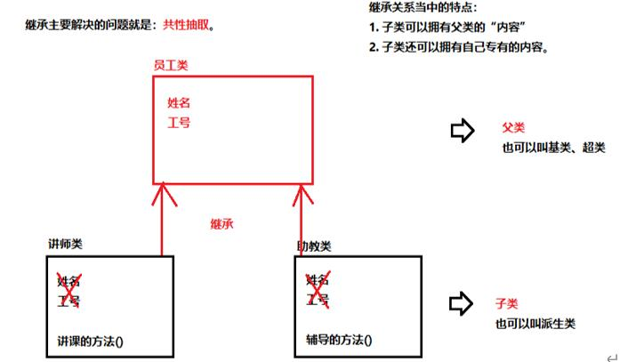
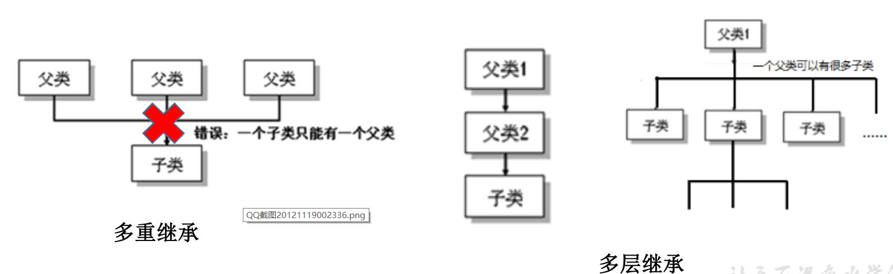
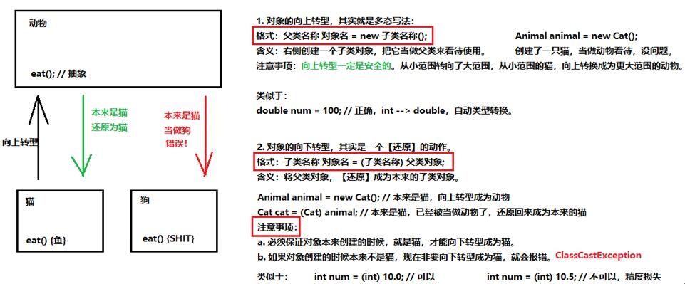

<!--
 * @Author: your name
 * @Date: 2020-04-20 17:05:56
 * @LastEditTime: 2020-04-22 15:23:04
 * @LastEditors: Please set LastEditors
 * @Description: In User Settings Edit
 * @FilePath: \docs\1.basics\0.Object\3-三大特征.md
 -->
# 2 面对对象三大特征

## 2.0 三大特征综述

三大特征主要是封装、继承、多态

## 2.1 封装

### 2.1.1 封装的原理

比如说我要洗衣服，我没必要知道内部原理，只需要按键，通过按键调用相应的功能，你比如说甩干、洗涤等等

那么封装就是把该隐藏的隐藏起来，该暴露的暴露出来。

### 2.1.2 如何实用封装

那么我们就得使用关键字——Private进行成员变量的保护
 * 注：
  
     1. 变量

     一旦使用了private，在本类中仍然可以随意的进行访问，
     
     但是超过本类，就得使用getter/setter方法

     2.. 构造方法
    
     专门用来创建对象的方法，当我们通过关键字new创建对象，其实就是调用的构造方法

## 2.2 继承

### 2.1.1 继承理论



但是为什么要有继承呢？

主要是因为存在相同的属性和行为，不用再占用内存进行定义，直接使用父类的就可以了。

```java
定义父类的格式： 
public class 父类名称 {
         // ...
}
定义子类的格式：
public class 子类名称 extends 父类名称 {
              // ...
}
 
子（父）类名称 对象名 = new 子（父）类名称；
```
注：

1. 只有添加extends 父类名称才使得父类与子类有了关系
2. 父类只能有一个，但是子类可以有无数个
3. 父类的私有方法和变量，子类只能通过get/set进行操作
4. 允许多层继承，不允许多重继承
   

### 2.1.2 继承特点——重写


就是子类对于弗雷德方法进行改造，也是方法的重置、覆盖

注：
1. 与方法的重载区别，重载主要是方法参数可以不一致
2. 子类<font color=red>绝对</font>不能重写父类的private方法

## 2.3 多态

### 2.3.1 多态概念

面向对象中最重要的概念，主要是父类的引用指向子类的对象

多态明显提高了代码的通用性，

```java
父类 对象=new 子类
```

### 2.3.2 引用类型转换

知道多态之后，我们想要进行引用类型转换



```java
向上类型：
父类 变量名=new 子类

向下类型：
子类 变量名=（子类）父类变量名
```

#### 2.3.2.1 向上类型转换（多态）
<b>一、程序</b>

```java
public class Animal {
    public void eat(){
    }
}

public class Cat extends Animal {
    @Override
    public void eat() {
        System.out.println("爱吃鱼");
    }

    public void sleep(){
        System.out.println("夜猫子");
    }
}

public class Test {
    public static void main(String[] args) {
        Animal animal = new Cat();
        animal.eat();

```
<b>二、结果展示</b>

```java
爱吃鱼
```

<b>三、可能存在的问题</b>

#### 2.3.2.1 向上类型转换（多态）

<b>一、程序</b>

```java
public class Dog extends Animal {
    @Override
    public void eat() {
        System.out.println("肯骨头");
    }
}

public class Test {
    public static void main(String[] args) {
        Animal animal = new Cat();
        animal.eat();

        Dog dog=(Dog) animal;
        dog.eat();
    }
}

```

<b>二、结果展示</b>

```java
爱吃鱼
Exception in thread "main" java.lang.ClassCastException: Cat cannot be cast to Dog
	at Test.main(Test.java:6)

```

<b>三、可能存在的问题</b>

从这个代码我们可以看得出来，

<b>一、程序</b>


<b>二、结果展示</b>


<b>三、可能存在的问题</b>


<b>一、程序</b>


<b>二、结果展示</b>


<b>三、可能存在的问题</b>
