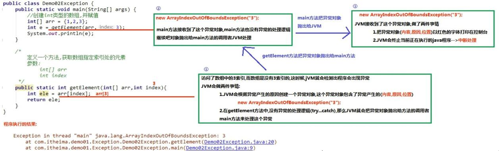
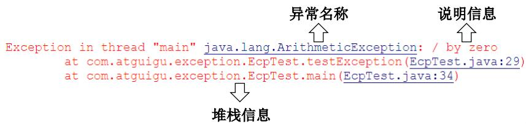
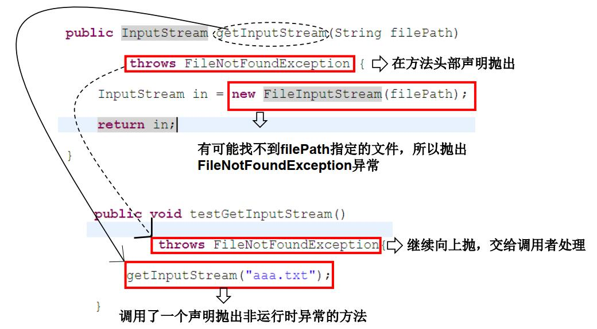

<!--
 * @Author: your name
 * @Date: 2020-04-16 15:30:12
 * @LastEditTime: 2020-04-17 10:23:35
 * @LastEditors: Please set LastEditors
 * @Description: In User Settings Edit
 * @FilePath: \docs\1.basics\1.java-basic\12-异常.md
 -->
## 12.0 异常综述

## 12.1 异常体系结构

异常本身就是一个类。产生异常就是创建了一个异常对象并抛出了一个异常对象

Java处理异常的方式就是中断处理

注：异常并不是语法错误

异常共分为了两个大类：
* Error
   * Java虚拟机无法解决的严重问题：StackOverflowError和OOM问题，一般不便携针对性代码进行处理
* Exception
   * 因编程错误或偶然外在因素导致的错误
  
为了解决这些错误，就有两个概念必须知道了：
1. 编译时异常
   说白了就是你在写程序的时候，语法不正确或者其他原因需要加入jar包/相应的语法才能消除
2. 运行时异常
   这个应该就是你的逻辑有问题，比如数组超出界限一类的。

异常过程的解析：



## 12.2 异常处理机制

### 12.2.0 异常处理的关键字：

1. try...catch
2. finally
3. throw
4. throws

这部分详见[关键字](3-关键字.md)

### 12.2.1 常见异常

* java.lang.RuntimeException
* java.io.IOExeption
* java.lang.ClassNotFoundException
* java.lang.InterruptedException
* java.io.FileNotFoundException
* java.sql.SQLException

### 12.2.1 异常处理机制一：try-catch-finally

在编写程序时，在可能出现错误的地方加上检测代码，比如说
```java 
int i=x/y 

```
要写分母为0情况如何处理、数据为空怎么办、输入不是规定好的类型如何处理

这样太啰嗦了，那么Java才用的异常处理机制就像我们走来了。

其主导思想就是：

物以类聚，人以群分

  
```java
    try{
        ...... //可能产生异常的代码
    }
    catch( ExceptionName1 e ){
        ...... //当产生ExceptionName1型异常时的处置措施
    }
    catch( ExceptionName2 e ){
        ...... //当产生ExceptionName2型异常时的处置措施
    } [
    finally{
        ...... //无论是否发生异常， 都无条件执行的语句
    } ]
``` 
注：

1. 如果明确知道异常类型，那么catch（）括号里的就可以标注具体类型
    但是，如使用的是ArithmeticException， 代码却是由NullPointerException导致的，那就不行了。
    一般就是用Exception类
2. 捕获异常的有关信息有关方法
```java
   getMessage() 获取异常信息，返回字符串
   printStackTrace() 获取异常类名和异常信息，以及异常出
现在程序中的位置。返回值void。
```
3. 报错指南
    
4. 不论在try代码块中是否发生了异常事件， catch语句是否执
行， catch语句是否有异常， catch语句中是否有return，
finally块中的语句都会被执行。

用一张图来进行解释一下吧：


<b>一、程序</b>

```java
public class TryCatchFinally {
    public static void main(String[] args) {
        String[] str={"sun","hao","ran"};
        try{
            for (int i = 0; i < 5; i++) {
                System.out.println(str[i]);
            }
        }catch(Exception e){
            System.out.println("error");
            e.getMessage();
            e.printStackTrace();
        }finally{
            System.out.println("剩余程序");
            int i=3+4;
            System.out.println(i);
        }

    }
}
```

<b>二、结果展示</b>

```java
sun
hao
ran
error
剩余程序
7
java.lang.ArrayIndexOutOfBoundsException: 3
	at TryCatchFinally.main(TryCatchFinally.java:6)
```

<b>三、可能存在的问题</b>

## 12.3 异常处理机制二：throws

这种方式比较常见，详见[BIO](https://codefool0307.github.io/JavaScholar/#/1.basics/1.java-basic/5-IO?id=_52112-%e5%8a%9f%e8%83%bd)这一部分


注：

1. 声明抛出异常，父类有，子类也要有
   
2. 重写方法声明抛出异常，<font color="#FF0000">父</font><font color="#E3001C">类</font><font color="#C70038">范</font><font color="#AB0054">围</font><font color="#8F0070">></font><font color="#73008C">子</font><font color="#5700A8">类</font><font color="#3B00C4">范</font><font color="#1F00E0">围</font>
   
```java
public class A {
public void methodA() throws IOException {
……
} }
public class B1 extends A {
public void methodA() throws FileNotFoundException {
……
} }
public class B2 extends A {
public void methodA() throws Exception { //报错
……
} }
```
3. throws声明后，可以再内部添加throw new xxxException();

## 12.3 异常处理机制三：手动抛出异常throw

在有问题的部分添加 

```java
  throw new xxxException("异常原因")
```
注：
1. 这个必须要声明对象，即xxxException e = new xxxException();
2. throw是写在方法体内部
3. 有一个静态方法
```java
public static <T> T requireNonNull(T obj):查看指定引用对象不是null。
```

## 12.3自定义异常

由于Java异常类不是很完全，还要自己写用户自定义异常类

```java
   public class XXXExcepiton extends Exception | RuntimeException{
            提供serialVersionUID//用这个标识这个类，类似身份证
            提供一个空参数的构造方法
            提供一个带异常信息的构造方法
        }
```

<b>一、程序</b>

```java
public class MyException extends Exception {
    static final long serialVersionUID=13145524324L;
    private int idnumber;
    public MyException() {}
    public MyException(String message, int idnumber) {
        super(message);
        this.idnumber = idnumber;
    }
    public int getIdnumber() { return idnumber; }
}

import java.util.Scanner;
public class MyExceptionTest {
    public static void main(String[] args) {
        Scanner sc = new Scanner(System.in);
        System.out.println("请输入数字");
        int i = sc.nextInt();
        try{
            regist(i);
        }catch (MyException e){
            System.out.println("范围不对"+e.getIdnumber());
        }finally {
            System.out.println("本次登记结束");
        }
    }
    public static void regist(int str) throws MyException{
        if (str<0){
            throw new MyException("不在范围内，输入的是：",str);
        }else{
            System.out.println("登记成功"+str);
        }
    }
}

```

<b>二、结果展示</b>

```java
请输入数字
        2
        登记成功2
        本次登记结束
```

<b>三、可能存在的问题</b>


