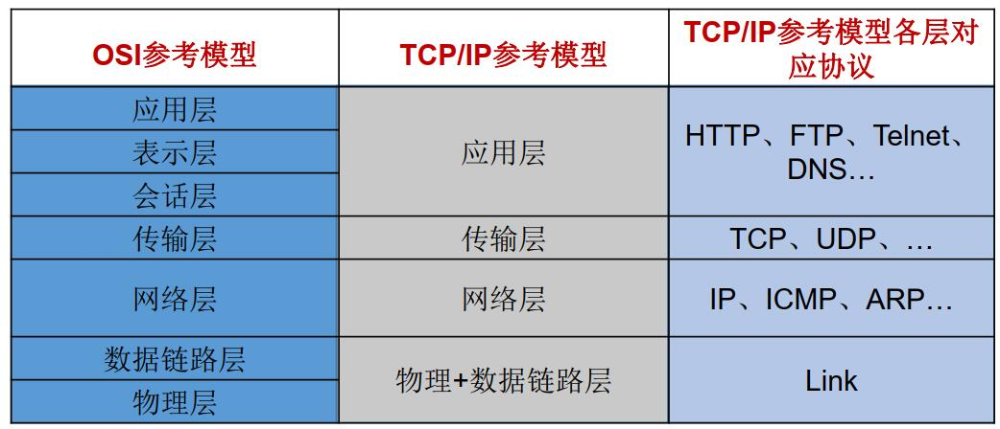
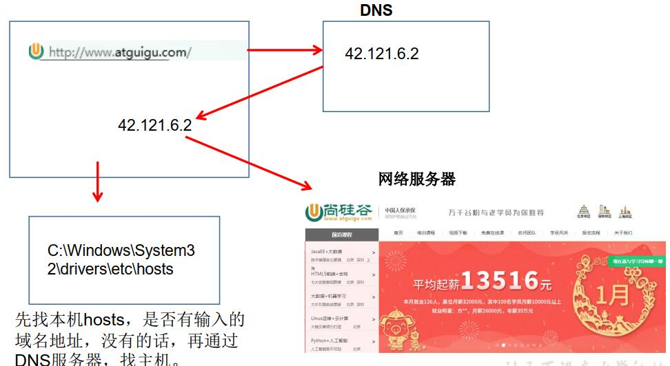
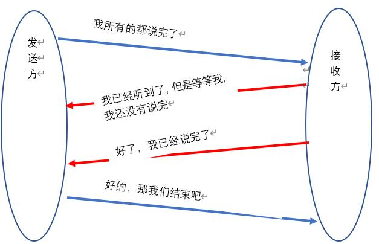
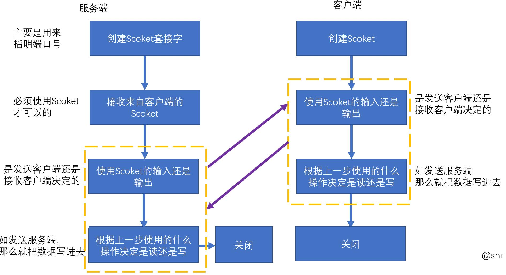

<!--
 * @Author: your name
 * @Date: 2020-04-18 07:50:30
 * @LastEditTime: 2020-04-18 16:45:03
 * @LastEditors: Please set LastEditors
 * @Description: In User Settings Edit
 * @FilePath: \JavaScholar\docs\1.basics\1.java-basic\14-网络编程.md
 -->
# 14 网络编程(细节未处理好，将于4.22处理)

结合[第二部分、OS](http://localhost:3000/#/2.os/3.TCP/1-%E6%A8%A1%E5%9E%8B%E4%BB%8B%E7%BB%8D)看

## 14.0 网络编程综述

网络编程的目的就是通过网络协议与其他计算机实现数据交换

## 14.1 网络通信要素

### 14.1.0 网络中的主机如何通信

1. 通信双方地址
   * IP
   * 端口号
2. 一定的规则（网络通信协议）
   * OSI参考模型
   * [TCP/IP参考模型]()



### 14.1.1 IP和端口号

* IP地址
  * 分类方式1：IPV4、IPV6（主流）
  * 分类方式2：公网地址和私有地址
  * IP地址会有一个<font color=red bgcolor="yellow">InetAdress类</font>
     1. Internet上的主机有两种方式表示地址：
        域名（hostName）：www.baidu.com
        IP地址（hostAdress）：202.108.35.210
     2. InetAddress类主要表示IP地址， 两个子类： Inet4Address、 Inet6Address。
     3. InetAddress 类 对 象 含 有 一 个 Internet 主 机 地 址 的 域 名 和 IP 地 址 ：www.baidu.com 和 202.108.35.210。
     4. 使用域名容易记忆，当在连接网络时输入一个主机的域名后， 域名服务器(DNS)
负责将域名转化成IP地址，这样才能和主机建立连接。 -------域名解析

     

     5. InetAdress类常用方法：
   
        ```java
        1. public static InetAddress getLocalHost()
        2. public static InetAddress getByName(String host)
        3.public String getHostAddress()： 返回 IP 地址字符串（以文本表现形式） 。
        4.public String getHostName()： 获取此 IP 地址的主机名
        5.public boolean isReachable(int timeout)： 测试是否可以达到该地址
        ```
<b>一、程序</b>

```java
import java.net.InetAddress;
import java.net.UnknownHostException;
public class IP01 {
    public static void main(String[] args) throws UnknownHostException {
        InetAddress adress1 = InetAddress.getByName("www.baidu.com");
        //获取网站的IP字符串
        byte[] address = adress1.getAddress();
        //获取网站的域名
        String hostName = adress1.getHostName();
        //获取网站的IP地址
        String hostAddress = adress1.getHostAddress();
        System.out.println(address);
        System.out.println(hostName);
        System.out.println(hostAddress);
        //获取本机的域名和IP地址
        InetAddress address2 = InetAddress.getLocalHost();
        System.out.println(address2);
    }
}
```

<b>二、结果展示</b>

```java
[B@1b6d3586
www.baidu.com
39.156.66.18
DESKTOP-TO0NJPC/169.254.222.133
```
<b>三、可能存在的问题</b>
 暂无


* 端口号
  * 公认端口&#8195;&#8195;0~1023，被预先定义的服务通信占用，如:HTTP占用端口
80， FTP占用端口21， Telnet占用端口23
  * 注册端口&#8195;&#8195;1024~49151,分配各用户进程或者应用程序
  * 动态/私有端口&#8195;&#8195;49152~65535

* Scoket：这个是端口号与IP地址组合得出一个网络套接字<b><font color="#FF0000">套</font><font color="#AA0055">接</font><font color="#5500AA">字</font></b>


### 14.1.2 网络通信协议
    网络通信协议具体会在第二部分进行详细讲解

#### 14.1.2.1 较为重要的协议

传输层协议中有两个非常重要的协议：
 1. 传输控制协议TCP(Transmission Control Protocol)
 2. 用户数据报协议UDP(User Datagram Protocol)。

目前学习重点是TCP/IP， 其两个主要协议：传输控制协议(TCP)和网络互联协议(IP)实际上是一组协议，包括多个具有不同功能且互为关联的协议。
* 三次握手与四次握手
   1. 三次握手较为好理解
   
     

   2. 四次握手
   
     

还有一个是UDP不做过多解释了，貌似用的不是很多

#### 14.1.2.2 Scoket

Socket分类：
1. 流套接字（stream socket）：使用TCP提供可依赖的字节流服务
2. 数据报套接字（datagram socket）：使用UDP提供“尽力而为”的数据报服务

 Scoket的常用方法：
  
  ```java

  1. Socket类的常用构造器：
    public Socket(InetAddress address,int port)创建一个流套接字并将其连接到指定 IP 地址的指定端口号。
    public Socket(String host,int port)创建一个流套接字并将其连接到指定主机上的指定端口号。
  2. Socket类的常用方法：
    public InputStream getInputStream()返回此套接字的输入流。 可以用于接收网络消息
    public OutputStream getOutputStream()返回此套接字的输出流。 可以用于发送网络消息
    public InetAddress getInetAddress()此套接字连接到的远程 IP 地址；如果套接字是未连接的， 则返回 null。
    public InetAddress getLocalAddress()获取套接字绑定的本地地址。 即本端的IP地址
    public int getPort()此套接字连接到的远程端口号；如果尚未连接套接字， 则返回 0。
    public int getLocalPort()返回此套接字绑定到的本地端口。 如果尚未绑定套接字， 则返回 -1。 即本端的端口号。
    public void close()关闭此套接字。 套接字被关闭后， 便不可在以后的网络连接中使用（即无法重新连接或重新绑定） 。 需要创建新的套接字对象。 关闭此套接字也将会关闭该套接字的 InputStream 和OutputStream。
    public void shutdownInput()如果在套接字上调用 shutdownInput() 后从套接字输入流读取内容， 则流将返回 EOF（文件结束符） 。 即不能在从此套接字的输入流中接收任何数据。
    public void shutdownOutput()禁用此套接字的输出流。 对于 TCP 套接字， 任何以前写入的数据都将被发送， 并且后跟 TCP 的正常连接终止序列。 如果在套接字上调用 shutdownOutput() 后写入套接字输出流，则该流将抛出 IOException。 即不能通过此套接字的输出流发送任何数据。
```

## 14.2 TCP编程

本次主要是基于Scoket的TCP编程

主要流程:
 
 

<b>一、程序</b>

```java
import org.junit.Test;
import java.io.ByteArrayOutputStream;
import java.io.IOException;
import java.io.InputStream;
import java.io.OutputStream;
import java.net.ServerSocket;
import java.net.Socket;

public class test {
    @Test
    public void Client(){
        Socket socket =null;
        OutputStream os=null;
        try {
            //1.创建Scoket
            socket = new Socket("127.0.0.1", 9989);
            //2.打开链接到Scoket输出流
            os = socket.getOutputStream();
            //3.写数据
            os.write("大王让我来巡上".getBytes());
        } catch (IOException e) {
            e.printStackTrace();
        }finally {
            if (os!=null){
                try {
                    os.close();
                } catch (IOException e) {
                    e.printStackTrace();
                }
            }
            if (socket!=null){
                try {
                    socket.close();
                } catch (IOException e) {
                    e.printStackTrace();
                }
            }
        }
    }
    @Test
    public void Server(){
        ServerSocket serverSocket =null;
        Socket accept =null;
        InputStream is =null;
        ByteArrayOutputStream bs =null;
        try {
            //1.创建服务端ServerScoket
            serverSocket = new ServerSocket(9989);
            //2.链接客户端的scoket
            accept = serverSocket.accept();
            //3.获取socket输入流
            is = accept.getInputStream();
            //读取输入流的数据
            //输出汉字如果使用byte，可能造成乱码，原因下面阐述
            bs = new ByteArrayOutputStream();
            byte[] bytes = new byte[1024];
            int len=0;
            while ((len=is.read(bytes))!=-1){
                bs.write(bytes,0,len);
            }
            System.out.println(bs.toString());
        } catch (IOException e) {
            e.printStackTrace();
        }finally {
            if (serverSocket!=null){
                try {
                    serverSocket.close();
                } catch (IOException e) {e.printStackTrace();}
            }
            if (bs!=null){
                try {
                    bs.close();
                } catch (IOException e) {e.printStackTrace();}
            }
            if (accept!=null){
                try {
                    accept.close();
                } catch (IOException e) {e.printStackTrace()} }
            if (is!=null){
                try {
                    is.close();
                } catch (IOException e) {e.printStackTrace();}
            }
        }
    }
}

```

<b>二、结果展示</b>


<b>三、可能存在的问题</b>


注：

1. 首先运行Server
2. 在运行Client

例子：我想把一张照片考到服务端，收到后请回复

<b>一、程序</b>

```java
import org.junit.Test;
import java.io.*;
import java.net.ServerSocket;
import java.net.Socket;
public class TCPTest {
    @Test
    public void Client() throws IOException {
            //1.创建Scoket
            Socket socket = new Socket("127.0.0.1",9833);
            //2.打开链接，是放到服务端，也就是输出
            OutputStream os = socket.getOutputStream();
            //3.读写操作
            //3.1先读取照片
            FileInputStream fis = new FileInputStream(new File("dog.jpg"));
            //3.2 写数据
            byte[] bytes = new byte[1024];
            int len=0;
            while ((len=fis.read())!=-1){
                os.write(bytes,0,len);
            }
            socket.shutdownOutput();
            //4.接收服务器的回传数据
        InputStream is = socket.getInputStream();
        ByteArrayOutputStream bs = new ByteArrayOutputStream();
        byte[] bytes1 = new byte[1024];
        int len1;
        while ((len1=is.read(bytes1))!=-1){
            bs.write(bytes,0,len1);
        }
        System.out.println(bs.toString());
    }
    @Test
    public void Server() throws IOException {
        //1.创建套接字
        ServerSocket ss = new ServerSocket(9833);
        //2.链接请求
        Socket accept = ss.accept();
        //3.接收一下Scoket内容
        InputStream is = accept.getInputStream();
        //4.写数据，并把他存在一个位置
        FileOutputStream fos = new FileOutputStream(new File("dog2.jpg"));
        //4.1.写数据
        byte[] bytes = new byte[1024];
        int len=0;
        while ((len=is.read(bytes))!=-1){
            fos.write(bytes,0,len);
        }

        //5. 服务器回传数据到客户端
        OutputStream os = accept.getOutputStream();
        os.write("收到单身狗图片一张".getBytes());
    }
}
```

<b>二、结果展示</b>


<b>三、可能存在的问题</b>

## 14.3 UDP编程

类 DatagramSocket 和 DatagramPacket 实现了基于 UDP 协议网络程序。

注：

系统不保证UDP数据报一定能够安全送到目的地，也不能确定什么时候可以抵达。

* DatagramSocket 类的常用方法

```java
public DatagramSocket(int port)创建数据报套接字并将其绑定到本地主机上的指定端口。 套接字将被
绑定到通配符地址， IP 地址由内核来选择。
public DatagramSocket(int port,InetAddress laddr)创建数据报套接字， 将其绑定到指定的本地地址。
本地端口必须在 0 到 65535 之间（包括两者） 。 如果 IP 地址为 0.0.0.0， 套接字将被绑定到通配符地
址， IP 地址由内核选择。
public void close()关闭此数据报套接字。
public void send(DatagramPacket p)从此套接字发送数据报包。 DatagramPacket 包含的信息指示：将
要发送的数据、 其长度、 远程主机的 IP 地址和远程主机的端口号。
public void receive(DatagramPacket p)从此套接字接收数据报包。 当此方法返回时， DatagramPacket
的缓冲区填充了接收的数据。 数据报包也包含发送方的 IP 地址和发送方机器上的端口号。 此方法
在接收到数据报前一直阻塞。 数据报包对象的 length 字段包含所接收信息的长度。 如果信息比包的
长度长， 该信息将被截短。
public InetAddress getLocalAddress()获取套接字绑定的本地地址。
public int getLocalPort()返回此套接字绑定的本地主机上的端口号。
public InetAddress getInetAddress()返回此套接字连接的地址。 如果套接字未连接， 则返回 null。
public int getPort()返回此套接字的端口。 如果套接字未连接， 则返回 -1。
```

* DatagramPacket类的常用方法

```java
public DatagramPacket(byte[] buf,int length)构造 DatagramPacket， 用来接收长
度为 length 的数据包。 length 参数必须小于等于 buf.length。
public DatagramPacket(byte[] buf,int length,InetAddress address,int port)构造数
据报包， 用来将长度为 length 的包发送到指定主机上的指定端口号。 length
参数必须小于等于 buf.length。
public InetAddress getAddress()返回某台机器的 IP 地址， 此数据报将要发往该
机器或者是从该机器接收到的。
public int getPort()返回某台远程主机的端口号， 此数据报将要发往该主机或
者是从该主机接收到的。
public byte[] getData()返回数据缓冲区。 接收到的或将要发送的数据从缓冲区
中的偏移量 offset 处开始， 持续 length 长度。
public int getLength()返回将要发送或接收到的数据的长度。
```

<b>一、程序</b>

```java
import org.junit.Test;

import java.io.IOException;
import java.net.*;

public class UDPTest {
    @Test
    public void sender() throws IOException{
        DatagramSocket socket = new DatagramSocket();

        String str="学好java基础很重要";
        byte[] bytes = str.getBytes();
        InetAddress localHost = InetAddress.getLocalHost();
        DatagramPacket packet = new DatagramPacket(bytes, 0, bytes.length, localHost, 8900);

        socket.send(packet);
        socket.close();
    }
    @Test
    public void receiver() throws IOException {
        DatagramSocket socket = new DatagramSocket(8900);

        byte[] bytes = new byte[1024];
        DatagramPacket packet = new DatagramPacket(bytes, 0, bytes.length);

        socket.receive(packet);
        System.out.println(new String(packet.getData(),0,packet.getLength()));
        socket.close();
    }
    }
```
<b>二、结果展示</b>


<b>三、可能存在的问题</b>


## 14.4 URL编程

### 14.4.1 URL基本构成

URL的基本结构由5部分组成：

<传输协议>://<主机名>:<端口号>/<文件名>#片段名?参数列表

例如:

http://192.168.1.100:8080/helloworld/index.jsp#a?username=shkstart&password=123

#片段名：即锚点，例如看小说，直接定位到章节

参数列表格式：参数名=参数值&参数名=参数值....

### 14.4.2 URL构造器与方法

* 构造器

```java
public URL (String spec)：            通过一个表示URL地址的字符串可以构造一个URL对象。
       例如： URL url = new URL ("http://www. atguigu.com/");
public URL(URL context, String spec)：通过基 URL 和相对 URL 构造一个 URL 对象。
        例如： URL downloadUrl = new URL(url, “download.html")
        public URL(String protocol, String host, String file); 例如： new URL("http","www.atguigu.com", “download. html");
public URL(String protocol, String host, int port, String file); 
        例如: URL gamelan = new URL("http", "www.atguigu.com", 80, “download.html");
```

* 常用方法

```java
public String getProtocol( ) 获取该URL的协议名
public String getHost( ) 获取该URL的主机名
public String getPort( ) 获取该URL的端口号
public String getPath( ) 获取该URL的文件路径
public String getFile( ) 获取该URL的文件名
public String getQuery( ) 获取该URL的查询名
```
<b>一、程序</b>

```java
import java.net.MalformedURLException;
import java.net.URL;

public class UrlScoket {
    public static void main(String[] args) {
        try {
            URL url = new URL("https://codefool0307.github.io/JavaScholar/#/4.algorithm/9-%E6%8E%92%E5%BA%8F?id=_961-%e8%8d%b7%e5%85%b0%e5%9b%bd%e6%97%97%e9%97%ae%e9%a2%98");
            //1.获取协议名
            String protocol = url.getProtocol();
            System.out.println(protocol);
            //2.获取主机名
            String host = url.getHost();
            System.out.println(host);
            //3.获取端口号
            int port = url.getPort();
            System.out.println(port);
            //4.获取查询名
            String query = url.getQuery();
            System.out.println(query);
        } catch (MalformedURLException e) {
            e.printStackTrace();
        }finally {
            System.out.println("程序运行结束了");
        }

    }
}
```

<b>二、结果展示</b>

```java
https
codefool0307.github.io
-1
null
程序运行结束了
```
<b>三、可能存在的问题</b>

注：很多，不再一一试验，用的时候查手册即可

### 14.4.3 URLConnction使用

若希望输出数据，

1. 必须先与URL建立连接，
2. 然后才能对其进行读写，此时需要使用URLConnection的openConnection() 方法生成对应的对象。
3. 然后与URL获取连接
4. 同上，该怎么处理就怎么处理了

<b>一、程序</b>

```java
import java.io.IOException;
import java.io.InputStream;
import java.net.URL;
import java.net.URLConnection;

public class URL02 {
    public static void main(String[] args) {
        try {
            //1.创建链接
            URL url = new URL("http://localhost:8080/examples/1.jpg");
            //2.对连接中的内容进行读写操作的前奏
            URLConnection urlConnection = url.openConnection();
            //3.与URL连接
            urlConnection.connect();
            //4.把照片读进来
            InputStream is = urlConnection.getInputStream();
            //5.把照片保存在本地
            FileOutputStream fos = new FileOutputStream("1-1.jpg");
            byte[] bytes = new byte[1024];
            int len=0;
            while ((len=is.read(bytes))!=-1){
                fos.write(bytes,0,len);
            }
            System.out.println("下载完成");
        } catch (IOException e) {
            e.printStackTrace();
        }
    }
}
```

<b>二、结果展示</b>

能够看到照片1-1.jpg
```java
下载完成
```

<b>三、可能存在的问题</b>

<font size="7">注：</font>

1. 我这边偷懒了，没有关闭资源，如果要是按照正常的话，时需要关闭资源的。 如需copy，得写上关闭资源
2. URL类就是只需要写客户端就可以了，服务端就是tomcat
3. 怎么使用的这个地址?
   1. 命令行输入catalina run运行tomcat
   2. 网页中输入localhost：xxxx（xxxx是在conf的setting.xml文件中Connector标签规定好的端口号）
   3. 在tomcat→webapps→examples放入资源
   4. 网页中输入localhost：xxxx/examples/xxx即可打开资源