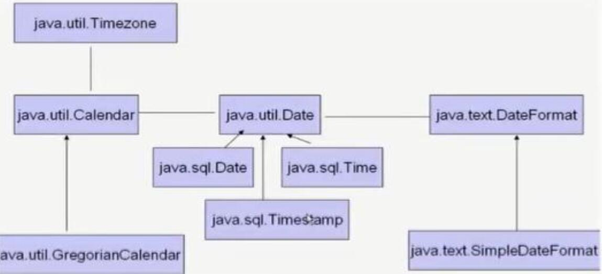
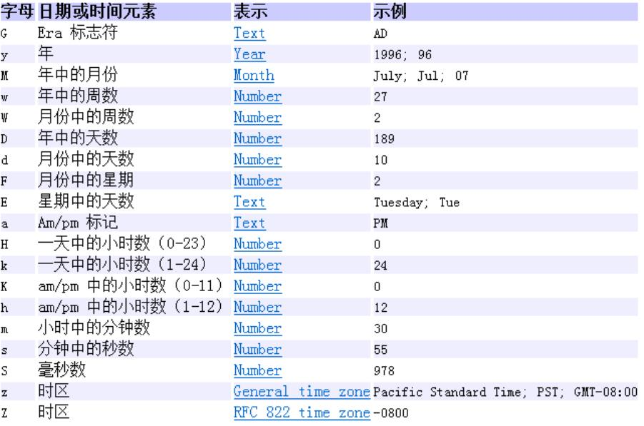
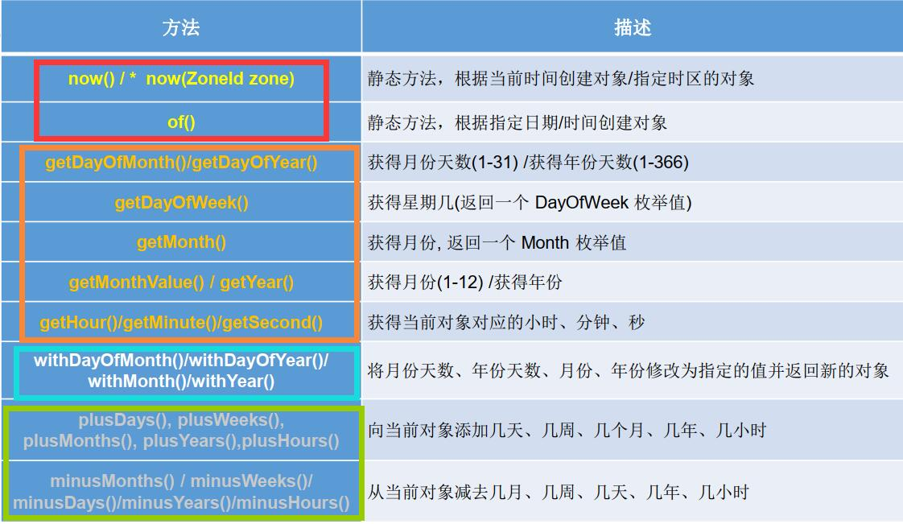
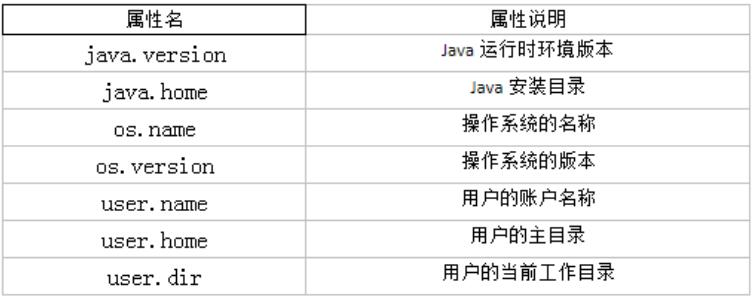

<!--
 * @Author: your name
 * @Date: 2020-04-18 14:10:34
 * @LastEditTime: 2020-04-26 19:46:24
 * @LastEditors: Please set LastEditors
 * @Description: In User Settings Edit
 * @FilePath: \JavaScholar\docs\1.basics\1.java-basic\16-类.md
 -->
# 16 常用类

## 16.0 常用类综述

常用类主要有：

1. Object类与Objects类  [:pencil2:]
2. 时间API             [:pencil2]
3. system类[:pencil2:]
4. <font color="#FF0000">String类</font>
5. Scanner
6. Random
7. Arrays
8. math[:pencil2:]
9. File
10. 枚举类
11. Java比较器[:pencil2:]
12. BigInteger与BigDecimal[:pencil2:]

## 16.1 Object类

Object类存储在java.lang包中，是所有java类(Object类除外)的<font color="#7F0080">终极</font>父类。当然，数组也继承了Object类。然而，接口是不继承Object类的。具体原因详见：[Object类不作为接口的父类](https://docs.oracle.com/javase/specs/jls/se7/html/jls-9.html#jls-9.6.3.4)


Object类的常用方法主要是toString、equals、hashCode方法,

其余更加详细的方法请查看API文档，之后也会做补充

### 16.1.1 toString方法

toString方法返回的结果是内存地址，所以要在勒种重写一下toString方法

<b>一、程序</b>

```java
public class Person {
    private String name;
    private int age;
    public Person() { }
    public Person(String name, int age) {
        this.name = name;
        this.age = age;
    }
    @Override
    public String toString() {
        return "Person{" + "name='" + name + '\'' + ", age=" + age + '}'; }
    public String getName() { return name; }
    public void setName(String name) { this.name = name; }
    public int getAge() { return age; }
    public void setAge(int age) { this.age = age; }
}

public class Test {
    public static void main(String[] args) {
        //1.不使用toString方法
        Person p1 = new Person();
        p1.setAge(24);
        p1.setName("sage");
        System.out.println("姓名："+p1.getName()+"年龄："+p1.getAge());

        //2.使用toString方法
        Person p2 = new Person("wuhan", 45);
        System.out.println(p2.toString());

    }
}
```

<b>二、结果展示</b>

```java
姓名：sage年龄：24
Person{name='wuhan', age=45}
```

<b>三、可能存在的问题</b>

### 16.1.2 equals方法

由于equals方法默认比较的是两个对象的地址值，没有任何意义，所以，我们需要改写equals方法，从而达到进行对象属性的比较


<b>一、程序</b>

```java
import java.util.Objects;

public class Person {
    private String name;
    private int age;
    public Person() { }
    public Person(String name, int age) {
        this.name = name;
        this.age = age;
    }

    @Override
    public boolean equals(Object o) {
        if (this == o) {return true;}
        if (o == null || getClass() != o.getClass()) {return false;}
        //比较完所有的情况，那么传入的对象是Person类对象，
        //那么为了解决多态的弊端（不能使用子类的特有内容），必须要向下转型
        Person person = (Person) o;
        return age == person.age &&
                Objects.equals(name, person.name);
    }
    @Override
    public int hashCode() { return Objects.hash(name, age); }

    @Override
    public String toString() {
        return "Person{" + "name='" + name + '\'' + ", age=" + age + '}'; }
    public String getName() { return name; }
    public void setName(String name) { this.name = name; }
    public int getAge() { return age; }
    public void setAge(int age) { this.age = age; }
}

public class Test {
    public static void main(String[] args) {
        //1.不使用toString方法
        Person p1 = new Person();
        p1.setAge(24);
        p1.setName("sage");
        System.out.println("姓名："+p1.getName()+"年龄："+p1.getAge());

        //2.使用toString方法
        Person p2 = new Person("wuhan", 45);
        Person p3 = new Person("wuhan", 45);
        System.out.println(p2.toString());
        System.out.println(p2.equals(p3));
    }
}

```

<b>二、结果展示</b>

```java
姓名：sage年龄：24
Person{name='wuhan', age=45}
true
```

<b>三、可能存在的问题</b>

### 16.1.3 hashcode方法

用来获取对象的哈希值，在容器set中用的比较多

重点在于：equals方法与hashCode方法之间有什么关系？

1. 如果两个对象使用equals比较返回true,那么它们的hashCode值一定要相同

2. 如果两个对象equals比较返回false,那么它们的hashCode值不一定不同

3. 覆盖equals，往往需要覆盖hashCode,可以使用IDEA自动生成，保证equals返回true,则hashCode相同；equals返回false,则hashCode不同

## 16.2 Objects类

由于Object的equals方法容易抛出空指针异常，而在JDK7当中添加了一个Objects工具类，就是为了解决这个问题的

<b>一、程序</b>

```java
import java.util.Objects;
public class Test {
    public static void main(String[] args) {
        String s1="aaaa";
        String s2="bbbb";
        String s3=null;
        /*boolean equals = s3.equals(s1);
        System.out.println(equals);*/
        boolean equals1 = Objects.equals(s3, s1);
        System.out.println(equals1);
    }
}
```

<b>二、结果展示</b>

```java
Exception in thread "main" java.lang.NullPointerException
	at Test.main(Test.java:7)
会出现异常，那么要解决这个异常问题，就是用Objects了，
false
```
<b>三、可能存在的问题</b>

#### Objects还有其他的常用方法，之后进行补充


## 16.3时间API



在时间API中主要是有三种来查看时间：System、Date、time

### 16.3.1 System类

System类提供的public static long currentTimeMillis()用来返回当前时
间与1970年1月1日0时0分0秒之间以毫秒为单位的时间差

### 16.3.2 Date类

* 表示特定的瞬间，精确到毫秒
* 共分为了java.util.Date和子类java.sql.Date

```java
1.构造器：
   Date()： 使用无参构造器创建的对象可以获取本地当前时间。
   Date(long date)
2.常用方法
   getTime():返回自 1970 年 1 月 1 日 00:00:00 GMT 以来此 Date 对象表示的毫秒数。
   toString():把此 Date 对象转换为以下形式的 String： 
   dow mon dd hh:mm:ss zzz yyyy 其中： dow 是一周中的某一天 (Sun, Mon, Tue,Wed, Thu, Fri, Sat)， zzz是时间标准。
   其它很多方法都过时了。
```

<b>一、程序</b>

```java
import java.util.Date;
public class Test {
    public static void main(String[] args) {
        Date date = new Date();
        long time = date.getTime();
        String s = date.toString();
        System.out.println(time);
        System.out.println(s);

        Date date1 = new Date(839579437);
        long time1 = date1.getTime();
        System.out.println(time1);
        String s1 = date1.toString();
        System.out.println(s1);

        //sql的时间类
        java.sql.Date date2 = new java.sql.Date(739854729);
        System.out.println(date2.toString());

        //如何将java.util.Date对象转换为java.sql.Date对象
        java.sql.Date date3 = new java.sql.Date(date.getTime());
        System.out.println(date3);

    }
}

```

<b>二、结果展示</b>

```java
1587800888768
Sat Apr 25 15:48:08 CST 2020
839579437
Sun Jan 11 01:12:59 CST 1970
1970-01-09
2020-04-25

```

<b>三、可能存在的问题</b>

### 16.3.3 SimpleDateFormat类

由于Date类的API不易于国际化，大部分都不在使用了，

java.text.SimpleDateFormat
类是一个不与语言环境有关的方式来格式化和解析日期的具体类。

它允许进行

格式化：日期→文本、&emsp;&emsp;&emsp;&emsp;解析：文本→日期

* 格式化：
```java
构造函数：
SimpleDateFormat() ：默认的模式和语言环境创建对象
public SimpleDateFormat(String pattern)： 该构造方法可以用参数pattern指定的格式创建一个对象，该对象调用：
常用方法：
public String format(Date date)： 方法格式化时间对象date
```

* 解析：
```java
public Date parse(String source)： 从给定字符串的开始解析文本，以生成一个日期。
```



<b>一、程序</b>

```java
import java.text.ParseException;
import java.text.SimpleDateFormat;
import java.util.Date;

public class Test {
    public static void main(String[] args) {
        //1.默认模式来进行创建
        Date date = new Date();
        SimpleDateFormat sdf = new SimpleDateFormat();
        String format = sdf.format(date);
        System.out.println(format);

        //2.指定模式来进行创建
        SimpleDateFormat sdf2 = new SimpleDateFormat("yyyy年MM月dd日 EEE:HH:mm:ss");
        String format1 = sdf2.format(date);
        System.out.println(format1);

        //3.指定日期解析
        try {
            Date date1 = sdf2.parse("2014年08月09日 星期一:09:08:02");
            String s = date1.toString();
            System.out.println(s);
        } catch (ParseException e) {
            e.printStackTrace();
        }
    }
}


```

<b>二、结果展示</b>

```java
20-4-25 上午11:40
2020年04月25日 星期六:11:40:01
Sat Aug 09 09:08:02 CST 2014
```

<b>三、可能存在的问题</b>

### 16.3.4 Calendar类

Calendar是一个抽象基类，主用用于完成<font color="#FF0000">日</font><font color="#D5002A">期</font><font color="#AB0054">字</font><font color="#81007E">段</font><font color="#5700A8">之</font><font color="#2D00D2">间</font>相互操作的功能。

获取Calendar实例的方法

```java
使用Calendar.getInstance()方法
调用它的子类GregorianCalendar的构造器。
```

一个Calendar的实例是系统时间的抽象表示，通过get(int field)方法来取得想要的时间信息。比如YEAR、 MONTH、 DAY_OF_WEEK、 HOUR_OF_DAY 、MINUTE、 SECOND

```java
public void set(int field,int value)
public void add(int field,int amount)
public final Date getTime()
public final void setTime(Date date)
注意:
获取月份时： 一月是0，二月是1，以此类推， 12月是11
获取星期时： 周日是1，周二是2 ， 。 。。。周六是7
```
<b>一、程序</b>

```java
import java.util.Calendar;
import java.util.Date;
public class Test {
    public static void main(String[] args) {
        //创建对象
        Calendar calendar = Calendar.getInstance();
        Date time = calendar.getTime();
        System.out.println(time);
        Date date = new Date(985379579725L);
        System.out.println(date);
        //把时间设置为这个之后，进行调动
        calendar.setTime(date);
        calendar.set(Calendar.DAY_OF_MONTH,7);
        System.out.println(calendar.getTime());

    }
}
```

<b>二、结果展示</b>

```java
Sat Apr 25 15:51:40 CST 2020
Sat Mar 24 04:32:59 CST 2001
Wed Mar 07 04:32:59 CST 2001
```

<b>三、可能存在的问题</b>

### 16.3.5 time类

java.time 中包含了所有关于本地日期（LocalDate）、本地时间（LocalTime）、本地日期时间（LocalDateTime）、时区（ZonedDateTime）和持续时间（Duration）的类。

#### 16.3.5.1 LocalDate、 LocalTime、 LocalDateTime

 LocalDate、 LocalTime、 LocalDateTime 类是其中较重要的几个类，它们的实例是不可变的对象，分别表示使用 ISO-8601日历系统的日期、时间、日期和时间。

常用方法：




<b>一、程序</b>

比较多，不一一列举

```java
import java.time.LocalDate;
import java.time.LocalDateTime;
import java.time.LocalTime;
import java.time.Month;

public class Test {
    public static void main(String[] args) {
        //相当于无参构造
        LocalDate localDate = LocalDate.now();
        LocalTime localTime = LocalTime.now();
        LocalDateTime localDateTime = LocalDateTime.now();
        System.out.println(localDate);
        System.out.println(localTime);
        System.out.println(localDateTime);
        System.out.println("--------------------------------");
        //相当于有参构造
        LocalDateTime ldt = LocalDateTime.of(2002, 07, 03, 12, 45);
        System.out.println(ldt);
        System.out.println("--------------------------------");
        //常用方法：
        int dayOfMonth = ldt.getDayOfMonth();
        int dayOfYear = ldt.getDayOfYear();
        Month month = ldt.getMonth();
        System.out.println(month);
        System.out.println(dayOfMonth);
        System.out.println(dayOfYear);

    }
}

```

<b>二、结果展示</b>

```java
2020-04-25
16:20:54.139
2020-04-25T16:20:54.139
--------------------------------
2002-07-03T12:45
--------------------------------
JULY
3
184
```

<b>三、可能存在的问题</b>

#### 16.3.5.2 Instant

时间线上的一个瞬时点。 这可能被用来记录应用程序中的事件时间


<b>一、程序</b>

```java
import java.time.Instant;
import java.time.OffsetDateTime;
import java.time.ZoneOffset;

public class Test {
    public static void main(String[] args) {
        Instant instant = Instant.now();
        System.out.println(instant);

        Instant instant1 = Instant.ofEpochMilli(6528365);
        System.out.println(instant1);

        OffsetDateTime odt = instant1.atOffset(ZoneOffset.ofHours(7));
        System.out.println(odt);
    }
}
```

<b>二、结果展示</b>

```java
2020-04-25T08:26:13.523Z
1970-01-01T01:48:48.365Z
1970-01-01T08:48:48.365+07:00
```

<b>三、可能存在的问题</b>

#### 16.3.5.3 DateTimeFormatter类

该类提供了三种格式化方法：
1. 预定义的标准格式。如：ISO_LOCAL_DATE_TIME;ISO_LOCAL_DATE;ISO_LOCAL_TIME
2. 本地化相关的格式。如： ofLocalizedDateTime(FormatStyle.LONG)
3. 自定义的格式。如： ofPattern(“yyyy-MM-dd hh:mm:ss”)

<b>一、程序</b>

```java
import java.time.LocalDateTime;
import java.time.format.DateTimeFormatter;
import java.time.temporal.TemporalAccessor;
public class Test {
    public static void main(String[] args) {
        DateTimeFormatter dtf = DateTimeFormatter.ofPattern("yyyy-MM-dd hh:mm:ss");
        LocalDateTime now = LocalDateTime.now();
        String format = dtf.format(now);
        System.out.println(format);

        TemporalAccessor parse = dtf.parse("2019-02-18 11:42:18");
        System.out.println(parse);
    }
}
```

<b>二、结果展示</b>

```java

2020-04-25 04:36:00
{SecondOfMinute=18, MinuteOfHour=42, MicroOfSecond=0, MilliOfSecond=0, NanoOfSecond=0, HourOfAmPm=11},ISO resolved to 2019-02-18

```

<b>三、可能存在的问题</b>

#### 16.3.5.4 其他time类

```java

ZoneId： 该类中包含了所有的时区信息， 一个时区的ID， 如 Europe/Paris
ZonedDateTime： 一个在ISO-8601日历系统时区的日期时间， 如 2007-12-03T10:15:30+01:00 Europe/Paris。
               其中每个时区都对应着ID， 地区ID都为“ {区域}/{城市}” 的格式， 例如：Asia/Shanghai等
Clock： 使用时区提供对当前即时、 日期和时间的访问的时钟。
        持续时间： Duration， 用于计算两个“时间” 间隔
        日期间隔： Period， 用于计算两个“日期” 间隔
TemporalAdjuster : 时间校正器。有时我们可能需要获取例如：将日期调整到“下一个工作日”等操作。
TemporalAdjusters : 该类通过静态方法(firstDayOfXxx()/lastDayOfXxx()/nextXxx())提供了大量的常用TemporalAdjuster 的实现。

```

具体的之后补充


## 16.4 比较器

在Java中经常会涉及到对象数组的排序问题，那么就涉及到对象之间的比较问题。

Java实现对象排序的方式有两种：
1. 自然排序： java.lang.Comparable
2. 定制排序： java.util.Comparator

之前在容器中已经阐述了，不在阐述

## 16.5 System类

System类代表系统，系统级的很多属性和控制方法都放置在该类的内部。该类位于java.lang包。

由于该类的构造器是private的，所以无法创建该类的对象，也就是无法实例化该类。其内部的成员变量和成员方法都是static的， 所以也可以很方便的进行调用。

```java
1-成员变量：
System类内部包含in、 out和err三个成员变量，分别代表标准输入流
(键盘输入)，标准输出流(显示器)和标准错误输出流(显示器)。
2-成员方法：
native long currentTimeMillis()：
该方法的作用是返回当前的计算机时间，时间的表达格式为当前计算机间和GMT时间(格林威治时间)1970年1月1号0时0分0秒所差的毫秒数。
void exit(int status)：
该方法的作用是退出程序。其中status的值为0代表正常退出，非零代表异常退出。 使用该方法可以在图形界面编程中实现程序的退出功能等。
void gc()：
该方法的作用是请求系统进行垃圾回收。至于系统是否立刻回收，则取决于系统中垃圾回收算法的实现以及系统执行时的情况。
String getProperty(String key)：
该方法的作用是获得系统中属性名为key的属性对应的值。
```



## 16.6 Math类

java.lang.Math提供了一系列静态方法用于科学计算。其方法的参数和返回
值类型一般为double型。

```java
abs 绝对值
acos,asin,atan,cos,sin,tan 三角函数
sqrt 平方根
pow(double a,doble b) a的b次幂
log 自然对数
exp e为底指数
max(double a,double b)
min(double a,double b)
random() 返回0.0到1.0的随机数
long round(double a) double型数据a转换为long型（四舍五入）
toDegrees(double angrad) 弧度—>角度
toRadians(double angdeg) 角度—>弧度
```
BigInteger类与BigDecimal类

标准类在数学运算的时候出现精度或者运算范围不够，那么我们就要使用BigInteger类与BigDecimal类

```java
构造器
BigInteger(String val)： 根据字符串构建BigInteger对象
public BigDecimal(double val)
public BigDecimal(String val)


常用方法
public BigInteger abs()：返回此 BigInteger 的绝对值的 BigInteger。
BigInteger add(BigInteger val) ：返回其值为 (this + val) 的 BigInteger
BigInteger subtract(BigInteger val) ：返回其值为 (this - val) 的 BigInteger
BigInteger multiply(BigInteger val) ：返回其值为 (this * val) 的 BigInteger
BigInteger divide(BigInteger val) ：返回其值为 (this / val) 的 BigInteger。整数相除只保留整数部分。
BigInteger remainder(BigInteger val) ：返回其值为 (this % val) 的 BigInteger。
BigInteger[] divideAndRemainder(BigInteger val)：返回包含 (this / val) 后跟
(this % val) 的两个 BigInteger 的数组。
BigInteger pow(int exponent) ：返回其值为 (thisexponent) 的 BigInteger。

public BigDecimal add(BigDecimal augend)
public BigDecimal subtract(BigDecimal subtrahend)
public BigDecimal multiply(BigDecimal multiplicand)
public BigDecimal divide(BigDecimal divisor, int scale, int roundingMode)
```

<b>一、程序</b>

```java
public void testBigInteger() {
BigInteger bi = new BigInteger("12433241123");
BigDecimal bd = new BigDecimal("12435.351");
BigDecimal bd2 = new BigDecimal("11");
System.out.println(bi);
// System.out.println(bd.divide(bd2));
//四舍五入
System.out.println(bd.divide(bd2, BigDecimal.ROUND_HALF_UP));
//四舍五入，保留15位小数
System.out.println(bd.divide(bd2, 15, BigDecimal.ROUND_HALF_UP));
}
```

<b>二、结果展示</b>

```java
1130.486，
1130.486454545454545
```

<b>三、可能存在的问题</b>

## 16.6 String类

String类代表字符串

注：
1. String是一个final类，代表了不可变得字符序列
2. String的值创建之后，不能更改
3. String对象的字符内容是存储在字符数组value[]当中 

部分源码:

```javascript
public final class String
implements java.io.Serializable, Comparable<String>, CharSequence {
/** The value is used for character storage. */
private final char value[];
/** Cache the hash code for the string */
private int hash; // Default to 0
```
### 16.6.1 String对象创建方式

```java
String str = "hello";
//本质上this.value = new char[0];
String s1 = new String();
//this.value = original.value;
String s2 = new String(String original);
//this.value = Arrays.copyOf(value, value.length);
String s3 = new String(char[] a);
String s4 = new String(char[] a,int startIndex,int count);
```

<b>一、程序</b>

```java


```

<b>二、结果展示</b>

```java

```

<b>三、可能存在的问题</b>
