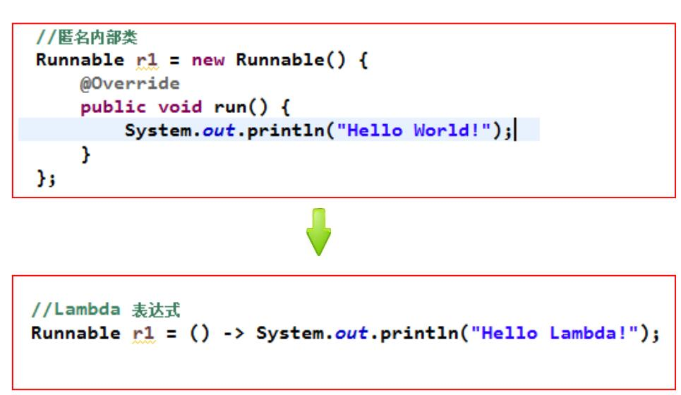
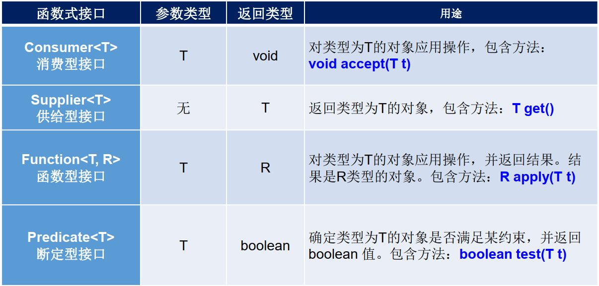
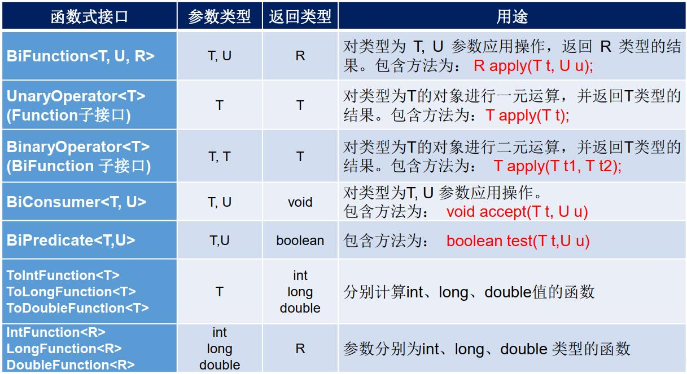

<!--
 * @Author: your name
 * @Date: 2020-04-17 11:22:53
 * @LastEditTime: 2020-04-17 17:12:09
 * @LastEditors: Please set LastEditors
 * @Description: In User Settings Edit
 * @FilePath: \docs\1.basics\1.java-basic\13-函数式编程.md
 -->
# 13 函数式编程

## 13.0 函数式编程综述

属于JDK8的新特性，分为了Lambada表达式与函数式接口两部分

## 13.1 函数式编程

### 13.1.1 为什么要是用Lambda表达式

我觉得就是能少写点程序就是少写点程序，箭头可比代码好用多了

### 13.1.2 Lambda表达式

我们用一个匿名内部类看看是如何转换的



那么一个Lambda表达式就是由三部分组成的：
由三部分组成:
```java
     a.一些参数    b.一个箭头         c.一段代码
        格式:
            (参数列表) -> {一些重写方法的代码};
```
注：
1. 左侧：指定了Lambda表达式需要的参数列表
2. 右侧：指定了Lambda表达式要执行的功能

如：

```java
Runnable r1=()->{System.out.prinln("Hello");};
Consumer<String> con=(String str)->{System.out.prinln(str);}
或者
Consumer<String> con=(str)->{System.out.prinln(str);}
```

注：
1. 参数列表部分：可以省略数据类型不写
&#8195;&#8195;&#8195;&#8195;&#8195;&#8195;&#8195;如果参数只有一个，类型和（）都可以不写
2. 代码部分：&#8195;&#8195;如果代码只有一行，{}可以不写

切记：
1. Lambda必须具有接口，而且接口中有且仅有一个抽象方法
2. Lambda必须具有上下文推断（主要是方法参数或者局部变量是接口类型）


## 13.2 函数式接口

只包含一个抽象方法的接口是函数式接口（<font color="#FF0000">接口中可以包含其他方法（默认、静态、私有）</font>）

```java
@FunctionalInterface
修饰符 interface 接口名称 {
     public abstract 返回值类型 方法名称(可选参数信息);
    // 其他非抽象方法内容
}
为了保证只有一个抽象方法，引入了@FunctionalInterface注解
作用:可以检测接口是否是一个函数式接口
  是:编译成功
  否:编译失败(接口中没有抽象方法抽象方法的个数多余1个)
```

<b>一、程序</b>

```java
@FunctionalInterface
public interface MyFunction{
  public abstract void show();
}

public class MyFunctionImpl implements MyFunction {
    @Override
    public void show() {
        System.out.println("实现类");
    }
}

public class Test {
    public static void main(String[] args) {
        //多态展示
        method(new MyFunctionImpl());
        //匿名内部类
        method(new MyFunction() {
            @Override
            public void show() {
                System.out.println("匿名内部类改变了实现类");
            }
        });
        //函数式编程,只要是接口并且接口只有仅有一个抽象类，那么就可以使用函数式编程，参数的那就得看抽象方法里面又没有参数了
            //若抽象方法为void show2(String str),那么就得使用
            //(m)-> System.out.println(m),见下面更改版程序
        method(()-> System.out.println("Lambda"));

    }
    public static void method(MyFunction m){
        m.show();
    }
}

```

<b>二、结果展示</b>


```java
        实现类
        匿名内部类改变了实现类
        Lambda
```

<b>三、可能存在的问题</b>


<b>一、程序</b>

```java
@FunctionalInterface
public interface MyFunction{
  //public abstract void show();
  void show2(String str);
}

public class MyFunctionImpl implements MyFunction {

    @Override
    public void show2(String str) {
        System.out.println(str);
    }
}


public class Test {
    public static void main(String[] args) {
        //多态展示
        method(new MyFunctionImpl());
        //匿名内部类
        method(new MyFunction() {
            @Override
            public void show2(String str) {
                System.out.println(str);
            }
        });
        //函数式编程
        method((m)-> System.out.println(m));

    }
    public static void method(MyFunction m){
        m.show2("大哥让我来巡山了");
    }
}

```

<b>二、结果展示</b>
```java
大哥让我来巡山了
大哥让我来巡山了
大哥让我来巡山了
```

<b>三、可能存在的问题</b>

### 13.2.1 函数式变成带来了什么好处呢？ 

因为有一些程序不需要马上执行，从而产生性能浪费问题：
比如说拼接字符串，只有满足条件，才开始拼接字符串，节省时间

### 13.2.2 常用函数式接口

#### 13.2.2.0 综述



#### 13.2.2.1 Supplier接口

java.util.function.Supplier<T> 接口仅包含一个无参的方法： T get() 。
Supplier<T>接口被称之为生产型接口,指定接口的泛型是什么类型,那么接口中的get方法就会生产什么类型的数据

<b>一、程序</b>

```java
import java.util.function.Supplier;
public class Supplier01 {
    public static void main(String[] args) {
        int[] arr={1,2,4,67,45};
       getMax(()->{
           int max=arr[0];
           for (int i = 0; i < arr.length; i++) {
               if (max<arr[i]){
                   max=arr[i];
               }
           }
           return max;
       });
    }

    public static void getMax(Supplier<Integer> sup){
        Integer integer = sup.get();
        System.out.println(integer);
    }
}
```

<b>二、结果展示</b>

```java
67
```

<b>三、可能存在的问题</b>

 
#### 13.2.2.2 Consumer接口

java.util.function.Consumer<T>接口,

包含抽象方法void accept(T t)

默认方法:andThen把两个Consumer接口组合到一起,在对数据进行消费
con1.andThen(con2).accept(s); 谁写前边谁先消费

Consumer接口是一个消费型接口,泛型执行什么类型,就可以使用accept方法消费什么类型的数据
 
<b>一、程序</b>

```java
import java.util.function.Consumer;
public class Consumer01 {
    public static void main(String[] args) {
        getString("hello",(s)->{
                        System.out.println(s.toUpperCase());},
                    (t)->{
                        System.out.println(t.toLowerCase());
                    });
    }
    
    public static void getString(String name, Consumer<String> con1,
                                               Consumer<String> con2){
        con1.andThen(con2).accept(name);
        //作用等同于con1.accept（name），con2.accept(name)
    }
}
```

<b>二、结果展示</b>

```java
HELLO
hello
```

<b>三、可能存在的问题</b>

注：生产与消费一个是只生产东西，一个是只花钱
 
#### 13.2.2.3 Predicate接口

java.util.function.Predicate<T>接口作用:对某种数据类型的数据进行判断,结果返回一个boolean值     也是消费型接口

Predicate接口中包含一个抽象方法：

     boolean test(T t):用来对指定数据类型数据进行判断的方法

      结果:   符合条件,返回true        不符合条件,返回false

默认方法:and、or、negate

<b>一、程序</b>

```java
import java.util.ArrayList;
import java.util.function.Predicate;
public class Pre {
    public static void main(String[] args) {
        String[] arr={"迪丽热巴,nv","刘德华,男","谢霆锋帅,男"};
        check(arr,(s)->{
            Boolean a=s.split(",")[0].length() > 3;
            return a;
        }, (t)->{
            Boolean b=t.split(",")[1].contains("男");
        return b;
    });

    }
    public static void check(String[] arr, Predicate<String> str1,
                             Predicate<String> str2){
        ArrayList<String> list = new ArrayList<>();
        for (String s : arr) {
            boolean test = str1.and(str2).test(s);
            if (test){
                list.add(s); 
            }
        }
        System.out.println(list);
    }
}
```
<b>二、结果展示</b>
```java
[谢霆锋帅,男]
```

<b>三、可能存在的问题</b>
 

#### 13.2.2.4 Function接口
java.util.function.Function<T,R>接口用来根据一个类型的数据得到另一个类型的数据，
        前者称为前置条件，后者称为后置条件。               
Function接口中最主要的抽象方法为：R apply(T t)，根据类型T的参数获取类型R的结果。  T转化为R类型
        使用的场景例如：将String类型转换为Integer类型。

默认方法：andThen
Function接口中的默认方法andThen:用来进行组合操作
需求：把String类型的"123",转换为Inteter类型,把转换后的结果加10
把增加之后的Integer类型的数据,转换为String类型


注意：

1. 生产与消费类型接口主要区别在于一个只生产，一个只消费（消费一定要有钱（参数））
2. 定义常见函数的方法与主方法就像是：
    我把你先要怎么处理，是转换还是删除还是大写小写给你处理好，
    主方法你就直接给我这个数值就好了
    就像一个游戏：功能开发完整，你买了账号，充了值，就可以使用了.

 ### 13.2.3 其他接口

 
