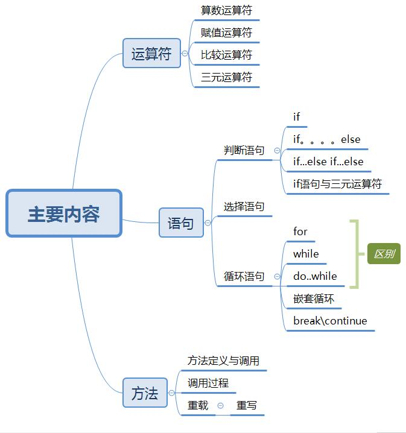
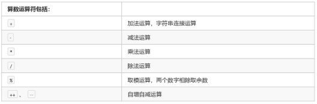
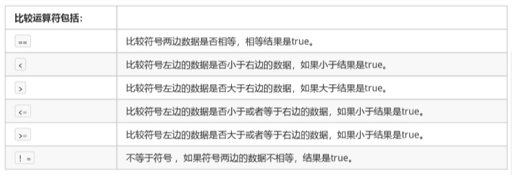

# 1.2 基本语法
## 1.2.0 语法的主要内容

## 1.2.1 算数运算符
<h3>一、基本概念</h3>

### 1.2.1.1 概念1：常用符号


### 1.2.1.2 概念2：分类

赋值运算符分为：
- 1、基本赋值运算符：就是一个等号“=”，代表将右侧的数据交给左侧的变量。 int a = 30;

```html
注意：“=“     与     ”==“     不同
```

- 2、复合赋值运算符：
	- +=		a += 3		相当于		a = a + 3        
	- -=		b -= 4		相当于		b = b - 4
	- *=		c *= 5		相当于		c = c * 5        
	- /=		d /= 6		相当于		d = d / 6
	- %=		e %= 7		相当于		e = e % 7

- 3.<font color=#3695>在单独使用的时候</font>，前++和后++没有任何区别。也就是：++num;和num++;是完全一样的。
  
    - 在混合的时候，有【重大区别】
	    - A. 如果是【前++】（++num），那么变量【立刻马上+1】，然后拿着结果进行使用。	 【先加后用】
	    - B. 如果是【后++】（num++），那么首先使用变量本来的数值，【然后再让变量+1】。   【先用后加】
 <h3>二、可能考察点</h3>
未补充

<h3>三、相关程序</h3>
未补充

## 1.2.2 比较运算符
<h3>一、基本概念</h3>

### 1.2.2.1 概念1：符号


注意事项：
- 1. 比较运算符的结果一定是一个boolean值，成立就是true，不成立就是false
- 2. 如果进行多次判断，不能连着写。例如：1 < x < 3程序当中【不允许】这种写法。

 <h3>二、可能考察点</h3>
未补充

<h3>三、相关程序</h3>
未补充


## 1.2.3 赋值运算符
<h3>一、基本概念</h3>

### 1.2.3.1 概念1：符号
<font color=#56326>
    与（并且）	&&	<br>         
	或（或者）	||  <br>	             
	非（取反）	!	<br>
</font>

注意事项：
1. 逻辑运算符只能用于boolean值。
2. 与、或需要左右各自有一个boolean值，但是取反只要有唯一的一个boolean值即可。
3. 与、或两种运算符，如果有多个条件，可以连续写。
两个条件：   条件A && 条件B     多个条件：条件A && 条件B && 条件C

 <h3>二、可能考察点</h3>
未补充

<h3>三、相关程序</h3>
未补充
 
## 1.2.4 三元运算符

### 1.2.4.1 运算符
- 一元运算符：只需要一个数据就可以进行操作的运算符。<br> 
     例如：取反!、自增++、自减--
- 二元运算符：需要两个数据才可以进行操作的运算符。<br> 例如：加法+、赋值=
- 三元运算符：需要三个数据才可以进行操作的运算符。
  
格式：

数据类型 变量名称 = 条件判断 ? 表达式A : 表达式B;

（条件判断可以使用 “=” “<” “>”等等）

流程：

首先判断条件是否成立：

	如果成立为true，那么将表达式A的值赋值给左侧的变量；
	如果不成立为false，那么将表达式B的值赋值给左侧的变量；
二者选其一。

注意事项：
1. 必须同时保证表达式A和表达式B都符合左侧数据类型的要求。
2. 三元运算符的结果必须被使用。
   
## 1.2.5 判断语句

   <font color=red>判断语句1——if</font>
  
  ```java
		If （关系表达式）{
		                语句体；
		}
 ```

  <font color=red>判断语句2——if....else</font>
  
  ```java
		If（关系表达式）{
                       语句体1；
                              }else{
                       语句体2；
                              }
 ```
 <br>

  <font color=red>判断语句3——if…else if…else</font>

  ```java
	If（关系表达式）{
					语句体1；
					}else if（）{
					语句体2；
					}
					。。。。
					}else if（）{
					语句体n；
					}
					else{
								语句体n+1；
					}
 ```

### 1.2.6 选择语句
```java
Switch（表达式）{
Case 常量值1：语句体1； break；
Case 常量值2：语句体2； break；
Case 常量值3：语句体3； break；
。。。
default：      语句体n+1;break;       
}
```
<br> 

注：
      1. 多个case后面的数值不可以重复。<br>
      2. switch后面小括号当中只能是下列数据类型：<br>
      基本数据类型：byte/short/char/int    引用数据类型：String字符串、enum枚举
    	1.  switch语句格式可以很灵活：前后顺序可以颠倒，而且break语句还可以省略。
“匹配哪一个case就从哪一个位置向下执行，直到遇到了break或者整体结束为止。” 
（比如选择了3，就从星期三开始往下走，直到遇到break停止，遇不到不停止）
1.4.3 循环语句
1.4.3.1 循环语句1——for
for（初始化表达式；布尔表达式；步进表达式）{
循环体
}
  
1.4.3.2 循环语句2——while
  
 
1.4.3.3 循环语句3——do….while
	  
1.4.4.4 三种循环的区别
1. 如果条件判断从来没有满足过，那么for循环和while循环将会执行0次，但是do-while循环会执行至少一次。
2. for循环的变量如果在小括号当中定义，只有循环内部才可以使用。
while循环和do-while循环初始化语句本来就在外面，所以出来循环之后还可以继续使用。
1.4.4.5 跳出语句——break与continue
 
1）break
1. 可以用在switch语句当中，一旦执行，整个switch语句立刻结束。
2. 还可以用在循环语句当中，一旦执行，整个循环语句立刻结束。打断循环。 
2）continue
另一种循环控制语句是continue关键字。
一旦执行，立刻跳过当前次循环剩余内容，马上开始下一次循环。 
注：关于循环的选择，有一个小建议：凡是次数确定的场景多用for循环；否则多用while循环。
 
1.4.4.6 嵌套循环
 
1.5 方法
1.5.1 方法定义与调用
修饰符 返回值类型 方法名称(参数类型 参数名称,...){
方法体
return 返回值;
}
1.5.2 调用过程
 
有返回值：实参把值，带给了形参，并说我带给你了，你快做吧，
          过了一会，形参就在方法体内部计算，算好了，怎么返回呢？想到方法有个返回值类型的兄弟，
但是比较挑剔，我只能返回String类型的数值，好呗，我的int c=a+b；必须要修改为String类型的
好了，返回值兄弟说，可以了，return c，把返回值给了show         （或者创建一个新对象如 new String）
无返回值：实参把值，带给了形参，并说我带给你了，你快做吧，
          过了一会，形参就在方法体内部计算，算好了，没办法返回，那行吧，我只能自己计算了，
你调用我就好了
 
1.5.3 重载定义（注意与重写区别）
对于功能类似的方法来说，因为参数列表不一样，却需要记住那么多不同的方法名称，太麻烦。
方法的重载（Overload）：多个方法的名称一样，但是参数列表不一样。
1. 参数个数不同  2. 参数类型不同  3. 参数的多类型顺序不同 4.参数的名称保持一致 5. 方法的返回值类型保持一致
  

