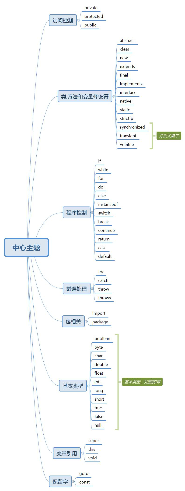
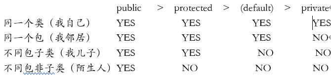

# 3 关键字

## 3.0 关键字综述

## 3.1 访问控制

主要是应用于类、方法或者字段上。可以进行信息保护的作用。
> 

## 3.2 类、方法和 变量修饰符

### 3.2.9 static关键字

### 3.2.12 transient关键字

静态优先于非静态加载到内存中(静态优先于对象进入到内存中)
被static修饰的成员变量不能被序列化的,序列化的都是对象
        private static int age;
        oos.writeObject(new Person("小美女",18));
        Object o = ois.readObject();
        Person{name='小美女', age=0}
    
transient关键字:瞬态关键字
  被transient修饰成员变量,不能被序列化
   private transient int age;
   oos.writeObject(new Person("小美女",18));
   Object o = ois.readObject();
   Person{name='小美女', age=0}

