## 1.6 集合/数组

### 1.6.0 集合/数组综述
* 数组，数组分为一维数组与二维数组，其中二维数组在图论中有过应用（虽然大部分使用链表吧）
* 集合
  
  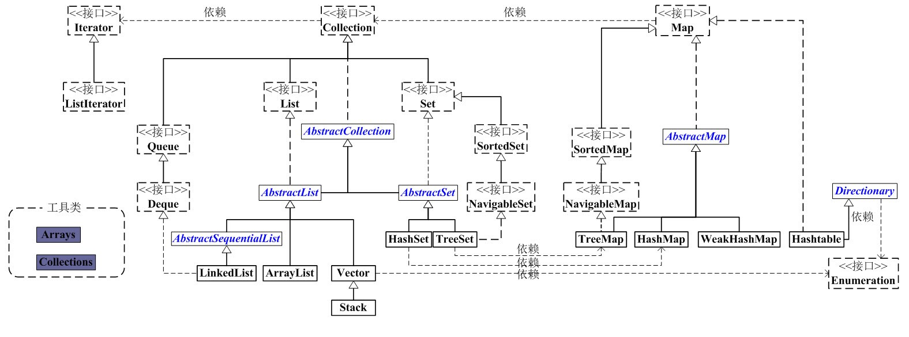

### 1.6.1 数组
#### 1.6.1.1 数组的原理
首先我们要理解一个概念就是堆栈方法区等概念

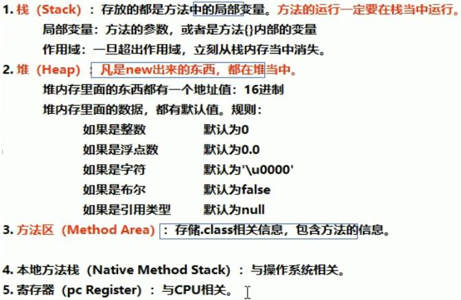

那么我们用一个例子来进行讲解，是怎么工作的：

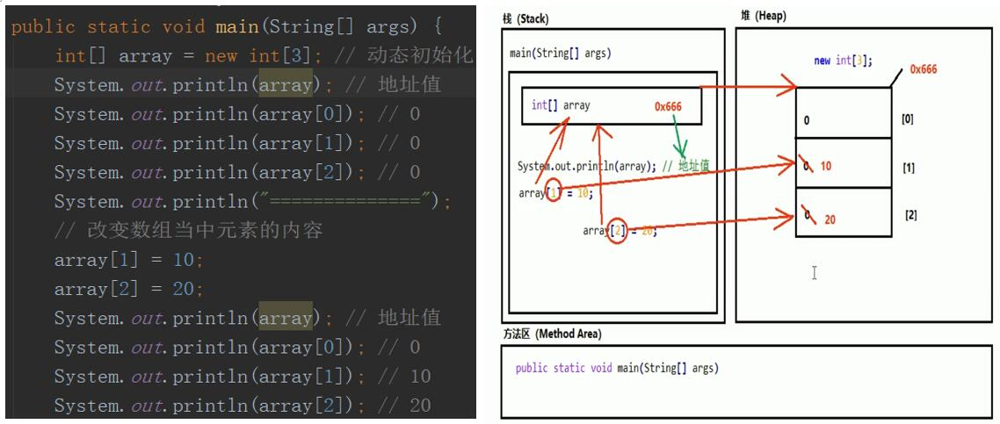

```html
思路分析：
步骤1、程序开始执行，运行.class文件：			
    1）看有几个.class文价
    2）把.class文件放入方法区，
    3）把各个.class文件的main函数放入
步骤2、方法区有了东西，并且是main函数：		        
    1）把main(String[] args)加载到栈内存中，
    2）对于方法的所有局部变量开辟一个小空间
步骤3、变量右侧，若是new出来的，放入堆中	                
    1）在堆里开辟一块内存空间
    2）根据数组数量进行划分，并进行索引编号、默认值等操作
    3）堆确定一个地址值，赋值到栈局部变量中
步骤4、开始赋值操作				        
    1）array[1]=10;array[2]=20;传递给局部变量array
    2）array根据地址去堆中寻找数组
    3）找到数组之后，array[1]、array[2]根据索引值来进行原来数据的覆盖工作

   注：main方法只不过是作为信息存储在方法区，如果要运行main方法，一定要将main（String[] args)加载到栈内存中，
      并且为main方法在栈内存中开辟一个内存空间。（这个动作叫做进入栈内存）
```
#### 1.6.1.2 数组初始化

##### 1.6.1.2.1 动态初始化
&nbsp; &nbsp; &nbsp; &nbsp; 数据类型[] 数组名称 = new 数据类型[数组长度];

&nbsp; &nbsp; &nbsp; &nbsp; &nbsp; &nbsp; &nbsp; &nbsp; <font color=red><b>注:</b></font>内容数据类型是与数据类型保持一致

##### 1.6.1.2.2 静态初始化
&nbsp; &nbsp; &nbsp; &nbsp; 数据类型[] 数组名称 = new 数据类型[] { 元素1, 元素2, ... };

&nbsp; &nbsp; &nbsp; &nbsp; &nbsp; &nbsp; &nbsp; &nbsp; 注：虽然静态初始化没有直接告诉长度，但是根据大括号里面的元素具体内容，也可以自动推算出来长度。

##### 1.6.1.2.3 省略初始化
&nbsp; &nbsp; &nbsp; &nbsp;省略格式：数据类型[] 数组名称 = { 元素1, 元素2, ... };

&nbsp; &nbsp; &nbsp; &nbsp;&nbsp;<font color=red><b>注:</b></font>

&nbsp; &nbsp; &nbsp; &nbsp;&nbsp;&nbsp; &nbsp; &nbsp; &nbsp;&nbsp;1. 静态初始化没有直接指定长度，但是仍然会自动推算得到长度。

&nbsp; &nbsp; &nbsp; &nbsp;&nbsp;&nbsp; &nbsp; &nbsp; &nbsp;&nbsp;2. 静态初始化标准格式可以拆分成为两个步骤。

&nbsp; &nbsp; &nbsp; &nbsp;&nbsp;&nbsp; &nbsp; &nbsp; &nbsp;&nbsp;3. 动态初始化也可以拆分成为两个步骤。

&nbsp; &nbsp; &nbsp; &nbsp;&nbsp;&nbsp; &nbsp; &nbsp; &nbsp;&nbsp;4. 静态初始化一旦使用省略格式，就不能拆分成为两个步骤了。

#### 1.6.1.3 数组的访问
&nbsp; &nbsp; &nbsp; &nbsp;直接打印数组名称，得到的是数组对应的：内存地址哈希值。（与容器打印区别）

&nbsp; &nbsp; &nbsp; &nbsp;访问数组元素的格式：数组名称[索引值]

&nbsp; &nbsp; &nbsp; &nbsp;<font color=red><b>注:</b></font>索引值从0开始，一直到“数组的长度-1”为止。
 
#### 1.6.1.4 数组初始化
&nbsp; &nbsp; &nbsp; &nbsp;使用动态初始化数组的时候，其中的元素将会自动拥有一个默认值。规则如下：
<b>
```html
      如果是整数类型，那么默认为0；
      如果是浮点类型，那么默认为0.0；
      如果是字符类型，那么默认为'\u0000'；
      如果是布尔类型，那么默认为false；
      如果是引用类型，那么默认为null。
```
</b>

<font color=red><b>注:</b></font>

&nbsp; &nbsp; &nbsp; &nbsp;静态初始化其实也有默认值的过程，只不过系统自动马上将默认值替换成为了大括号当中的具体数值。

#### 1.6.1.4 数组常用方法
##### 1.6.1.4.1 数据索引越界
&nbsp; &nbsp; &nbsp; &nbsp;数组的索引编号从0开始，一直到“数组的长度-1”为止。如果访问数组元素的时候，索引编号并不存在，那么将会发生
数组索引越界异常ArrayIndexOutOfBoundsException
原因：索引编号写错了。       解决：修改成为存在的正确索引编号。
##### 1.6.1.4.2 空指针异常
&nbsp; &nbsp; &nbsp; &nbsp;所有的引用类型变量，都可以赋值为一个null值。但是代表其中什么都没有。
数组必须进行new初始化才能使用其中的元素。如果只是赋值了一个null，没有进行new创建，那么将会发生：
空指针异常NullPointerException
原因：忘了new               解决：补上new
##### 1.6.1.4.3 数组长度
&nbsp; &nbsp; &nbsp; &nbsp;如何获取数组的长度，格式：数组名称.length
这将会得到一个int数字，代表数组的长度。数组一旦创建，程序运行期间，长度不可改变。
 
##### 1.6.1.4.4 数组遍历

三种方式：

&nbsp; &nbsp; &nbsp; &nbsp;<font color=#3562fc><b>方式一：</b></font>for循环

&nbsp; &nbsp; &nbsp; &nbsp;<font color=#3562fc><b>方式二：</b></font>增强for循环

&nbsp; &nbsp; &nbsp; &nbsp;<font color=#3562fc><b>方式三：</b></font>迭代器（主要是在集合中使用）

<b>一、程序</b>

```java
public class ArrayFor {
    public static void main(String[] args) {
       int[] array={1,3,4,5,67,8,990,2534,4,57,35,3253,5456,34,6,37,564,457,45,34225};
        for (int i = 0; i < array.length; i++) {
            System.out.print(array[i]+"\t");
        }
        System.out.println();
        System.out.println("--------------------------------");
        for (int i : array) {
            System.out.print(i+"\t");
        }
    }
}
```
<br>

<b>二、结果展示</b>

```html
1	3	4	5	67	8	990	2534	4	57	35	3253	5456	34	6	37	564	457	45	34225	
------------------------------------------------------------------------------------------------------------------------------------------------------------------
1	3	4	5	67	8	990	2534	4	57	35	3253	5456	34	6	37	564	457	45	34225	
Process finished with exit code 0
```

<b>三、可能出现的问题</b>

暂无

##### 1.6.1.4.5 数组的最大（小）值
 
<b>一、程序</b>

```java
public class MaxMin {
    public static void main(String[] args) {
        int[] array={1,3,4,5,67,8,990,2534,4,57,35,3253,5456,34,6,37,564,457,45,34};
        int max=array[0];
        for (int i = 0; i < array.length; i++) {
            if (max<array[i]){
                max=array[i];
            }
        }
        System.out.println(max);
    }
}
```
<br>

<b>二、结果展示</b>
```html
5456
```

<b>三、可能出现的问题</b>

暂无 

### 1.6.2 集合

#### 1.6.2.1 Collection接口
##### 1.6.2.1.1 Collection分类
Collection：<font color=red>单列集合类</font>的根接口，用于存储一系列符合某种规则的元素

&nbsp; &nbsp; &nbsp; &nbsp;它有两个重要的子接口，分别是<font style="background:yellow">单列集合类</font>java.util.List 和 <font style="background:yellow">java.util.Set</font>。

&nbsp; &nbsp; &nbsp; &nbsp;&nbsp;&nbsp;&nbsp;List 的特点是元素有序、元素可重复。 接口的主要实现类有 java.util.ArrayList 和 java.util.LinkedList
&nbsp; &nbsp; &nbsp; &nbsp;&nbsp;&nbsp;&nbsp;Set 的特点是元素无序，而且不可重复。Set 接口的主要实现类有 java.util.HashSet 和 java.util.TreeSet 。
 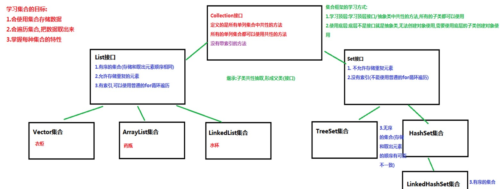
<font color=red><b>问题:</b></font>集合与数组都是容器，那么有什么区别呢？

- 1.数组长度固定，集合的长度是可以变化的
- 2.数组存储的是<font color=#24fff style="background: linear-gradient(red, blue)">同一类型</font>,可以存储基本数据类型
&nbsp; &nbsp;集合存储的是<font color=#24fff style="background: linear-gradient(red, blue)">对象</font>，对象的类型可以不一致。
##### 1.6.2.1.2 通用操作 

<b>一、CURD操作</b>

```java
      public boolean add(E e)：  把给定的对象添加到当前集合中。

      public void clear() :清空集合中所有的元素。

      public boolean remove(E e): 把给定的对象在当前集合中删除。

      public boolean contains(E e): 判断当前集合中是否包含给定的对象。

      public boolean isEmpty(): 判断当前集合是否为空。

      public int size(): 返回集合中元素的个数。

      public Object[] toArray(): 把集合中的元素，存储到数组中。
```
<br>

<b>二、遍历操作</b> 

* <font size="20" color=red>itrator迭代器</font>
  
&nbsp; &nbsp;&nbsp; &nbsp;&nbsp;在程序开发中，经常需要遍历集合中的所有元素。针对这种需求，JDK专门提供了<font color=#0000f style="background: linear-gradient(to right,red,yellow)">一个接口java.util.Iterator</font>

有两个常用的方法

```java
        boolean hasNext()     判断集合中还有没有下一个元素,有就返回true,没有就返回false
        E next()              取出集合中的下一个元素
```
 
使用：

~~<font color=#0000f>方法1：</font>
 Iterator迭代器,是一个接口,我们无法直接使用,需要使用Iterator接口的实现类对象,获取实现类的方式比较特殊.~~

<font color=#0000f>方法2：</font>Collection接口中有一个方法,叫iterator(),这个方法返回的就是迭代器的实现类对象 
（多态书写格式有两种，其中一种是接口）
 Iterator<E> iterator() 返回在此 collection 的元素上进行迭代的迭代器。

<b>一、程序</b>

```java
public class Demo200412Itrator {
    public static void main(String[] args) {
        Collection<String> list = new ArrayList<>();
        list.add("1");
        list.add("2");
        list.add("3");
        //遍历集合
        Iterator<String> iterator = list.iterator();
        while (iterator.hasNext()){
            String next = iterator.next();
            System.out.println(next);
        }
    }
}
```
<br>

<b>二、结果展示</b>
```html
        1
        2
        3
```

<b>三、可能出现的问题</b>

1.hasNext作用是什么？
2.迭代器的判断流程
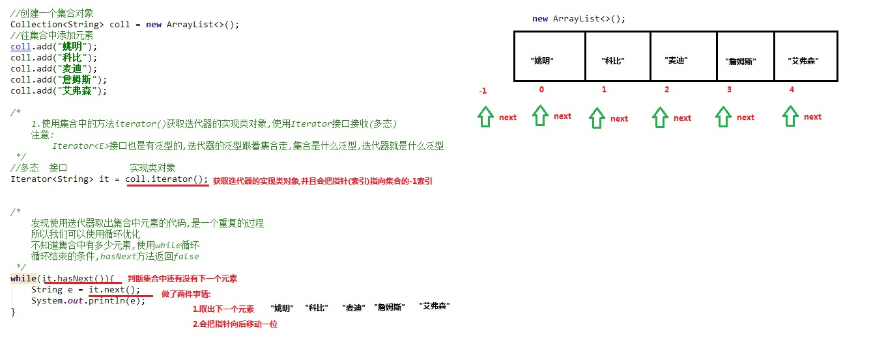 


* <font size="20" color=red>Stream</font>
  
&nbsp; &nbsp;&nbsp; &nbsp;&nbsp;本节的更多内容请查看[java8~14新特性章节](/1.basics/1.java-basic/22-新特性.md)

&nbsp; &nbsp;&nbsp; &nbsp;&nbsp;通过方法forEach进行遍历，更加快捷
 
 &nbsp; &nbsp;&nbsp; &nbsp;&nbsp;&nbsp; &nbsp;&nbsp; &nbsp;&nbsp;注：这个是java9 的新特性
 <b>一、程序</b>

```java
public class forEach {
    public static void main(String[] args) {
        Stream stream = Stream.of("1", 3, 34.67, '2');
        stream.forEach((t)->{
            System.out.println(t);
        });
    }
}
```
<br>

<b>二、结果展示</b>
```html
        1
        3
        34.67
        2
```

<b>三、可能出现的问题</b>

暂无
 
* <font size="20" color=red>增强for循环</font>

```java
                              随便起名
        for(集合/数组的数据类型 变量名: 集合名/数组名){
            sout(变量名);
        }
```

增强for循环:用来遍历集合和数组        <font color=red>数组变量名</font>.for即可以快速创建
注：想要遍历什么集合数组就在 <font style="background:yellow">集合名/数组名</font>中输入什么集合数组，<font style="background:yellow">数据类型</font>就是根据集合数组确定
具体程序详见[]


##### 1.6.2.1.3 List接口

###### 1.6.2.1.3.1 List特点

&nbsp; &nbsp;&nbsp; &nbsp;&nbsp;1.有序的集合,存储元素和取出元素的顺序是一致的(存储123 取出123)

&nbsp; &nbsp;&nbsp; &nbsp;&nbsp;2.有索引,包含了一些带索引的方法

&nbsp; &nbsp;&nbsp; &nbsp;&nbsp;3.允许存储重复的元素

###### 1.6.2.1.3.1 List常用集合

* <font size="20" color=red>ArrayList集合</font>


&nbsp; &nbsp;&nbsp; &nbsp;数组的长度不可以发生改变。但是ArrayList集合的长度是可以随意变化的。

&nbsp; &nbsp;&nbsp; &nbsp;对于ArrayList来说，有一个尖括号<E>代表泛型（[泛型详细内容]()）。

&nbsp; &nbsp;&nbsp; &nbsp;&nbsp; &nbsp;&nbsp; &nbsp;注意：泛型只能是引用类型，不能是基本类型。

注：

&nbsp; &nbsp;&nbsp; &nbsp;对于ArrayList集合来说，直接打印得到的不是地址值，而是<font color=#fdcbe>内容</font>。如果内容是空，得到的是空的中括号：[]

&nbsp; &nbsp;&nbsp; &nbsp;对于数组来说，直接打印的是地址值哈希值
  
如果希望向集合ArrayList当中存储基本类型数据，必须使用基本类型对应的“包装类”。([包装类详细内容](/1.basics/1.java-basic/1-shujuleixing.md))

* <font size="20" color=red> LinkedList集合(队列)</font>

LinkedList集合的特点:

        1.底层是一个链表结构:查询慢,增删快

        2.里边包含了大量操作首尾元素的方法
<br>
 
&nbsp; &nbsp;&nbsp; &nbsp;注意:使用LinkedList集合特有的方法,不能使用<font color=red>多态</font>  

```java
 public void addFirst(E e):
将指定元素插入此列表的开头。
 public void addLast(E e):
将指定元素添加到此列表的结尾。此方法等效于add
 public void push(E e):
将元素推入此列表所表示的堆栈。此方法等效于addFirst
 public E getFirst():
返回此列表的第一个元素。
 public E getLast():
返回此列表的最后一个元素。
 public E removeFirst():
移除并返回此列表第一个元素。
 public E removeLast():
移除并返回此列表的最后一个元素。
 public E pop():
从此列表所表示的堆栈处弹出一个元素。此方法等效于removeFirst（但是先运行removeFirst才运行pop） 
 public boolean isEmpty()：
如果列表不包含元素，则返回true。
```
* <font size="20" color=red>Vector集合</font>
 
 &nbsp; &nbsp;&nbsp; &nbsp;Vector与ArrayList一样可以维护一个插入顺序，但ArrayList比Vector快，在<font color=red>非多线程</font>环境中选择ArrayList方式

 &nbsp; &nbsp;&nbsp; &nbsp;Vector 可实现自动增长的对象数组。 java.util.vector提供了向量类(vector)以实现类似动态数组的功能。创建了一个向量类的对象后，可以往其中随意插入不同类的对象，对于预先不知或者不愿预先定义数组大小，并且需要频繁地进行查找，插入，删除工作的情况。可以考虑使用向量类。

 向量类提供类三种构造方法:
 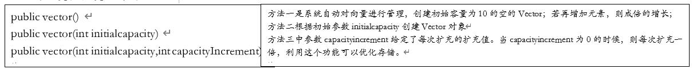

 &nbsp; &nbsp;&nbsp; &nbsp;注：对同一个向量对象，亦可以在其中插入不同类的对象。但插入的应是对象而不是数值，所以插入数值时要注意将数组转换成相应的对象。

线程安全问题(重新看一下)

&nbsp; &nbsp;&nbsp; &nbsp;线程安全就是多线程访问时，采用了加锁机制，当一个线程访问该类的某个数据时，进行保护，其他线程不能进行访问直到该线程读取完，其他线程才可使用。不会出现数据不一致或者数据污染。线程不安全就是不提供数据访问保护，有可能出现多个线程先后更改数据造成所得到的数据是脏数据。

Vector内部如何实现线程安全

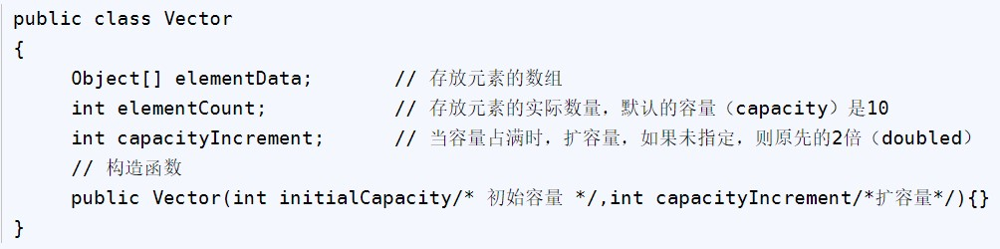

  
Vector类中的capacity()/size()/isEmpty()/indexOf()/lastIndexOf()/removeElement()/addElement() 等方法均是 sychronized的，所以，对Vector的操作均是线程安全的。

对于Vector的操作均是线程安全这句话还需要注意一点是：如果是单个方法进行调用是线程安全的，但是如果是组合的方式进行调用则需要再次进行同步处理，例如：

```java
if (!vector.contains(element)) 
    vector.add(element); 
    ...
}
```

这是经典的 put-if-absent 情况，尽管 contains, add 方法都正确地同步了，但作为 vector 之外的使用环境，仍然存在race condition: 因为虽然条件判断 if (!vector.contains(element))与方法调用 vector.add(element)都是原子性的操作 (atomic)，但在 if条件判断为真后，那个用来访问vector.contains 方法的锁已经释放，在即将的 vector.add 方法调用之间有间隙，在多线程环境中，完全有可能被其他线程获得 vector的 lock 并改变其状态, 此时当前线程的vector.add(element); 正在等待（只不过我们不知道而已）。只有当其他线程释放了 vector 的 lock 后，vector.add(element); 继续，但此时它已经基于一个错误的假设了。

单个的方法 synchronized 了并不代表组合（compound）的方法调用具有原子性，使 compound actions 成为线程安全的可能解决办法之一还是离不开intrinsic lock (这个锁应该是 vector 的，但由 client 维护)：

所以在回答Vector与ArrayList的区别时，应该这样回答：

Vector 和 ArrayList 实现了同一接口 List, 但所有的 Vector 的方法都具有 synchronized 关键修饰。但对于复合操作，Vector 仍然需要进行同步处理。

为什么ArrayList线程不安全？

 如一个 ArrayList ，在添加一个元素的时候，它可能会有两步来完成：

* 1.在 Items[Size] 的位置存放此元素；
* 2.增大 Size 的值。
  
 在单线程运行的情况下，如果 Size = 0，添加一个元素后，此元素在位置 0，而且 Size=1； 而如果是在多线程情况下，比如有两个线程，线程 A 先将元素存放在位置 0。但是此时 CPU 调度线程A暂停，线程 B 得到运行的机会。线程B也向此 ArrayList 添加元素，因为此时 Size 仍然等于 0 （注意哦，我们假设的是添加一个元素是要两个步骤哦，而线程A仅仅完成了步骤1），所以线程B也将元素存放在位置0。然后线程A和线程B都继续运行，都增加 Size 的值。现在看看 ArrayList 的情况，元素实际上只有一个，存放在位置 0，而 Size 却等于 2。这就是“线程不安全”了。

虽然ArrayList是非线程安全的，要想实现线程安全的ArrayList，可在ArrayList的基础上通过同步块来实现，或者使用同步包装器（Collections.synchronizedList），还可以使用J.U.C中的CopyOnWriteArrayList。
   
但如果不使用的话，ArrayList的非线程安全带来的问题：
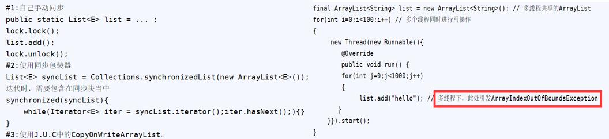

##### 1.6.2.1.5 Set接口

###### 1.6.2.1.5.1 Set特点——集合存储不重复的原理
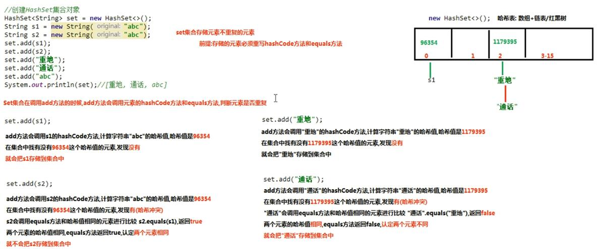

###### 1.6.2.1.5.2 Set常用集合

* <font size="20" color=red>HashSet</font>
  
  1.java.util.HashSet集合 implements Set接口 
    HashSet特点:
         1.不允许存储重复的元素
         2.没有索引,没有带索引的方法,也不能使用普通的for循环遍历
         3.是一个无序的集合,存储元素和取出元素的顺序有可能不一致
         4.底层是一个哈希表结构(查询的速度非常的快)
<b>一、程序</b>

```java
public class hashset {
    public static void main(String[] args) {
       HashSet<String> set = new HashSet<>();
        set.add("1");
        set.add("2");
        set.add("3");

        Iterator<String> it = set.iterator();
        while (it.hasNext()){
            String next = it.next();
            System.out.println(next);
        }
    }
}
```
<br>

<b>二、结果展示</b>
```html
        1
        2
        3
```

<b>三、可能出现的问题</b>

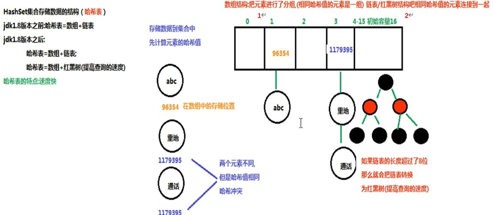 
<br>
2.HashSet存储自定义类型的元素
    
    set集合保证元素唯一:
        存储的元素(String,Integer,...Student,Person...),
          必须重写hashCode方法和equals方法
    要求:同名同年龄的人,视为同一个人,只能存储一次
 
<b>一、程序</b>

I Person类

```java
import java.util.Objects;

public class Person {
    private int age;
    private String name;
    public Person() { }
    public Person(int age, String name) {
        this.age = age;
        this.name = name;
    }
    @Override
    public boolean equals(Object o) {
        if (this == o) return true;
        if (o == null || getClass() != o.getClass()) return false;
        Person person = (Person) o;
        return age == person.age &&
                Objects.equals(name, person.name);
    }

    @Override
    public int hashCode() { return Objects.hash(age, name); }
    public int getAge() { return age; }
    public void setAge(int age) { this.age = age; }
    public String getName() { return name; }
    public void setName(String name) { this.name = name; }
    @Override
    public String toString() {
        return "Person{" +
                "age=" + age +
                ", name='" + name + '\'' +
                '}';
    }
}
```

II 程序

```java
import java.util.HashSet;

public class Define {
    public static void main(String[] args) {
        Person a = new Person(23, "老大");
        Person b = new Person(45, "老二");
        Person c = new Person(23, "老大");
        HashSet<Person> people = new HashSet<>();
        people.add(a);
        people.add(b);
        people.add(c);
        System.out.println(people);
    }
}
```
<br>

<b>二、结果展示</b>
```html
[Person{age=45, name='老二'}, Person{age=23, name='老大'}]
```

<b>三、可能出现的问题</b>

暂无 

* <font size="20" color=red>LinkedHashSet</font>
  
<font color=#3ffde><b>由于HashSet存在乱序的情况，那么就需要改善一下这个问题</b></font>
java.util.LinkedHashSet集合 extends HashSet集合
 LinkedHashSet集合特点:底层是一个哈希表(数组+链表/红黑树)+链表:多了一条链表(记录元素的存储顺序),保证元素有序

<b>一、程序</b>

```java
public class Demo {
    public static void main(String[] args) {
        Set<String> set = new LinkedHashSet<>();
        set.add("3");
        set.add("1");
        set.add("2");

        Iterator<String> it = set.iterator();
        while (it.hasNext()){
            String next = it.next();
            System.out.println(next);
        }
    }
}
```
<br>

<b>二、结果展示</b>

```html
3
1
2
```

<b>三、可能出现的问题</b>

暂无

#### 1.6.2.2 Map

##### 1.6.2.2.1 Map分类

* java.util.Map<k,v>集合

```html
    Map集合的特点:
        1.Map集合是一个双列集合,一个元素包含两个值(一个key,一个value)
        2.Map集合中的元素,key和value的数据类型可以相同,也可以不同
        3.Map集合中的元素,key是不允许重复的,value是可以重复的
        4.Map集合中的元素,key和value是一一对应
```

* java.util.HashMap<k,v>集合 implements Map<k,v>接口

```html
    HashMap集合的特点:
        1.HashMap集合底层是哈希表:查询的速度特别的快     
        注意与HashSet集合底层是哈希表
            JDK1.8之前:数组+单向链表     JDK1.8之后:数组+单向链表|红黑树(链表的长度超过8):提高查询的速度
        2.hashMap集合是一个无序的集合,存储元素和取出元素的顺序有可能不一致
```

* java.util.LinkedHashMap<k,v>集合 extends HashMap<k,v>集合 

```html    
   LinkedHashMap的特点:
        1.LinkedHashMap集合底层是哈希表+链表(保证迭代的顺序)
        2.LinkedHashMap集合是一个有序的集合,存储元素和取出元素的顺序是一致的
```
##### 1.6.2.2.2 通用功能

<b>一、CURD操作</b>

```java
public V put(K key, V value) :      把指定的键与指定的值添加到Map集合中。
public V remove(Object key) :       把指定的键 所对应的键值对元素 在Map集合中删除，返回被删除元素的值。
public V get(Object key):           根据指定的键，在Map集合中获取对应的值
boolean containsKey(Object key):    判断集合中是否包含指定的键。
boolean containsValue(Object key) : 判断集合中是否包含指定的值。
```

<b>二、遍历操作</b>

* <font size="20" color=red>Map集合遍历——键找值方式</font>
public Set<K> keySet() : 获取Map集合中所有的键，存储到Set集合中。
遍历基本原理：
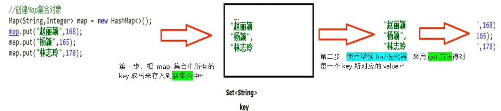

<b>一、程序</b>

```java
public class Demo {
    public static void main(String[] args) {
        HashMap<String, Integer> map = new HashMap<>();
        map.put("大哥",23);
        map.put("二哥",45);
        //获取map集合中的键
        Set<String> set = map.keySet();
        //方式一：增强for循环
        for (String key : set) {
            Integer value = map.get(key);
            System.out.println(key+"----"+value);
        }
        //方式二：迭代器
        Iterator<String> it = set.iterator();//使用迭代器必须使用这个
        while (it.hasNext()){
            String key = it.next();
            Integer value = map.get(key);
            System.out.println(key+"--------"+value);
        }

    }
}

```
<br>

<b>二、结果展示</b>

```html
二哥----45
大哥----23
二哥--------45
大哥--------23
```

<b>三、可能出现的问题</b>

暂无

 * <font size="20" color=red>Map集合遍历——键值对方式</font>

Map集合遍历的第二种方式:使用Entry对象遍历
    Map集合中的方法Set<Map.Entry<K,V>> entrySet() 返回此映射中包含的映射关系的 Set 视图。
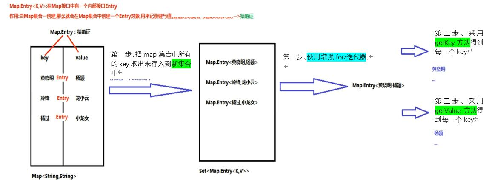


<b>一、程序</b>

```java
public class Demo {
    public static void main(String[] args) {
        HashMap<String, Integer> map = new HashMap<>();
        map.put("大哥",23);
        map.put("二哥",45);
        Set<Map.Entry<String, Integer>> set = map.entrySet();
        //方式一；增强for循环
        for (Map.Entry<String, Integer> map1 : set) {
            String key = map1.getKey();
            Integer value = map1.getValue();
            System.out.println(key+"----"+value);
        }
        //方式二：迭代器
        Iterator<Map.Entry<String, Integer>> it = set.iterator();
        while (it.hasNext()){
            Map.Entry<String, Integer> map1 = it.next();
            String key = map1.getKey();
            Integer value = map1.getValue();
            System.out.println(key+"----"+value);
        }
    }
}

```
<br>

<b>二、结果展示</b>

```html
        二哥----45
        大哥----23
        二哥----45
        大哥----23
```

<b>三、可能出现的问题</b>

暂无

##### 1.6.2.2.3 常见的集合

* <font size="20" color=red>HashMap</font>
* <font size="20" color=red>LinkedHashMap</font>
* <font size="20" color=red>HashTable</font>
  
  注：
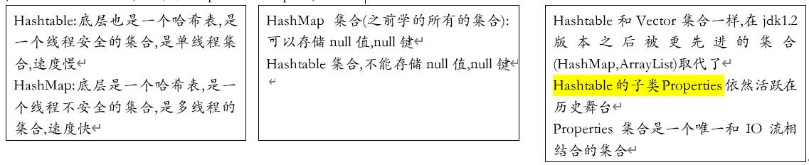


#### 1.6.2.3 Collections

##### 1.6.2.3.1 Collections特点

##### 1.6.2.3.2 通用操作

<b>一、CURD操作</b>

```java
public static <T> boolean addAll(Collection<T> c, T... elements): 往集合中添加一些元素。
public static void shuffle(List<?> list):                         打乱顺序
public static <T> void sort(List<T> list):                        将集合中元素按照默认规则排序。
public static <T> void sort(List<T> list，Comparator<? super T> ):将集合中元素按照指定规则排序。
```

<br>

<b>二、大小操作Comparator与Comparable</b>

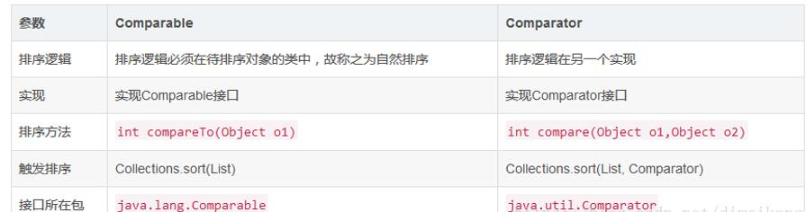

排序可能遇到的问题：
* 1.按照java规定好的进行排序：
```java
  public static <T> void sort(List<T> list)                        :将集合中元素按照默认规则排序。（已有类型排序规则已经重写）
  public static <T> void sort(List<T> list，Comparator<? super T> ):将集合中元素按照指定规则排序。（在类函数中进行说明）
```
* 2.自定义类型排序规则 
在自定义规则排序中，就有两种形式：Comparator与Comparable

* <font size="20" color=red>Comparable——不牵扯第三方</font>

&nbsp; &nbsp;&nbsp; &nbsp;&nbsp; Comparable可以认为是一个内比较器，实现原则就是某个类，与我进行比较，不依赖第三方，

&nbsp; &nbsp;&nbsp; &nbsp;&nbsp; Comparabl步骤：

&nbsp; &nbsp;&nbsp; &nbsp;&nbsp; &nbsp; &nbsp;&nbsp; &nbsp;&nbsp; 1）在类中实现Comparable接口

&nbsp; &nbsp;&nbsp; &nbsp;&nbsp; &nbsp; &nbsp;&nbsp; &nbsp;&nbsp; 2）重写compareTo（）方法

不改写时判断条件就是：
&nbsp; &nbsp;&nbsp; &nbsp;&nbsp; &nbsp;1、比较者大于被比较者（也就是compareTo方法里面的对象），那么返回正整数
&nbsp; &nbsp;&nbsp; &nbsp;&nbsp; &nbsp;2、比较者等于被比较者，那么返回0
&nbsp; &nbsp;&nbsp; &nbsp;&nbsp; &nbsp;3、比较者小于被比较者，那么返回负整数


<b>一、程序</b>

I perosn类
  * 一定更要注意实现了Comparable
  * 重写了compareTo方法
```java
public class Person implements java.lang.Comparable<Person> {
    private String name;
    private int age;
    public Person() {}
    public Person(String name, int age) {
        this.name = name;
        this.age = age;
    }

    public String getName() { return name; }
    public void setName(String name) { this.name = name; }
    public int getAge() { return age; }
    public void setAge(int age) { this.age = age; }
    @Override
    //改写方式一：
    public int compareTo(Person o) {
        if (this.getAge()<o.getAge()){
            return -1;
        }
        if (this.getAge()==o.getAge()){
            return 0;
        }
        else{
            return 1;
        }
        //改写方式二：
        //return this.getAge()-o.getAge();
    }

    @Override
    public String toString() {
        return "Person{" +
                "name='" + name + '\'' +
                ", age=" + age +
                '}';
    }
}

```
II 程序

```java
public class Comparable {
    public static void main(String[] args) {
        Person a = new Person("sun", 45);
        Person b = new Person("haor", 90);
        Person c = new Person("gafa", 56);
        Person d = new Person("jfg", 45);
        Person e = new Person("dfh", 789);

        //添加元素到集合
        ArrayList<Person> people = new ArrayList<>();
        Collections.addAll(people, a, b, c, d, e);

        //排序
        Collections.sort(people);
        System.out.println(people);
     }
}
```
<br>

<b>二、结果展示</b>

```html
[Person{name='sun', age=45}, Person{name='jfg', age=45}, Person{name='gafa', age=56}, Person{name='haor', age=90}, Person{name='dfh', age=789}]
```

<b>三、可能出现的问题</b>

  暂无

* <font size="20" color=red>Comparator——找第三方</font>

&nbsp; &nbsp;&nbsp; &nbsp;&nbsp; &nbsp;Comparator接口里面有一个compare方法，方法有两个参数T o1和T o2，是泛型的表示方式，分别表示待比较的两个对象，方法返回值和Comparable接口一样是int，有三种情况：
1、o1大于o2，返回正整数
2、o1等于o2，返回0
3、o1小于o3，返回负整数
注意：有两种书写方式
方式一：
<b>一、程序</b>

I、Person

```java
public class Student implements Comparator<Student> {
    private String name;
    private int age;
    public Student() {}
    public Student(String name, int age) {
        this.name = name;
        this.age = age;
    }
    public String getName() { return name; }
    public void setName(String name) { this.name = name; }
    public int getAge() { return age; }
    public void setAge(int age) { this.age = age; }
    @Override
    public int compare(Student o1, Student o2) {
        if (o1.getAge()<o2.getAge()){
            return -1;
        }
        if (o1.getAge()==o2.getAge()){
            return 0;
        }
        else{
            return 1;
        }
    }

    @Override
    public String toString() {
        return "Person{" +
                "name='" + name + '\'' +
                ", age=" + age +
                '}';
    }


}
```
<br>

II、程序

```java
public class Comparator {
    public static void main(String[] args) {
        Student a = new Student("sun", 45);
        Student b = new Student("a", 90);
        Student c = new Student("g", 90);
        Student d = new Student("jfg", 45);
        Student e = new Student("dfh", 21);

        //添加元素到集合
        ArrayList<Student> list = new ArrayList<>();
        Collections.addAll(list, a, b, c, d, e);

        //排序
        Collections.sort(list,new Student());
        System.out.println(list);
        System.out.println("====================");
        //方式二：
        //方式一还是在相应的类进行修改，看起来还是太麻烦了，我们采用匿名内部类做，会好看很多
        Collections.sort(list, new java.util.Comparator<Student>() {
            @Override
            public int compare(Student o1, Student o2) {
                if (o1.getName()=="g"){
                    return 1;
                }
                else{
                    return 0;
                }
            }
        });
        System.out.println(list);
    }
}
```

<b>二、结果展示</b>

```html
[Person{name='dfh', age=21}, Person{name='sun', age=45}, Person{name='jfg', age=45}, Person{name='a', age=90}, Person{name='g', age=90}]
====================
[Person{name='dfh', age=21}, Person{name='sun', age=45}, Person{name='jfg', age=45}, Person{name='a', age=90}, Person{name='g', age=90}]

```
<b>三、可能出现的问题</b>
暂无

<h4>优缺点分析</h4>
1. 实现Comparable接口的方式比实现Comparator接口的耦合性要强一些，在复杂程序不利于修改
2. 如果实现类没有实现Comparable接口，又想对两个类进行比较（或者实现类实现了Comparable接口，但是对compareTo方法内的比较算法不满意），那么可以实现Comparator接口，自定义一个比较器，写比较算法


#### 1.6.2.4 Arrays类

&nbsp; &nbsp;&nbsp; &nbsp;&nbsp; java.util.Arrays是一个与<font style="background:yellow">数组</font>相关的工具类，里面提供了大量<font color=green>静态方法（不用创建对象）</font>，用来实现数组常见的操作。

```java
public static String toString(数组)：   将参数数组变成字符串（按照默认格式：[元素1, 元素2, 元素3...]）  
public static void sort(数组)：         按照默认升序（从小到大）对数组的元素进行排序。
```
* 字符串转换为数组
  - toCharArray方法、getBytes方法，前者是对应的字符数组，后者对应字节数组
  - String的构造方法

备注：

&nbsp; &nbsp;&nbsp; &nbsp;&nbsp; &nbsp;&nbsp; &nbsp;1. 如果是数值，sort默认按照升序从小到大
&nbsp; &nbsp;&nbsp; &nbsp;&nbsp; &nbsp;&nbsp; &nbsp;2. 如果是字符串，sort默认按照字母升序
&nbsp; &nbsp;&nbsp; &nbsp;&nbsp; &nbsp;&nbsp; &nbsp;3. 如果是自定义的类型，那么这个自定义的类需要有Comparable或者Comparator接口的支持。
 
