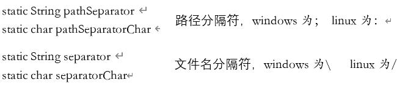
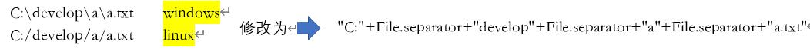
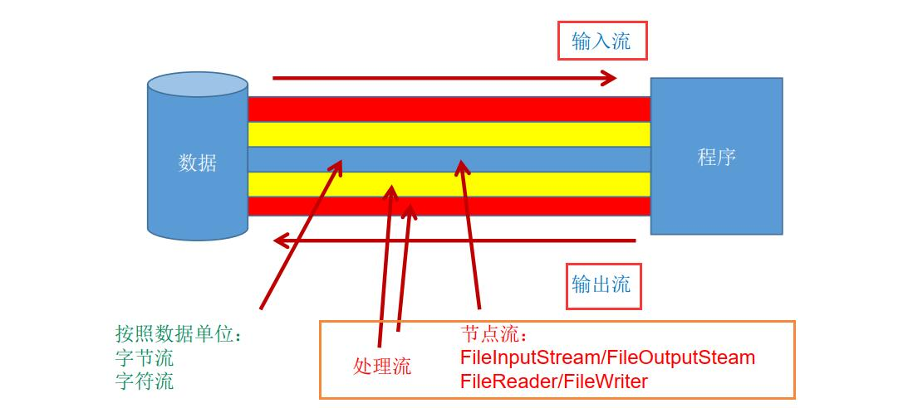
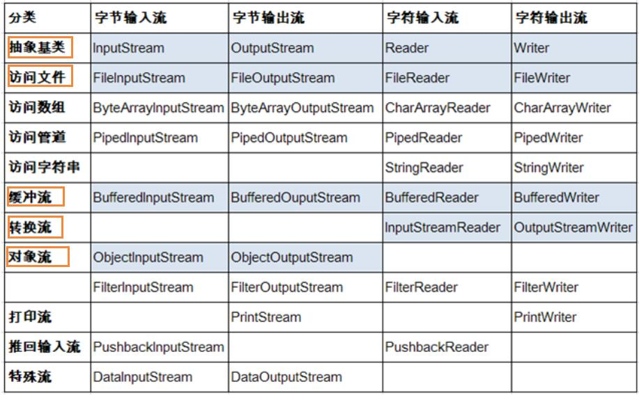
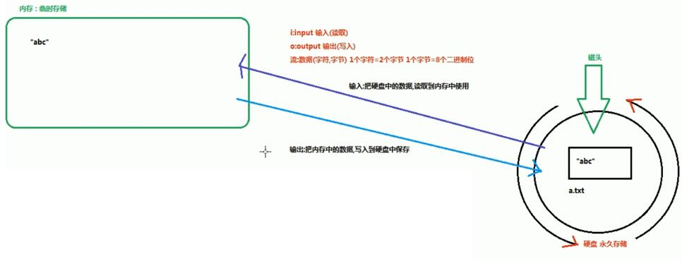
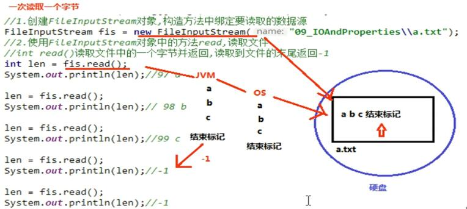
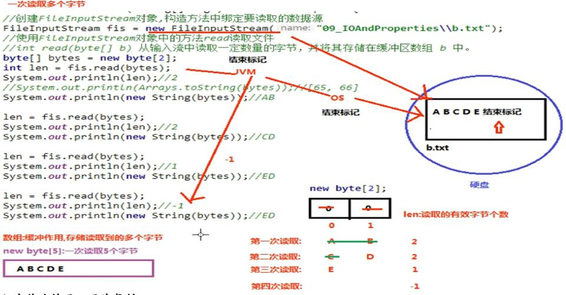
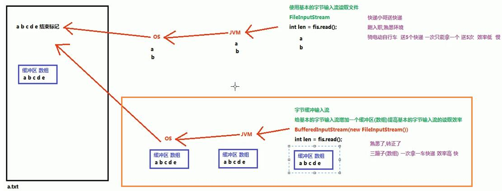
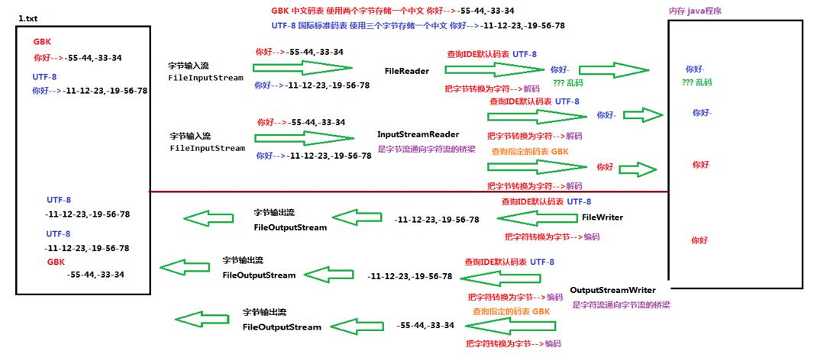
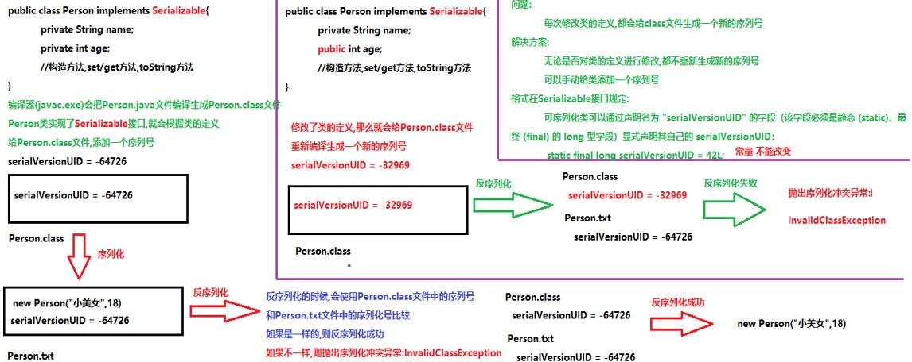

# 5 IO及NIO


## 5.1 File类
&#8195;&#8195;File是个文件类，可以用其增加、删除、查找某种类型的文
件或者文件夹，

### 5.1.1 常用方法 
* <font size="20" color=red>分隔符</font>



注：



* <font size="20" color=red>构造方法</font>

```java
    File(String pathname)             通过将给定路径名字符串转换为抽象路径名来创建一个新 File 实例。
    File(String parent, String child) 根据 parent 路径名字符串和 child 路径名字符串创建一个新 File 实例。
    File(File parent, String child)   根据 parent 抽象路径名和 child 路径名字符串创建一个新 File 实例。
``` 

注：

&#8195;&#8195;1.三种方式的类型是String的还是File的

* <font size="20" color=red>CURD操作</font>

```java
A、获取功能的方法
        public String getAbsolutePath() ：  返回此File的绝对路径名字符串。
        public String getPath() ：          将此File转换为路径名字符串。
        public String getName()  ：         返回由此File表示的文件或目录的名称。
        public long length()  ：            返回由此File表示的文件的长度。
 
B、判断功能的方法

        public boolean exists() ：          此File表示的文件或目录是否实际存在。
        public boolean isDirectory() ：     用于判断构造方法中给定的路径是否以文件夹结尾
        public boolean isFile() ：          用于判断构造方法中给定的路径是否以文件结尾
 
C、创建删除功能的方法
        public boolean createNewFile() ：   当且仅当具有该名称的文件尚不存在时，创建一个新的空文件。
        public boolean delete() ：          删除由此File表示的文件或目录。
        public boolean mkdir() ：           创建由此File表示的目录。不可以创建多级目录
        public boolean mkdirs() ：          创建由此File表示的目录，可以创建多级目录 
``` 

* <font size="20" color=red>遍历</font>

```java
        public String[] list() ：返回一个String数组，获取当前目录下的文件夹以及文件
        public File[] listFiles() ：返回一个File数组，获取当前目录下的文件夹以及文件
```
    注意:
        list方法和listFiles方法遍历的是构造方法中给出的目录
        如果构造方法中给出的目录的路径不存在,会抛出空指针异常
        如果构造方法中给出的路径不是一个目录,也会抛出空指针异常
 
## 5.2 IO

### 5.2.0 IO流分类



那么，流的分类共有



### 5.2.0 IO流程



输入(读)→大脑

输出(写)→纸

### 5.2.1 字节流

#### 5.2.1.1 字节输出流——OutputStream

##### 5.2.1.1.1 常用方法

* <font size="20" color=red>OutputStream通用方法</font>
  
```java
    public void close()：                          关闭此输出流并释放与此流相关联的任何系统资源。
    public void flush()：                          刷新此输出流并强制任何缓冲的输出字节被写出。
    public void write(byte[] b)：                  将b.length字节从指定的字节数组写入此输出流。
    public void write(byte[] b, int off, int len)：从指定的字节数组写入 len字节，从偏移量 off开始输出到此输出流。
    public abstract void write(int b)：            将指定的字节输出流。
```

* <font size="20" color=red>FileOutputStream文件</font>

```java
FileOutputStream(String name) 	     创建一个向具有指定名称的文件中写入数据的输出文件流。
FileOutputStream(File file)     	 创建一个向指定 File 对象表示的文件中写入数据的文件输出流。
```

##### 5.2.1.1.2 功能

此处用程序进行解释

* <font size="20" color=red>一次写一个字节</font>

<h3>一、程序</h3>

```java
public class OutputStram {
    public static void main(String[] args) throws IOException {
        FileOutputStream fos = new FileOutputStream("a.txt");
        fos.write(91);
        fos.close();
    }
```

<h3>二、结果展示</h3>
会在这个文件下产生一个a.txt文件

<h3>三、可能存在的问题</h3>

* <font size="20" color=red>一次写多个字节</font>
<h3>一、程序</h3>

```java
import java.io.FileOutputStream;
import java.io.IOException;

public class Out2 {
    public static void main(String[] args) throws IOException {
        FileOutputStream fos = new FileOutputStream("b.txt");
        //A  放入多个字符
        byte[] bytes = {98,99,100};
        fos.write(bytes);
        //B  放入字符串
        byte[] bytes1="大哥让我来巡山了".getBytes();
        fos.write(bytes1);
        fos.close();

    }
}

```

<h3>二、结果展示</h3>

在b.txt文件中会显示：

```java
     bcd大哥让我来巡山了
```

<h3>三、可能存在的问题</h3>


* <font size="20" color=red>续写与换行</font>

```java
FileOutputStream(String name, boolean append)   创建一个向具有指定 name 的文件中写入数据的输出文件流。
FileOutputStream(File file, boolean append)     创建一个向指定 File 对象表示的文件中写入数据的文件输出流。
参数:String name,File file:写入数据的目的地
     boolean append:追加写开关
        true:创建对象不会覆盖源文件,继续在文件的末尾追加写数据 
        false:创建一个新文件,覆盖源文件

```

注：

&#8195;&#8195;写换行符号 windows:\r\n&#8195;&#8195;&#8195;&#8195;linux:/n&#8195;&#8195; &#8195;&#8195;           mac:/r

<h3>一、程序</h3>

```java
import java.io.FileOutputStream;
import java.io.IOException;

public class Out03 {
    public static void main(String[] args) throws IOException {
        FileOutputStream fos = new FileOutputStream("a.txt", false);
        for (int i = 0; i < 10; i++) {
            byte[] bytes1="你好".getBytes();
            byte[] bytes2="\r\n".getBytes();
            fos.write(bytes1);
            fos.write(bytes2);
        }
        fos.close();
    }
}
```

<h3>二、结果展示</h3>
由于选择了append=false就会覆盖掉原来的文件

```html
        你好
        你好
        你好
        你好
        你好
        你好
        你好
        你好
        你好
        你好
```

<h3>三、可能存在的问题</h3>

#### 5.2.1.2 字节输入流——InputStream

##### 5.2.1.2.1 常用方法

* <font size="20" color=red>InputStream通用方法</font>

```java
int read()从输入流中读取数据的下一个字节。
int read(byte[] b) 从输入流中读取一定数量的字节，并将其存储在缓冲区数组 b 中。
void close() 关闭此输入流并释放与该流关联的所有系统资源。
```
* <font size="20" color=red>FileInputStream</font>

```java
FileInputStream(String name)
FileInputStream(File file)
  参数:读取文件的数据源
       String name:文件的路径       File file:文件
```
##### 5.2.1.2.2 功能

* <font size="20" color=red>一次读一个字节</font>

<h3>一、程序</h3>

```java
import java.io.FileInputStream;
import java.io.FileNotFoundException;
import java.io.IOException;

public class IN01 {
    public static void main(String[] args) throws IOException {
        FileInputStream fis = new FileInputStream("b.txt");
        int read = fis.read();
        //方式一:一次读取一个字节
          //强转类型
        System.out.println((char)read);
        //方式二：也是一次读取一个字节，但是呢让java处理
        int len=0;
        while ((len=fis.read())!=-1){
            System.out.println((char)len);
        }
        fis.close();
    }
}

```

<h3>二、结果展示</h3>

```html
            b
            c
            d
            f
```

<h3>三、可能存在的问题</h3>



* <font size="20" color=red>一次读多个字节</font>

```java
A   复习一下之前的：
int read(byte[] b) 从输入流中读取一定数量的字节，并将其存储在缓冲区数组 b 中。
明确两件事情:
    1.方法的参数byte[]的作用?
        起到缓冲作用,存储每次读取到的多个字节
        数组的长度一把定义为1024(1kb)或者1024的整数倍
    2.方法的返回值int是什么?
        每次读取的有效字节个数
B   String类的构造方法
String(byte[] bytes) :把字节数组转换为字符串
String(byte[] bytes, int offset, int length) 把字节数组的一部分转换为字符串 offset:数组的开始索引 length:转换的字节个数
```

<h3>一、程序</h3>

```java
import java.io.FileInputStream;
import java.io.IOException;
public class IN02 {
    public static void main(String[] args) throws IOException {
        FileInputStream fis = new FileInputStream("b.txt");
        byte[] bytes=new byte[1024];
        int len=0;
        while ((len=fis.read(bytes))!=-1){
            System.out.println(new String(bytes,0,len));
        }
    }
}
```

<h3>二、结果展示</h3>

```java
    bcdf
```

<h3>三、可能存在的问题</h3>




### 5.2.2 字符流

#### 5.2.2.1 字符输出流——Writer

##### 5.2.2.1.1 常用方法

* <font size="20" color=red>Writer通用方法</font>
  
```java
   void write(int c)                                    写入单个字符。
   void write(char[] cbuf)                              写入字符数组。
   abstract  void write(char[] cbuf, int off, int len)  写入字符数组的某一部分,off数组的开始索引,len写的字符个数。
   void write(String str)                               写入字符串。
   void write(String str, int off, int len)             写入字符串的某一部分,off字符串的开始索引,len写的字符个数。
   void flush()                                         刷新该流的缓冲。
   void close()                                         关闭此流，但要先刷新它。

```

* <font size="20" color=red>FileWriter</font>

```java
FileWriter(File file)根据给定的 File 对象构造一个 FileWriter 对象。
FileWriter(String fileName) 根据给定的文件名构造一个 FileWriter 对象。
   参数:写入数据的目的地
     String fileName:文件的路径   File file:是一个文件
```

##### 5.2.1.1.2 功能

此处用程序进行解释

* <font size="20" color=red>写操作</font>

<h3>一、程序</h3>

```java
public class Writer01 {
    public static void main(String[] args) throws IOException {
        FileWriter fw = new FileWriter("c.txt");
        fw.write(99);
        fw.close();
    }
}
```

<h3>二、结果展示</h3>
会在这个文件下产生一个c.txt文件

<h3>三、可能存在的问题</h3>

- flush方法和close方法的区别：
    - flush： 刷新缓冲区，流对象可以继续使用。
    - close:  先刷新缓冲区，然后通知系统释放资源。流对象不可以再被使用了。


* <font size="20" color=red>续写与换行</font>

   同字节流

```java
FileWriter(String fileName, boolean append)
FileWriter(File file, boolean append)
   参数String fileName,File file:写入数据的目的地
        boolean append:续写开关 
                      true: 不会创建新的文件覆盖源文件,可以续写; 
                      false:创建新的文件覆盖源文件
```

#### 5.2.1.2 字符输入流——Reader

##### 5.2.1.2.1 常用方法

* <font size="20" color=red>Reader通用方法</font>

```java
int read() 读取单个字符并返回。
int read(char[] cbuf)一次读取多个字符,将字符读入数组。
void close() 关闭该流并释放与之关联的所有资源。
```
* <font size="20" color=red>FileInputStream</font>

```java
   FileReader(String fileName)
   FileReader(File file)
    参数:读取文件的数据源
        String fileName:文件的路径    File file:一个文件
```
##### 5.2.1.2.2 功能

* <font size="20" color=red>读多个字节</font>

<h3>一、程序</h3>

```java
import java.io.FileReader;
import java.io.IOException;

public class Read01 {
    public static void main(String[] args) throws IOException {
        FileReader fr = new FileReader("c.txt");
        char[] chars = new char[1024];
        int len=0;
        while ((len=fr.read(chars))!=-1){
            System.out.println(new String(chars,0,len));
        }
        fr.close();
    }
}

```

<h3>二、结果展示</h3>

```html
    casffsa        
```

<h3>三、可能存在的问题</h3>


### 5.2.3 缓冲流

#### 5.2.3.0 缓冲流原理


#### 5.2.3.1 字节缓冲流

##### 5.2.3.1.1 字节缓冲输出流-BufferedOutputStream

###### 5.2.3.1.2.1 常用方法

* <font size="20" color=red>BufferedOutputStream</font>

```java
public void close() ：关闭此输出流并释放与此流相关联的任何系统资源。
public void flush() ：刷新此输出流并强制任何缓冲的输出字节被写出。
public void write(byte[] b)：将 b.length字节从指定的字节数组写入此输出流。
public void write(byte[] b, int off, int len) ：从指定的字节数组写入 len字节，从偏移量 off开始输出到此输出流。
public abstract void write(int b) ：将指定的字节输出流。
```
* <font size="20" color=red>BufferedOutputStream</font>

```java
构造方法:
BufferedOutputStream(OutputStream out)  创建一个新的缓冲输出流，以将数据写入指定的底层输出流。
BufferedOutputStream(OutputStream out, int size)  创建一个新的缓冲输出流，以将具有指定缓冲区大小的数据写入指定的底层输出流。
 参数:OutputStream out:字节输出流
      int size:指定缓冲流内部缓冲区的大小,不指定默认
```
###### 5.2.3.1.2 功能

<h3>一、程序</h3>

```java
public class Buffered01 {
    public static void main(String[] args) throws IOException {
        FileOutputStream fos = new FileOutputStream("a.txt");
        BufferedOutputStream bos = new BufferedOutputStream(fos);
        byte[] bytes="字节缓冲输出".getBytes();
        bos.write(bytes);
        bos.close();
    }
}
```

<h3>二、结果展示</h3>

会在a.txt文件中多一个

```html
       字节缓冲输出     
```

<h3>三、可能存在的问题</h3>

##### 5.2.3.1.2 字节缓冲输入流-BufferedIntputStream

###### 5.2.3.1.2.1 常用方法

* <font size="20" color=red>BufferedIntputStream</font>

```java
int read()从输入流中读取数据的下一个字节。
int read(byte[] b) 从输入流中读取一定数量的字节，并将其存储在缓冲区数组 b 中。
void close() 关闭此输入流并释放与该流关联的所有系统资源。
```
* <font size="20" color=red>BufferedInputStream</font>

```java
BufferedInputStream(InputStream in) 创建一个 BufferedInputStream 并保存其参数，即输入流 in，以便将来使用。
 BufferedInputStream(InputStream in, int size) 创建具有指定缓冲区大小的 BufferedInputStream 并保存其参数，即输入流 in，以便将来使用。
 参数:InputStream in:字节输入流
      我们可以传递FileInputStream,缓冲流会给FileInputStream增加一个缓冲区,提高FileInputStream的读取效率
     int size:指定缓冲流内部缓冲区的大小,不指定默认
```
###### 5.2.3.1.2 功能

<h3>一、程序</h3>

```java
import java.io.BufferedInputStream;
import java.io.FileInputStream;
import java.io.IOException;

public class BufferedInput01 {
    public static void main(String[] args) throws IOException {
        FileInputStream fis = new FileInputStream("a.txt");
        BufferedInputStream bis = new BufferedInputStream(fis);
        byte[] bytes = new byte[1024];
        int len=0;
        while ((len=bis.read(bytes))!=-1){
            System.out.println(new String(bytes,0,len));
        }
        bis.close();
        fis.close();
    }
}

```

<h3>二、结果展示</h3>

```html
       字节缓冲输出    
```

<h3>三、可能存在的问题</h3>

#### 5.2.3.2 字符缓冲流

##### 5.2.3.2.1 字符缓冲输出流

###### 5.2.3.2.1.1 常用方法

* <font size="20" color=red>BufferedWriter</font>

```java
void write(int c) 写入单个字符。
void write(char[] cbuf)写入字符数组。
abstract  void write(char[] cbuf, int off, int len)写入字符数组的某一部分,off数组的开始索引,len写的字符个数。
void write(String str)写入字符串。       之前write需要借助getBytes和new String进行转换
void write(String str, int off, int len) 写入字符串的某一部分,off字符串的开始索引,len写的字符个数。
void flush()刷新该流的缓冲。
void close() 关闭此流，但要先刷新它。

特有的成员方法:
void newLine() 写入一个行分隔符。会根据不同的操作系统,获取不同的行分隔符

```
* <font size="20" color=red>BufferedWriter</font>

```java
BufferedWriter(Writer out) 创建一个使用默认大小输出缓冲区的缓冲字符输出流。
BufferedWriter(Writer out, int sz) 创建一个使用给定大小输出缓冲区的新缓冲字符输出流。
参数:
   Writer out:字符输出流
           我们可以传递FileWriter,缓冲流会给FileWriter增加一个缓冲区,提高FileWriter的写入效率
   int sz:指定缓冲区的大小,不写默认大小
```
###### 5.2.3.2.1.2 功能

<h3>一、程序</h3>

```java
import java.io.BufferedWriter;
import java.io.FileWriter;
import java.io.IOException;

public class writer {
    public static void main(String[] args) throws IOException {
        FileWriter fw = new FileWriter("d.txt");
        BufferedWriter bw = new BufferedWriter(fw);
        bw.write("456");
        bw.close();
    }
}
```

<h3>二、结果展示</h3>

生成一个d.txt文件

<h3>三、可能存在的问题</h3>


##### 5.2.3.2.2 字符缓冲输入流

###### 5.2.3.2.2.1 常用方法

* <font size="20" color=red>BufferedWriter</font>

```java
int read() 读取单个字符并返回。
int read(char[] cbuf)一次读取多个字符,将字符读入数组。
void close() 关闭该流并释放与之关联的所有资源。

String readLine() 读取一个文本行。读取一行数据
行的终止符号:通过下列字符之一即可认为某行已终止：换行 ('\n')、回车 ('\r') 或回车后直接跟着换行(\r\n)。
    返回值:包含该行内容的字符串，不包含任何行终止符，如果已到达流末尾，则返回 null

```
* <font size="20" color=red>BufferedReader</font>

```java
BufferedReader(Reader in)  创建一个使用默认大小输入缓冲区的缓冲字符输入流。
BufferedReader(Reader in, int sz)     创建一个使用指定大小输入缓冲区的缓冲字符输入流。
    参数:
       Reader in:字符输入流
        我们可以传递FileReader,缓冲流会给FileReader增加一个缓冲区,提高FileReader的读取效率
```
###### 5.2.3.2.2.2 功能

<h3>一、程序</h3>

```java
import java.io.BufferedReader;
import java.io.FileReader;
import java.io.IOException;

public class readeer {
    public static void main(String[] args) throws IOException {
        FileReader fr = new FileReader("c.txt");
        BufferedReader br = new BufferedReader(fr);
        char[] chars = new char[1024];
        int len=0;
        while((len=br.read(chars))!=-1){
            System.out.println(new String(chars,0,len));
        }
    }
}

```

<h3>二、结果展示</h3>

```java
    casffsa
```

<h3>三、可能存在的问题</h3>

### 5.2.4 转换流
#### 5.2.4.0 转换流思路



#### 5.2.4.1 输出流——OutputStreamWriter

##### 5.2.4.1.1 常用方法

* <font size="20" color=red>OutputStreamWriter</font>

```java
void write(int c) 写入单个字符。
void write(char[] cbuf)写入字符数组。
abstract  void write(char[] cbuf, int off, int len)写入字符数组的某一部分,off数组的开始索引,len写的字符个数。
void write(String str)写入字符串。
void write(String str, int off, int len) 写入字符串的某一部分,off字符串的开始索引,len写的字符个数。
void flush()刷新该流的缓冲。
void close() 关闭此流，但要先刷新它。
```
* <font size="20" color=red>OutputStreamWriter构造方法</font>

```java
OutputStreamWriter(OutputStream out)创建使用默认字符编码的 OutputStreamWriter。
OutputStreamWriter(OutputStream out, String charsetName) 创建使用指定字符集的 OutputStreamWriter。
参数:
OutputStream out:字节输出流,可以用来写转换之后的字节到文件中
String charsetName:指定的编码表名称,不区分大小写,可以是utf-8/UTF-8,gbk/GBK,...不指定默认使用UTF-8
```
<br>

###### 5.2.4.2.1.2 功能

<h3>一、程序</h3>

```java
import java.io.FileOutputStream;
import java.io.IOException;
import java.io.OutputStreamWriter;

public class writer01 {
    public static void main(String[] args) throws IOException {
        OutputStreamWriter os = new OutputStreamWriter(new FileOutputStream("a.txt"), "utf-8");
        os.write("123");
        os.close();
    }
}
```
<h3>二、结果展示</h3>


<h3>三、可能存在的问题</h3>

#### 5.2.4.2 输入流——InputStreamWriter

##### 5.2.4.2.1 常用方法

* <font size="20" color=red>InputStreamWriter</font>

```java
int read() 读取单个字符并返回。
 int read(char[] cbuf)一次读取多个字符,将字符读入数组。
 void close() 关闭该流并释放与之关联的所有资源。
```
* <font size="20" color=red>InputStreamWriter构造方法</font>

```java
  InputStreamReader(InputStream in) 创建一个使用默认字符集的 InputStreamReader。
  InputStreamReader(InputStream in, String charsetName) 创建使用指定字符集的 InputStreamReader。
    参数:InputStream in:字节输入流,用来读取文件中保存的字节
         String charsetName:指定的编码表名称,不区分大小写,可以是utf-8/UTF-8,gbk/GBK,...不指定默认使用UTF-8
注意事项:构造方法中指定的编码表名称要和文件的编码相同,否则会发生乱码
```
###### 5.2.4.2.2.2 功能

<h3>一、程序</h3>

```java
import java.io.FileInputStream;
import java.io.IOException;
import java.io.InputStreamReader;

public class reader {
    public static void main(String[] args) throws IOException {
        InputStreamReader is = new InputStreamReader(new FileInputStream("a.txt"));
        int len=0;
        char[] chars = new char[1024];
        while ((len=is.read(chars))!=-1){
            System.out.println(new String(chars,0,len));
        }
    }
}

```
<h3>二、结果展示</h3>


<h3>三、可能存在的问题</h3>


### 5.2.5 打印流

##### 5.2.5.1 常用方法

```java
特有的方法,print,println
     void print(任意类型的值)        void println(任意类型的值并换行)
构造方法:
    PrintStream(File file):输出的目的地是一个文件
    PrintStream(OutputStream out):输出的目的地是一个字节输出流
    PrintStream(String fileName) :输出的目的地是一个文件路径
PrintStream extends OutputStream继承自父类的成员方法:
    public void close() ：关闭此输出流并释放与此流相关联的任何系统资源。
    public void flush() ：刷新此输出流并强制任何缓冲的输出字节被写出。
    public void write(byte[] b)：将 b.length字节从指定的字节数组写入此输出流。
    public void write(byte[] b, int off, int len) ：从指定的字节数组写入 len字节，从偏移量 off开始输出到此输出流。
    public abstract void write(int b) ：将指定的字节输出流。

使用System.setOut方法改变输出语句的目的地改为参数中传递的打印流的目的地
        static void setOut(PrintStream out) 重新分配“标准”输出流。

注意:如果使用继承自父类的write方法写数据,那么查看数据的时候会查询编码表 97->a
如果使用自己特有的方法print/println方法写数据,写的数据原样输出 97->97

```
###### 5.2.4.2.2.2 功能

<h3>一、程序</h3>

```java
public class print {
    public static void main(String[] args) throws IOException {
        PrintStream ps = new PrintStream("e.txt");
        ps.write(78);
        ps.write("/r/n".getBytes());
        ps.println("HK");
        System.setOut(ps);
    }
}
```
<h3>二、结果展示</h3>
直接到e.txt文件进行了展示

<h3>三、可能存在的问题</h3>


### 5.2.6 标准输入、输出流(了解)

#### 5.2.6.1 常用方法

System.in和System.out分别代表了系统标准的输入和输出设备

默认输入设备是： 键盘， 输出设备是：显示器

- System.in的类型是InputStream
- System.out的类型是PrintStream，其是OutputStream的子类
FilterOutputStream 的子类

重定向：通过System类的setIn， setOut方法对默认设备进行改变。

```java
public static void setIn(InputStream in)
public static void setOut(PrintStream out)
```


### 5.2.7 数据流(了解)

#### 5.2.7.1 常用方法

为了方便地操作Java语言的基本数据类型和String的数据，可以使用数据流。

数据流有两个类： 
 DataInputStream 和 DataOutputStream

```java
DataInputStream中的方法
boolean readBoolean() byte readByte()
char readChar() float readFloat()
double readDouble() short readShort()
long readLong() int readInt()
String readUTF() void readFully(byte[] b)
DataOutputStream中的方法
将上述的方法的read改为相应的write即可
```


### 5.2.8 对象流（序列化流）

#### 5.2.8.0 序列化原理



#### 5.2.8.1 对象输出流——ObjectOutputStream

##### 5.2.8.1.1 常用方法

```java
构造方法:
       ObjectOutputStream(OutputStream out) 创建写入指定 OutputStream 的 ObjectOutputStream。
        参数:OutputStream out:字节输出流
特有的成员方法:
        void writeObject(Object obj) 将指定的对象写入 ObjectOutputStream。
```
<h3>一、程序

```java
public class Person {
    private String name;
    private int age;
    public Person() {}
    public Person(String name, int age) {
        this.name = name;
        this.age = age;
    }
    public String getName() {return name;}
    public void setName(String name) {this.name = name;}
    public int getAge() {return age;}
    public void setAge(int age) {this.age = age;}
}
```

```java
import java.io.FileOutputStream;
import java.io.IOException;
import java.io.ObjectOutputStream;
public class Object {
    public static void main(String[] args) throws IOException {
        ObjectOutputStream oos = new ObjectOutputStream(new FileOutputStream("a.txt"));
        oos.writeObject(new Person("sun",23));
        oos.flush();
    }
}
```

<h3>二、结果展示

```java
Exception in thread "main" java.io.NotSerializableException: Person
	at java.base/java.io.ObjectOutputStream.writeObject0(ObjectOutputStream.java:1185)
	at java.base/java.io.ObjectOutputStream.writeObject(ObjectOutputStream.java:349)
	at Object.main(Object.java:9)
```

<h3>三、可能出现的问题</h3>

序列化和反序列化的时候,会抛出<font color=#23456>NotSerializableException没有序列化异常</font>


解决方案：

    通过java.io.Serializable 接口以启用其序列化功能
    
注：

Serializable接口也叫标记型接口

要进行序列化和反序列化的类必须实现Serializable接口,就会给类添加一个标记
        当我们进行序列化和反序列化的时候,就会检测类上是否有这个标记
            有:就可以序列化和反序列化
            没有:就会抛出 NotSerializableException异常

 类似于去市场买肉-->肉上有一个蓝色章(检测合格)-->放心购买-->买回来怎么吃随意


<h3>一、程序

```java
import java.io.Serializable;

public class Person implements Serializable {
    private String name;
    private int age;

    public Person() {
    }
    ………………………………
```

<h3>二、结果展示

可以生成a.txt文件并生成
```java

```

<h3>三、可能出现的问题</h3>


#### 5.2.8.2 对象输入流——ObjectInputStream

##### 5.2.8.2.1 常用方法

    ObjectInputStream:对象的反序列化流作用:把文件中保存的对象
    以流的方式读取出来使用

```java
    ObjectInputStream(InputStream in) 创建从指定 InputStream 
    读取的 ObjectInputStream。
      参数:InputStream in:字节输入流
    特有的成员方法:
        Object readObject() 从 ObjectInputStream 读取对象。
```
注：

readObject方法声明抛出了ClassNotFoundException(class文件找不到异常)

当不存在对象的class文件时抛出此异常

反序列化的前提:
- 1.类必须实现Serializable      
- 2.必须存在类对应的class文件

<h3>一、程序

```java
import java.io.Serializable;

public class Person implements Serializable {
    private String name;
    private int age;

    public Person() {
    }
    ………………………………
```

```java
import java.io.FileInputStream;
import java.io.FileNotFoundException;
import java.io.IOException;
import java.io.ObjectInputStream;

public class Serable {
    public static void main(String[] args) throws IOException, ClassNotFoundException {
        ObjectInputStream ois = new ObjectInputStream(new FileInputStream("a.txt"));
        Person o = (Person) ois.readObject();
        ois.close();
        System.out.println(o.getAge()+"-----"+o.getName());
    }
}
```

<h3>二、结果展示

可以生成a.txt文件并生成
```java
    23-----sun
```

<h3>三、可能出现的问题</h3>


### 5.2.10 Properties类

#### 5.2.6.1 Properties常用方法

&#8195;&#8195;Properties 类表示了一个持久的属性集。Properties 可保存在流中或从流中加载。

&#8195;&#8195;Properties集合是一个唯一和IO流相结合的集合
属性列表中每个键及其对应值都是一个字符串。

&#8195;&#8195;Properties集合是一个双列集合,key和value默认都是字符串
* <h4>Stroe方法Stroe方法
&#8195;&#8195;可以使用Properties集合中的方法store,把集合中的临时数据,持久化写入到硬盘中存储

```java
void store(OutputStream out, String comments)     
void store(Writer writer, String comments)
参数:OutputStream out:字节输出流,不能写入中文
     Writer writer:字符输出流,可以写中文
     String comments:注释,用来解释说明保存的文件是做什么用的
                    不能使用中文,会产生乱码,默认是Unicode编码  一般使用""空字符串
```
注：

  Writer与OutputStream主要是一个是字符型，一个是字节型

* <h4>load方法
&#8195;&#8195;可以使用Properties集合中的方法load,把硬盘中保存的文件(键值对),读取到集合中使用

```java
void load(InputStream inStream)         
void load(Reader reader)
   参数:
       InputStream inStream:字节输入流,不能读取含有中文的键值对
       Reader reader:字符输入流,能读取含有中文的键值对
```

#### 5.2.6.2 属性映射
 

&#8195;&#8195;是一种存储键/值对的数据结构。属性映射经常被用来存放配置信息。

它有三个特性：

- 键和值都是字符串

- 键/值对可以很容易地写入文件或从文件读出。

- 用二级表存放默认值
  

它提供了几个主要的方法：

```java
getProperty ( String key)：               用指定的键在此属性列表中搜索属性。也就是通过参数 key ，得到 key 所对应的 value。
setProperty ( String key, String value)： 调用 Hashtable 的方法 put 。他通过调用基类的put方法来设置 键 - 值对。
clear ()：                                清除所有装载的 键 - 值对。该方法在基类中提供。
```

Properties类提供默认值的两种机制：

* 1. 在试图获得字符串值时制定默认值。
  
&#8195;&#8195;&#8195;&#8195;String title=settings.getProperty("title","Default title");

* 2. 如果觉得每次调用都指定默认值太麻烦，那么就可以将所有的默认值放在一个二级属性映射中，并在主映射的构造器中提供映射。且用它来构造查询表。
&#8195;&#8195;&#8195;&#8195;Properties settings=new properties(defaultSettings);

&#8195;&#8195;Java中的properties文件是一种纯文本格式的配置文件，主要用于表达配置信息，文件类型为 *.properties，文件中内容的格式是 "键=值" 的格式。在properties文件中，可以用井号"#"来作注释。

```java
Java读取Properties文件的方法
1. 使用java.util.Properties类的load()方法
InputStream in = new BufferedInputStream(new FileInputStream(name));
Properties p = new Properties();
p.load(in);
2. 使用class变量的getResourceAsStream()方法
InputStream in = 需要使用配置文件的文件.class.getResourceAsStream(name);
Properties p = new Properties();
p.load(in);
3. 使用class.getClassLoader()所得到的java.lang.ClassLoader的getResourceAsStream()方法
InputStream in= 需要使用配置文件的文件.class.getClassLoader().getResourceAsStream(name);
Properties p = new Properties();
p.load(in);
4. 使用java.lang.ClassLoader类的getSystemResourceAsStream()静态方法
InputStream in = ClassLoader.getSystemResourceAsStream(name);
Properties p = new Properties();
p.load(in);
5. 使用java.util.ResourceBundle类的getBundle()方法
ResourceBundle rb = ResourceBundle.getBundle(name, Locale.getDefault());
这个类的作用就是读取资源属性文件（properties），然后根据.properties文件的名称信息（本地化信息），匹配当前系统的国别语言信息（也可以程序指定），然后获取相应的properties文件的内容。
注意：
properties文件的名字是有规范的：一般的命名规范是： 自定义名_语言代码_国别代码.properties
如果是默认的，直接写为：自定义名.properties
比如：myres_en_US.properties
6. 使用java.util.PropertyResourceBundle类的构造函数
InputStream in = new BufferedInputStream(new FileInputStream(name));
ResourceBundle rb = new PropertyResourceBundle(in);

```
