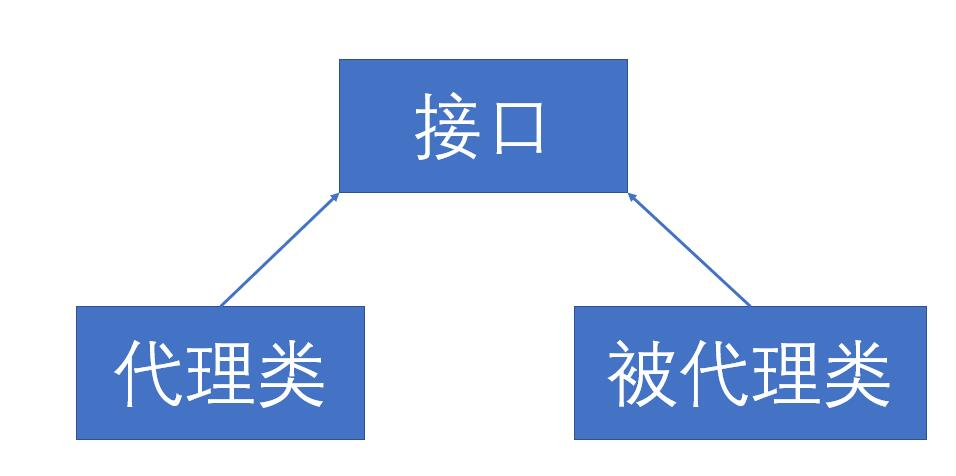
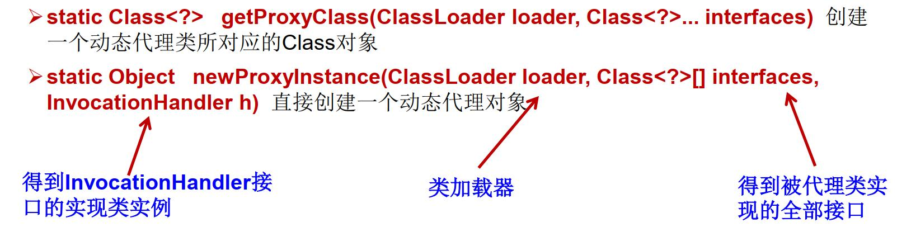
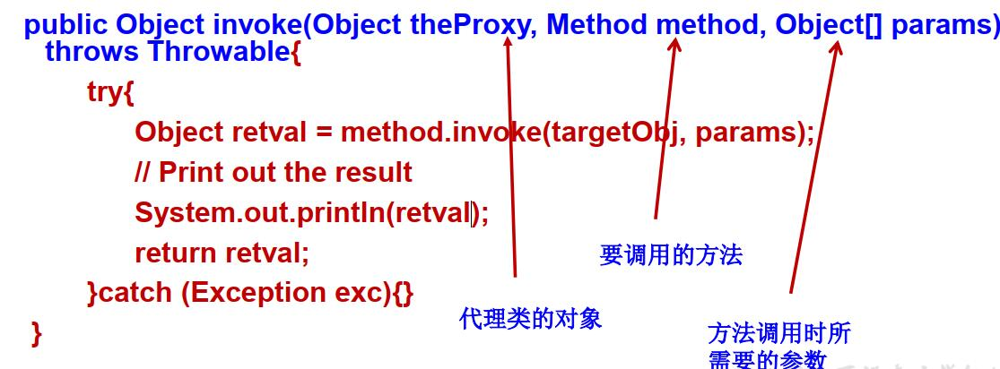
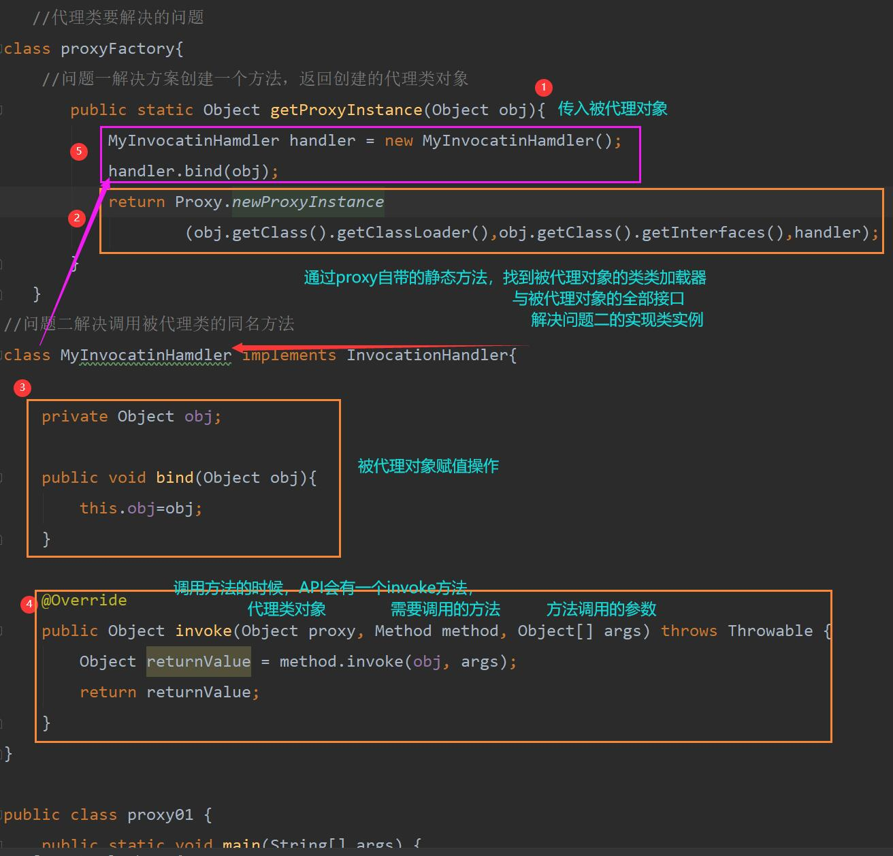
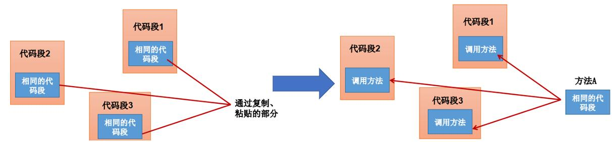

# 6-1 反射应用之动态代理（AOP源码分析关键）

## 6-1.1 代理设计模式原理

&emsp;&emsp;&emsp;&emsp;我们希望使用一个<font color=#f563>代理</font>将对象包装起来，使用这个<font color=#f563>代理对象</font>来取代<font color=green>包装起来的对象</font>，任何对包装对象的调用都要通过代理



之前的反射都是以静态代理为主，主要特征是一个代理类对应着一个唯一的目标对象类

但是这样会存在这一个问题就是不利于程序的扩展，使得程序更加复杂。

那么动态代理就用一个代理类完成全部的代理功能


## 6-1.2 动态代理应用

### 6-1.2.1 静态代理
首先，看一下之前学习的静态代理类

主要流程是；创建接口→创建代理类（代理类想要代理对象，必须要把<font color=red sytle="background:yellow">代理对象实例化</font>）→创建被代理类

实质就是：被代理类该实现实现，最后，你把所有的东西给<font color=red size="5">代理类</font>，他去忙活就好了

<h3>一、程序

```java
interface ClothFactory{
    void producerCloth();
}
//代理对象
class ProxyClothFactory implements ClothFactory{
    //将被代理对象类实例化
    private ClothFactory factory;
    public ProxyClothFactory(ClothFactory factory){ this.factory=factory; }
    @Override
    public void producerCloth() {
        System.out.println("前期工作");
        factory.producerCloth();
        System.out.println("后期工作");
    }
}
//被代理对象
class NikeClothFactory implements ClothFactory{

    @Override
    public void producerCloth() {
        System.out.println("Nike");
    }
}
public class Proxy {
    public static void main(String[] args) {
       //被代理类
        NikeClothFactory nike = new NikeClothFactory();
        //代理类
        ProxyClothFactory proxy = new ProxyClothFactory(nike);

        proxy.producerCloth();
    }
}
```
<h3>二、结果展示

```java
        前期工作
        Nike
        后期工作
```

<h3>三、可能出现的问题
1.静态代理的流程是


### 6-1.2.2 动态态代理

#### 6-1.2.2.1 动态代理API

Proxy：转么能完成代理的操作类



那么想要实现动态代理，必须要解决两件事情:

* 如何根据加载到内存中的被代理类，动态的创建一个代理类及其对象。
  &emsp;&emsp;&emsp;理解：如何根据不同客户的要求（不同的被代理类），创建一个通用的方案（创建一个代理类和对象）
* 当通过代理类的对象调用方法a时，如何动态的去调用被代理类中的同名方法a。
  &emsp;&emsp;&emsp;理解：n个客户来了，使用通用方案的时候，如何找到对应客户
 
 <h4>由此，带来了几个类的了解</h4>
 &emsp;&emsp;&emsp;创建一个实现接口InvocationHandler的类，它必须实现invoke方法，以完成代理的具体操作。

 

<h3>一、程序

```java
iimport java.lang.reflect.InvocationHandler;
import java.lang.reflect.Method;
import java.lang.reflect.Proxy;

interface Human{
    String getBelief();

    void est(String food);
}
//被代理类
class SuperMan implements Human{

    @Override
    public String getBelief() {
        return "life";
    }

    @Override
    public void est(String food) {
        System.out.println("我喜欢吃"+food);
    }
}
   //代理类要解决的问题
class proxyFactory{
    //问题一解决方案创建一个方法，返回创建的代理类对象
       public static Object getProxyInstance(Object obj){
           MyInvocatinHamdler handler = new MyInvocatinHamdler();
           handler.bind(obj);
           return Proxy.newProxyInstance(obj.getClass().getClassLoader(),obj.getClass().getInterfaces(),handler);
       }
   }

class MyInvocatinHamdler implements InvocationHandler{

    private Object obj;

    public void bind(Object obj){
        this.obj=obj;
    }

    @Override
    public Object invoke(Object proxy, Method method, Object[] args) throws Throwable {
        Object returnValue = method.invoke(obj, args);
        return returnValue;
    }
}

public class proxy01 {
    public static void main(String[] args) {
        SuperMan superMan = new SuperMan();
        Human proxyInstance = (Human) proxyFactory.getProxyInstance(superMan);
        proxyInstance.est("大米");
        String belief = proxyInstance.getBelief();
        System.out.println(belief);
    }
}

```
<h3>二、结果展示

```java
    我喜欢吃大米
    life
```

<h3>三、可能出现的问题




## 动态代理与AOP

其实之前的InvocationHandler，很难看出动态代理的优势所在

借助Spring的动态代理机制来理解



会在Spring的<font size=5>[AOP](6.Frame/1.Spring/AOP.md)</font>处详细介绍