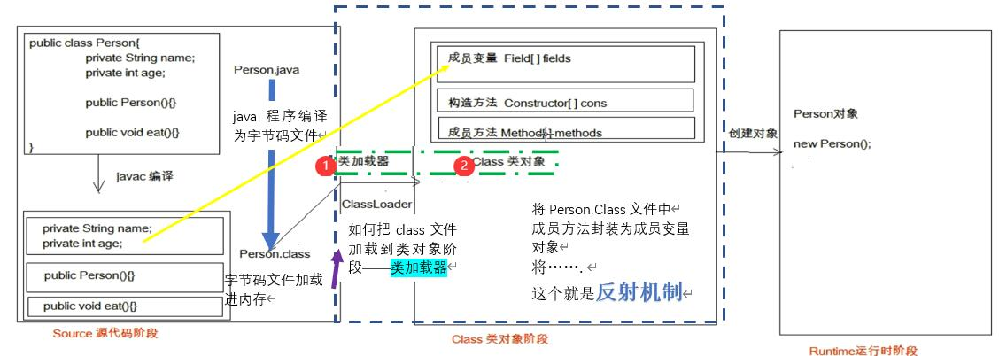

## 6.0 反射综述
反射思想主要在Spring的AOP中广泛应用，但是虽然这个思想及其重要，我们也是尽量避免使用反射，它存在着性能慢，代码多等问题。

## 6.1 反射

<h3>一、基础内容</h3>

### 6.1.1 反射概念

~~- 对于后期框架简化至关重要框架设计的灵魂~~<br>
~~- 将类的各个<font color=grenn>组成部分</font>封装为<font color=#965286><b>其他对象</b></font>，这就是反射机制~~

这样理解起来太麻烦了，来个最简单的反射案例：
```html
我:妈妈，剪刀在哪里呀？
妈妈：我那天放针线的时候好像在针线盒里看到了，你去找找有没有。针线盒在客厅的茶几上。	
你：好的
```
<br>
 &nbsp;  &nbsp; 这样就是从<font color=#36532><b>“针线”</b></font>推导出了<font color=#36532><b>“针线盒”</b></font>，再从<font color=#36532><b>“针线盒”</b></font>中找到了<font color=#6e96><b>“剪刀”</b></font>。

那么我们的反射也就是这么个意思:
从<font color=#3366FF><b>类或对象</b></font>中推导出<font color=#3366FF><b>Class类</b></font>，然后再从<font color=#3366FF><b>Class类</b></font>中获得<font color=#006600><b>类</b></font>的信息
&nbsp; &nbsp; 可以这样理解：针线就是寻找class的方法（针线盒），剪刀是class里面的功能

这样讲，有点通俗，体现不出深度来，自制一张图（大哥大姐如果觉得有问题，请点击右上角图标进入github给我留言，我会及时改正）



### 6.1.2 获取反射的方式

- 1. Class.forName("全类名")：将字节码文件加载进内存，返回Class对象    
      - 注：全类名指的是src文件下具体的那个文件
- 2. 类名.class：通过类名的属性class获取
- 3. 对象.getClass()：getClass()方法在Object类中定义着。                
      - 注：用对象获取时需要先进行创建对象
  
 &nbsp;  &nbsp;  &nbsp;  &nbsp; 结论：同一个字节码文件(*.class)在一次程序运行过程中，只会被加载一次，不论通过哪一种方式获取的Class对象都是同一个。（比如peroson与student文件对应的是不一样的）。
 
一、程序

```java
  public class Demo20041103Reflect {
    public static void main(String[] args) throws ClassNotFoundException {
        //方式一：全类名
        Class a = Class.forName("Person");

        //方式二：类名
        Class b = Person.class;

        //方式三：对象获取
        Person c = new Person();
        Class c1 = c.getClass();

        System.out.println(a==b);
        System.out.println(b==c1);
        System.out.println(a==c1);
    }
}
```` 
二、结果
```java
            true
            true
            true
```
三、可能出现的问题
- 1.ClassNotFoundException异常
    - 主要是找不到这个类，可能是全类名错误了


### 6.1.3 Class的对象
由于字节码文记载为Class类，会变成三类：
```java
* 1. 获取成员变量们
        * Field[] getFields()                  获取所有public修饰的成员变量
        * Field getField(String name)          获取指定名称的 public修饰的成员变量
        * Field[] getDeclaredFields()          获取所有的成员变量，不考虑修饰符
        * Field getDeclaredField(String name)  获取指定名称的成员变量
    注：Field：成员变量
        - 1. 设置值   void set(Object obj, Object value)            
        - 2. 获取值   get(Object obj) 
        - 3. 忽略访问权限修饰符的安全检查* setAccessible(true):暴力反射<br>         对于private使用这个，可以进行修改
 
* 2. 获取构造方法们
        * Constructor<?>[] getConstructors()                             获取public修饰的构造方法
        * Constructor<T> getConstructor(类<?>... parameterTypes)         获取public修饰指定的有参构造，在函数方法写入参数
        * Constructor<T> getDeclaredConstructor(类<?>... parameterTypes) 获取所有修饰指定的有参构造，在函数方法写入参数
        * Constructor<?>[] getDeclaredConstructors()                     修饰符不受限制
        注： Constructor创建方法
        - T newInstance(Object... initargs)  如果需要进行赋值操作，可以直接加在上面四个之后
        - 如果使用空参数构造方法创建对象，操作可以简化：Class对象的newInstance方法
        
* 3. 获取成员方法们：
        * Method[] getMethods()                                  获取所有方法
        * Method getMethod(String name, 类<?>... parameterTypes) 获取指定方法
        方法参数
        * Method[] getDeclaredMethods()
        * Method getDeclaredMethod(String name, 类<?>... parameterTypes)
        注：Method方法对象
        - 执行方法：* Object invoke(Object obj, Object... args)  对象名对象的设置
```        
 <h3>二、扩展</h3>
       之后会经常使用配置文件来进行减少耦合度(在Spring比较常见)