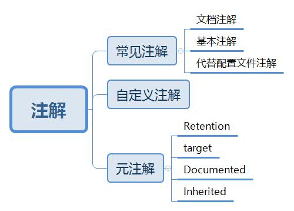

# 7 注解——Annotation

## 7.0 注解综述



## 7.1 注解概述
&#8195;&#8195;作为代码里的特殊标记,可用于修饰包、类、构造器、方法、成员变量、参数、局部变量等等，这些信息被保存在Anntation的name=value中

## 7.2 常见注解

### 7.2.1 文档注解（了解）

```java
    @author 标明开发该类模块的作者， 多个作者之间使用,分割
    @version 标明该类模块的版本
    @see 参考转向， 也就是相关主题
    @since 从哪个版本开始增加的
    @param 对方法中某参数的说明， 如果没有参数就不能写
    @return 对方法返回值的说明， 如果方法的返回值类型是void就不能写
    @exception 对方法可能抛出的异常进行说明 ， 如果方法没有用throws显式抛出的异常就不能写
        其中
        @param @return 和 @exception 这三个标记都是只用于方法的。
        @param的格式要求： @param 形参名 形参类型 形参说明
        @return 的格式要求： @return 返回值类型 返回值说明
        @exception的格式要求： @exception 异常类型 异常说明
        @param和@exception可以并列多个
```

### 7.2.2 基本注解

```java
    @Override: 限定重写父类方法, 该注解只能用于方法
    @Deprecated: 用于表示所修饰的元素(类, 方法等)已过时。通常是因为所修饰的结构危险或存在更好的选择
    @SuppressWarnings: 抑制编译器警告
```

### 7.2.3 配置文件注解
如Servlet3.0提供了注解(annotation),使得不再需要在web.xml文件中进行Servlet的部署。

## 7.3 自定义注解（用得不多）

  * 注解声明为：@interface
  * 内部定义成员，通常使用value表示
    共有八种基本数据类型的数组：String类型、 Class类型、 enum类型、 Annotation类型
  * 可以指定成员的默认值，使用default定义
  * 如果自定义注解没有成员，表明是一个标识作用。
  
## 7.4 元注解

### 7.4.1 @Target注解

```java
 @Target：描述注解能够作用的位置
	 * ElementType取值：
	                * TYPE              可以作用于类上     
                    * METHOD            可以作用于方法上       
                    * FIELD             可以作用于成员变量上
                    * CONSTRUCTOR       作用于构造器
                    * FIELD             描述域
                    * LOCAL_VARIABLE    描述局部变量
                    * PACKAGE           描述包
```

### 7.4.2 @Retention注解

```java
 @Retention：描述注解被保留的阶段
      RetentionPolicy.SOURCE:在源文件中有效（即源文件保留） ， 编译器直接丢弃这种策略的注释
      RetentionPolicy.CLASS:在class文件中有效（即class保留） ， 当运行 Java 程序时, JVM不会保留注解。 这是默认值
      RetentionPolicy.RUNTIME:在运行时有效（即运行时保留） ， 当运行 Java 程序时, JVM 会保留注释。程序可以通过反射获取该注释
```
      
### 7.4.3 @Documented注解
@Documented：描述注解是否被抽取到api文档中    

### 7.4.4 @Inherited注解
@Inherited：描述注解是否被子类继承


