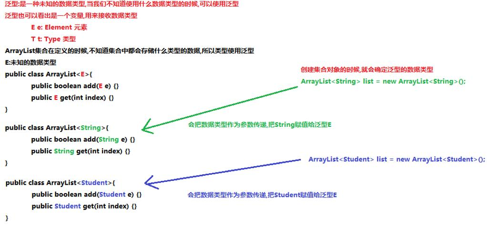
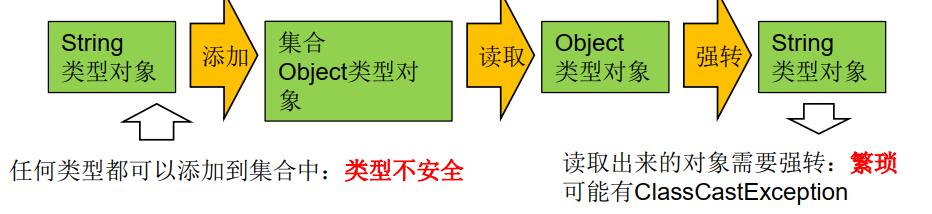
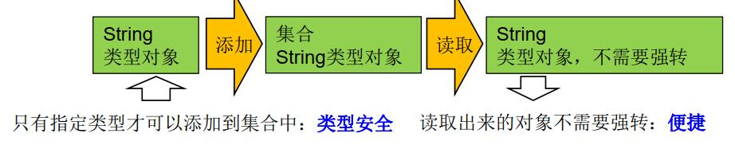
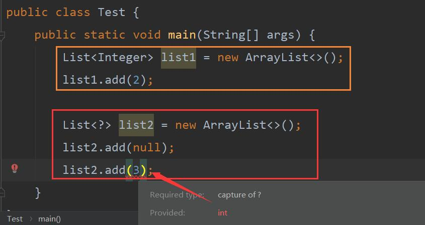
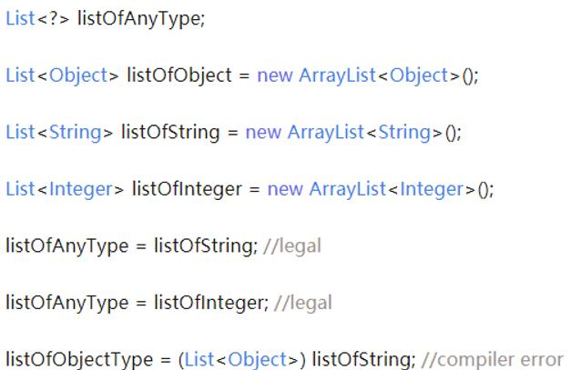

## 9.0 泛型综述


## 9.1 为什么要有泛型



而为何这样使用泛型呢，原因在于：

没有泛型的时候：


有泛型的时候：



好处: 

&emsp;&emsp;&emsp;&emsp;1.避免了类型转换的麻烦,存储的是什么类型,取出的就是什么类型

&emsp;&emsp;&emsp;&emsp;2.把运行期异常(代码运行之后会抛出的异常),提升到了编译期(写代码的时候会报错)

弊端:    

&emsp;&emsp;&emsp;&emsp;泛型是什么类型,只能存储什么类型的数据


## 9.2 泛型的使用

### 9.2.1 泛型与继承

&emsp;&emsp;不仅在类，接口，方法都可以使用

* <h3>情况一：继承时，父类不全部指定泛型
   
```java
   public class Father<T1,T2>

   在子类中可以

   public class Son1<T1,A> extends Father<T1,String>
   或者
   public class Son1<T1,T2,A> extends Father<T1,T2>
```
  
* <h3>情况二：继承时，父类将泛型指定

 ```java
   public class Father<T1,T2>

   在子类中可以

   public class Son1<A,B> extends Father<Integer,String>
``` 
注：一旦确定类型，子类将不再显示

* <h3>情况三：继承时，父类无泛型

   这个会产生一个问题，叫做类型擦除问题：

   主要是指在继承（实现）没有指定具体的类型，一旦擦除之后，按照Object来劲新处理
   
   &emsp;&emsp;如在代码中定义了List<Object>和List<String>等类型，在编译之后，都会变成List，JVM看到的只是List，而由泛型附加的类型信息对JVM来说是不可见的。因此，对于JVM来说，List<Object>和List<String>是同一个类
   如果说出现类型擦除，会使得全部变为了Object类
   如果一个String类型方法调用Object的泛型方法，可能会出现ClassCastException

```java
   public class Father<T1,T2> {
    public void show1(T1 t1,T2 t2){
        System.out.println(t1+"父类"+t2);
    }
}

public class Son1<T1,T2> extends Father {
    @Override
    //类型擦除，变为了Object
    public void show1(Object o, Object o2) {
        super.show1(o, o2);
    }
}
```
### 9.2.2 泛型标记符

```java
        E - Element (在集合中使用)
        T - Type（Java 类,如自定义的Person类等）
        K - Key（键）
        V - Value（值）
        N - Number（数值类型）
        ？-表示不确定的java类型
        S、U、V  - 2nd、3rd、4th types
```
注：

&emsp;&emsp;Object是所有类的根类，任何类的对象都可以设置给该Object引用变量，使用的时候可能需要类型强制转换，
使用了泛型T、E等这些标识符后，在实际用之前类型就已经确定了，不需要再进行类型强制转换。

### 9.2.3 通配符

通配符： <font color=green size="6">？</font>

注意：以List为例来说

1. List<?>是List<Object>和List<String>等等所有确定类型的父类
2. 读取List<?>的对象永远是安全的，写入list中的元素不行，我们不知道这个元素的类型是什么，但是null例外



那么们对于有限制的通配符，主要是分为了两类：

* <? extends Number>只允许泛型为Number及Number子类的引用调用
* <? super Number>只允许泛型为Number及Number父类的引用调用


### 9.2.4 自定义泛型

自定义泛型主要是可以在内部使用这个泛型

* 自定义泛型类
* 自定义泛型接口
* 自定义泛型方法

#### 9.2.4.1 定义和使用泛型的类
修饰符 class 类名<代表泛型的变量> { }  <font color=red>在使用时需要确定泛型的类型</font>

```java
public class Generic<T> {
    private T name;
    public Generic(T name){
       this.name=name;
    }
    public Generic() { }
    public T getName() {
        return name;
    }
    public void setName(T name) {
        this.name = name;
    }
    @Override
    public String toString() {
        return "Generic{" +
                "name=" + name +
                '}';
    }
}

public class Test {
    public static void main(String[] args) {
        Generic<String> g1 = new Generic<String>();
        g1.setName("12");
        String name = g1.getName();
        System.out.println(name);
    }
}
```
注：

1. 在创建实例的时候，一旦确定泛型，那么setName()也就可以确定

#### 9.2.4.2 定义和使用泛型的方法
定义含有泛型的方法:泛型定义在方法的修饰符和返回值类型之间

```java
    格式:
        修饰符 <泛型> 返回值类型 方法名(参数列表(使用泛型)){
            方法体;
        }
    含有泛型的方法,在调用方法的时候确定泛型的数据类型
    传递什么类型的参数,泛型就是什么类型
``` 

```java
public class GenericMethod {
    public <T> T method(T name){
        return name;
    }
    public static <T> void method1(T name){
        System.out.println(name);
    }
}

public class Test {
    public static void main(String[] args) {
        GenericMethod gm = new GenericMethod();
        //一旦通过这个确定泛型，那么最后也可以确定泛型
        Integer method = gm.method(45);
        String fanxing = gm.method("fanxing");
    }
}
```

#### 9.2.4.3 定义和使用泛型接口

* 定义类时确定泛型的类型

```java 
定义接口类
    public interface Iterator<E> {
        语句
    }
定义实现类
public class 实现类 implements 接口<泛型类型> {
        重写}
定义测试类
对实现类构建对象
``` 

```java
public interface DefinedG<T> {
    void method(T t);
}

public class DefinedGImpl implements DefinedG<String> {
    @Override
    public void method(String s) {
        System.out.println(s);
    }
}

public class Test {
    public static void main(String[] args) {
        DefinedGImpl d = new DefinedGImpl();
        d.method("wang");
    }
}

```

* 定义类时不确定泛型的类型

```java
定义接口类
    public interface Iterator<E> {
        语句
    }
定义实现类
    public class 实现类<E> implements 接口<E> {
        重写}
定义测试类
对实现类构建对象(注意，在创建对象的时候一定要确定泛型的类型 

``` 

```java

public interface UnDefinedG<T> {
    void method(T t);
}

public class UnDefinedGImpel<T> implements UnDefinedG<T>{
    @Override
    public void method(T t) {
        System.out.println(t);
    }
}

public class Test01 {
    public static void main(String[] args) {
        UnDefinedGImpel<Integer> um = new UnDefinedGImpel<>();
        um.method(123);
    }
}

```

### 9.2.5 List与原始List的区别

* List<Object> 与 List 原始类型之间的区别？

&emsp;&emsp;原始类型和带泛型参数类型 <Object> 之间的主要区别是在编译时编译器不会对原始类型进行类型安全检查，却会对带参数的类型进行检查，通过使用 Object 作为类型可以告知编译器该方法可以接受任何类型的对象（比如 String 或 Integer）。但却不能把 List<String> 传递给接受 List<Object> 的方法，因为会产生编译错误。

* List<Object> 与 List<?> 类型之间的区别？

&emsp;&emsp; List<?> 是一个未知类型的 List，而 List<Object> 其实是任意类型的 List，我们可以把 List<String>、List<Integer> 赋值给 List<?>，却不能把 List<String> 赋值给 List<Object>。譬如：


 
* List<? extends T>和List <? super T>之间有什么区别？

（有时面试官会用这个问题来评估你对泛型的理解，而不是直接问你什么是限定通配符和非限定通配符）

这两个 List 的声明都是限定通配符的例子，List<? extends T> 可以接受任何继承自 T 的类型的 List，而 List<? super T> 可以接受任何 T 的父类构成的 List。例如 List<? extends Number> 可以接受 List<Integer> 或 List<Float>。Java 容器类的实现中有很多这种用法如Collections

*  <T extends E> 和 <? extends E> 有什么区别？

它们用的地方不一样，
<T extends E> 定义类型参数，声明一个类型参数 T，可放在泛型类定义中类口/接口后面、泛型方法返回值前面。 
<? extends E> 实例化类型参数，用于实例化泛型变量中的类型参数，只是这个具体类型是未知的， 
public void addAll(Bean<? extends E> c)
public <T extends  E> void addAll(Bean<T> c)

* List<String> 与 List<Object> 的关系和区别？

这两个东西没有关系只有区别。
因为也许很多人认为 String 是 Object 的子类，所以 List<String> 应当可以用在需要 List<Object> 的地方，但是事实并非如此，泛型类型之间不具备泛型参数类型的继承关系，所以 List<String> 和 List<Object> 没有关系，无法转换。


