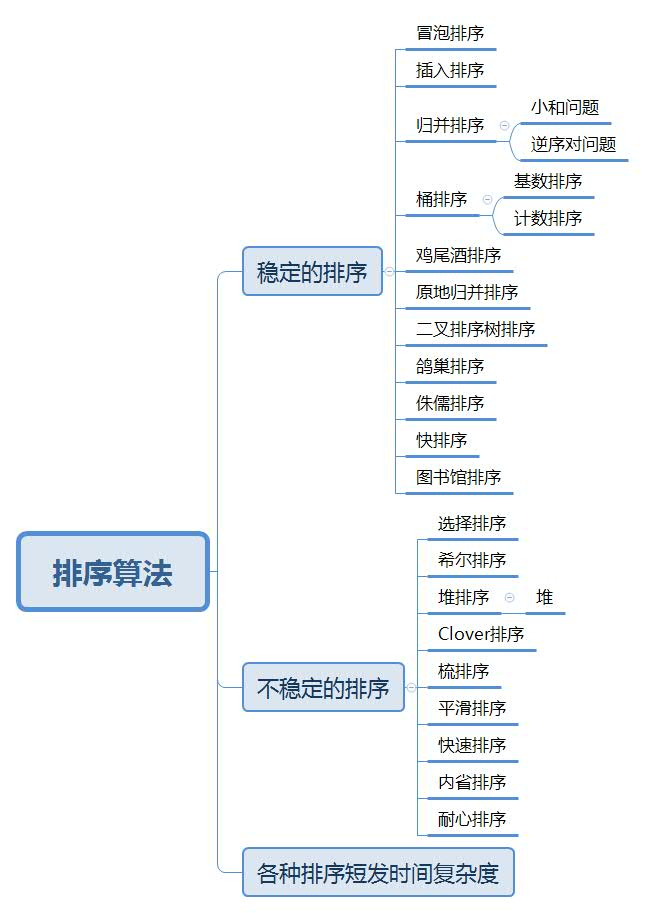
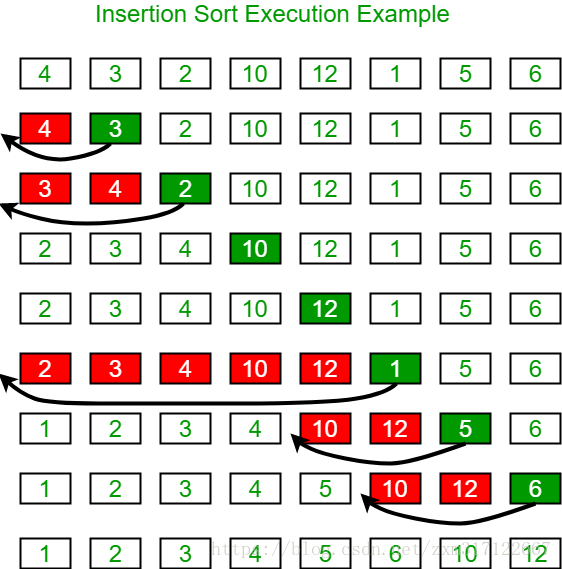
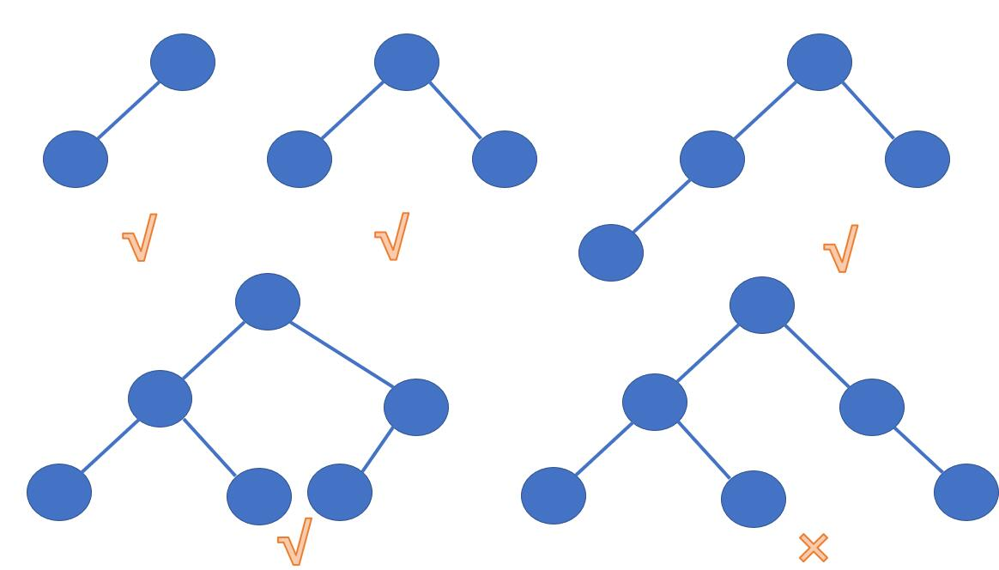
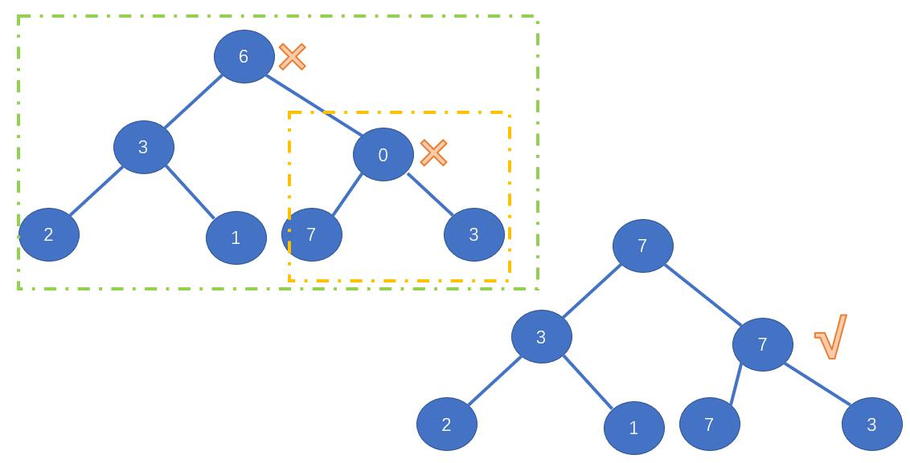

# 9 排序算法
## 9.0 排序算法综述


## 9.1 冒泡排序
最古老的排序方式，目前基本不使用了，一般计算都会超时
相关理论就不介绍了，本科一年级老谭的那本红皮书学的第一个算法

<b>一、程序</b>

```java
public class BubbleSort {
    public static void main(String[] args) {
          int[] arr={2,4,1,7,5,3,9};
          sort(arr);
        for (int i = 0; i < arr.length; i++) {
            System.out.print(arr[i]+"\t");
        }
    }

    public static void sort(int[] arr){
        if (arr==null || arr.length<2){
            return;
        }
        //第一个循环主要是进行0~N-1，0~N-2.......
        for (int i = arr.length-1; i >0; i--) {
            //在0~x之间进行遍历凉凉比较
            //  01  12  23  34  45  
            for (int j = 0; j < i; j++) {
                if (arr[j]>arr[j+1]){
                    swap(arr,j,j+1);
                }
            }
        }
    }
    public static void swap(int[] arr,int i,int j){
        int temp=arr[i];
        arr[i]=arr[j];
        arr[j]=temp;
    }
}
```

<b>二、结果展示</b>
```java
       1	2	3	4	5	7	9	
```

<b>三、可能存在的问题</b>
暂无

## 9.2 选择排序
基本思路：假设数组为 [1....n]，每一趟，<font color=red>选择一个值</font>与<font color=red>数组剩下的值</font>进行比较，<font color=#2fe32>互换最小值的索引</font>并<font color=#f7873>交换</font>

<b>一、程序</b>

```java
public class SelectSort {
    public static void main(String[] args) {
        int[] arr={2,4,1,7,5,3,9};
        sort(arr);
        for (int i = 0; i < arr.length; i++) {
            System.out.print(arr[i]+"\t");
        }
    }
    public static void sort(int[] arr){
        for (int i = 0; i < arr.length; i++) {
            int min=i;
            for (int j = i+1; j < arr.length ; j++) {
                min =arr[min] < arr[j]?min:j;
            }
            swap(arr,i,min);
        }
    }
    public static void swap(int[] arr,int i,int j){
        int temp=arr[i];
        arr[i]=arr[j];
        arr[j]=temp;
    }
}
```

<b>二、结果展示</b>
```java
    1	2	3	4	5	7	9
```

<b>三、可能存在的问题</b>
暂无

## 9.3 插入排序

基本思路：左看看右看看
假设数组为 [1....n]，选出一个数值与<font color=green>左侧的值</font><font color=blue>比较交换</font>直到<font color=red>越界为止</font>


此图借鉴了这位大佬的辛苦劳作，再次说明
https://blog.csdn.net/zxm317122667/article/details/83344178

<b>一、程序</b>

```java
ublic class InsertionSort {
    public static void main(String[] args) {
        int[] arr={2,4,1,7,5,3,9};
        Sort(arr);
        for (int i = 0; i < arr.length; i++) {
            System.out.print(arr[i]+"\t");
        }
    }
    public static void Sort(int[] arr){
        //第一个for循环是找到一个基准数值
        for (int i = 1; i < arr.length; i++) {
            //第二个for循环是把基准书左侧的所有数值进行比较并交换
            for (int j = i-1; j >= 0 && arr[j]>arr[j+1]; j--) {
                swap(arr,j,j+1);
            }
        }
    }
    public static void swap(int[] arr,int i,int j){
        int temp=arr[i];
        arr[i]=arr[j];
        arr[j]=temp;
    }
}
```

<b>二、结果展示</b>


<b>三、可能存在的问题</b>


## 9.4 归并排序

### 9.4.1 整体思路

假设一个数组arr，将其分开，分别进行排序，然后在进行合并

### 9.4.2 leetcode 912

<b>一、程序</b>

```java
public class Merge {
    public static void main(String[] args) {
      int[] arr={3,9,1,10,5,2,7,3};
      Sort(arr);
        for (int i = 0; i < arr.length; i++) {
            System.out.print(arr[i]+"\t");
        }
    }

    public static void Sort(int[] arr){
        if (arr==null || arr.length<2){
            return;
        }
     process(arr,0,arr.length-1);
    }

    public static void process(int[] arr,int L,int R){
        if (L==R){
            return;
        }
        int mid=L+((R-L)>>1);
        process(arr,L,mid);
        process(arr,mid+1,R);
        merge(arr,L,R,mid);
    }

    public static void merge(int[] arr,int L,int R,int mid){
        int[] help=new int[R-L+1];
        int i=0;
        int P1=L;
        int P2=mid+1;
        //前++与后++作用不同
        
        while (P1<=mid && P2<=R){
            help[i++]=arr[P1]<=arr[P2]?arr[P1++]:arr[P2++];
        }

        while (P1<=mid){
            help[i++]=arr[P1++];
        }

        while (P2<=R){
            help[i++]=arr[P2++];
        }
        for (int j = 0; j < help.length; j++) {
            arr[L+j]=help[j];
        }
    }
}
```

<b>二、结果展示</b>

```html
1	2	3	3	5	7	9	10
```

<b>三、可能存在的问题</b>


### 9.4.3 归并排序扩展——小和问题

假设一个数组[1,3,4,2,5] 1右边比1大的有4个，就记录4个1（4x1）以此类推

<b>一、程序</b>

```java
public class min {
    public static void main(String[] args) {
        int[] arr={1,3,4,2,5};
        int i = SmallSum(arr);
        System.out.println(i);
    }

    public static int SmallSum(int[] arr){
        if (arr==null || arr.length<2){
            return 0;
        }
       return  process(arr,0,arr.length-1);
    }

    public static int process(int[] arr,int L,int R){
        if (L==R){
            return 0;
        }
        int mid=L+((R-L)>>1);
        return process(arr,L,mid)+
        process(arr,mid+1,R)+
        merge(arr,L,R,mid);
    }

    public static int merge(int[] arr,int L,int R,int mid){
        int[] help=new int[R-L+1];
        int i=0;
        int P1=L;
        int P2=mid+1;
        int res=0;
        //前++与后++作用不同

        while (P1<=mid && P2<=R){
            res+=arr[P1]<arr[P2]?(R-P2+1)*arr[P1]:0;
            help[i++]=arr[P1]<=arr[P2]?arr[P1++]:arr[P2++];
        }

        while (P1<=mid){
            help[i++]=arr[P1++];
        }

        while (P2<=R){
            help[i++]=arr[P2++];
        }
        for (int j = 0; j < help.length; j++) {
            arr[L+j]=help[j];
        }
        return res;
    }
}
```

<b>二、结果展示</b>
```java
     16
```

<b>三、可能存在的问题</b>

### 9.4.4 归并排序扩展——逆序对

<b>一、程序</b>

```java
public class nixudui {
    public static void main(String[] args) {
        int[] arr={7,5,6,4};
        int sum = Sum(arr);
        System.out.println(sum);
    }

    public static int  Sum(int[] arr){
        return process(arr,0,arr.length-1);
    }

    public static int process(int[] arr,int L,int R){
        if (L>=R){
            return 0;
        }
        int mid=L+((R-L)>>1);
        return  process(arr,L,mid)+
         process(arr,mid+1,R)+
        merge(arr,L,R,mid);
    }

    public static int merge(int[] arr,int L,int R,int mid) {
        int[] help=new int[R-L+1];
        int i=0;
        int P1=L;
        int P2=mid+1;
        int res=0;

        while (P1 <= mid && P2 <= R){
            res+=arr[P1]>arr[P2]?mid-P1+1:0;
            help[i++]=arr[P1]<=arr[P2]?arr[P1++]:arr[P2++];
        }

        while (P1<=mid){
            help[i++]=arr[P1++];
        }

        while (P2<=R){
            help[i++]=arr[P2++];
        }
        for (int j = 0; j < help.length; j++) {
            arr[L+j]=help[j];
        }
        return res;
    }
}

```
<b>二、结果展示</b>


<b>三、可能存在的问题</b>

## 9.5 堆排序

### 9.5.1 堆原理

~~堆结构就是用数组实现的完全二叉树结构~~

这样看，太啰嗦了，就这么说吧，你可以把堆想象成完全二叉树，但是实际上，它是一个数组

什么是完全二叉树，可以查看[二叉树](./3-二叉树.md)

但是，说一下完全二叉树的大体概念：从左到右<font color="#FF0000">依次</font>变满的，如图：



一定要记得是从左到右依次填满，才可以的！！！！！

那么我们以一个数组为例一共有10个数据，但是我只要前5个数据，那么这个二叉树排序就是：


那么通过这个图我们发现了一个规律：
父节点：(i-1)/2
左孩子：2*i+1
右孩子：2*i+2
那么是通过有效区来进行控制的

那么想到堆，就会想到<font color="#FF0000">大根堆</font>与<font color="#FF0000">小根堆</font>

那么什么是大根堆呢：
每一颗子树的最大值一定是子树的头节点，如：



完全二叉树依次增加，增加的每一部分都是大根堆

那么大根堆有两个操作：
1. heapInsert操作
2. heapify操作


这个图画了一个半小时o(╥﹏╥)o
这个过程就是heapinseert过程了

<b>一、程序</b>

```java
public static void heapInsert(int[] arr,int index){
        while(arr[index]>arr[(index-1)/2]){
            swap(arr,index,(index-1)/2);
            index=(index-1)/2;
        }
    }
```

<b>二、结果展示</b>


<b>三、可能存在的问题</b>


那么如果说我想要将heapInsert的头节点取出并删除，如何做呢，那么就引来了另外一个话题：heapify方法


先进行两个孩子比较，最后进行父节点比较

<b>一、程序</b>

```java
public static void heapify(int[] arr,int index,int size){
        int left=2*index+1;
        //左孩子小于size，右孩子不一定小于size
        while(left<size){
            int largest= left+1 < size && arr[left+1]>arr[left]
                    ? arr[left+1]
                    : arr[left];
            largest=arr[largest]<arr[index]?index:largest;
            if (largest==index)break;
            //互换元素
            swap(arr,index,largest);
            index=largest;
            left=2*index+1;
        }
    }
```
<b>二、结果展示</b>


<b>三、可能存在的问题</b>

那么退排序结束之后，就开始了真正的堆排序了
1. 先让整个数组变为大根堆结构
2. 把堆的最大值与对末尾元素互换，然后不断重复这个操作对直到0为止

<b>一、程序</b>

```java
public class Stack {
    public static void main(String[] args) {
        int[] arr={8,4,4,9,10,3};
        heapSort(arr);
        System.out.println(Arrays.toString(arr));
    }


    public static void heapSort(int[] arr){
        if (arr==null || arr.length<2){
            return ;
        }
        //1.变为大根堆
        for (int i = 0; i < arr.length; i++) {
            heapInsert(arr,i);
        }
        //2.元素互换
        int size=arr.length;
        swap(arr,0,--size);
        while (size>0){
            heapify(arr,0,size);
            swap(arr,0,--size);
        }
    }


    public static void heapInsert(int[] arr,int index){
        while(arr[index]>arr[(index-1)/2]){
            swap(arr,index,(index-1)/2);
            index=(index-1)/2;
        }
    }

    public static void heapify(int[] arr,int index,int size){
        int left=2*index+1;
        //左孩子小于size，右孩子不一定小于size
        while(left<size){
            int largest= left+1 < size && arr[left+1]>arr[left]
                    ? left+1
                    : left;
            largest = arr[largest] > arr[index] ? largest : index;
            if (largest == index) {
                break;
            }
            //互换元素
            swap(arr,largest,index);
            index=largest;
            left=2*index+1;
        }
    }

    public static void swap(int[] arr,int i,int j){
        int temp=arr[i];
        arr[i]=arr[j];
        arr[j]=temp;
    }
}


```

<b>二、结果展示</b>


<b>三、可能存在的问题</b>

## 9.6 快速排序

### 9.6.1 荷兰国旗问题

首先让我们先学习一下荷兰国旗问题：

针对一个数组arr，给定一个区分值num，将其分为了小于num区域，等于num区域，大于num区域

首先来看分成了小于等于num区域和大于num区域

主要原则就是：
1. 当前数≤区分值
&emsp;当前数与≤区下一个数换
&emsp;≤区右移，指针右移
2. 当前数>区分值
&emsp;≤区不动，指针右移


那么荷兰国旗问题，就是把等于问题取出来：

1. 当前数<区分值
&emsp;当前数与≤区下一个数换
 &emsp;≤区右移，指针右移
2. 当前数=区分值
   指针直接跳下一个
3. 当前数>区分值
&emsp;当前数与>区前一个数换
 &emsp;>区左移，指针不动

 


<b>一、程序</b>

```java
public static int[] partition(int[] arr,int L,int R,int p){
        int less=L-1;
        int more=R+1;
        while (L<more){
            if (arr[L]<p){
                swap(arr,L++,++less);
            }if(arr[L]>p){
                swap(arr,L,--more);
            }else {
                L++;
            }
        }
        return new int[]{less+1,more-1};
    }
```

<b>二、结果展示</b>


<b>三、可能存在的问题</b>

那么我们就开始研究快排

首先快排选择一个数，进行荷兰国旗处理，

之后，进行递归

那么这个<font color=red>数</font>就有好几种选择方式，

1. 选择最后一个数作为区分值，就是上面这个程序
2. 选择有边界作为区分值，每次都是右边界
3. 随机选择一个数，复杂度为O（N*logN）

<b>一、程序</b>

```java
public class QuickSort {
    public static void main(String[] args) {
        int[] arr={3,6,1,4,4,6,2,8,3,8,10};
        quicksort(arr);
        System.out.println(Arrays.toString(arr));
    }

    public static void quicksort(int[] arr){
        if (arr==null || arr.length<2){
            return;
        }
        process(arr,0,arr.length-1);
    }
    public static void process(int[] arr,int L,int R){
     if (L<R){
         swap(arr, L+(int) (Math.random()*(R-L+1)),R);
         int[] p = partition2(arr, L, R);
         process(arr,L,p[0]-1);
         process(arr,p[1]+1,R);
     }

    }
    public static int[] partition2(int[] arr,int L,int R){
        int less=L-1;
        int more=R;
        while (L<more){
            if (arr[L]<arr[R]){
                swap(arr,++less,L++);
            }else if(arr[L]>arr[R]){
                swap(arr,--more,L);
            }else {
                L++;
            }
        }
        swap(arr,more,R);
        return new int[]{less+1,more};
    }

    public static int[] partition1(int[] arr,int L,int R,int p){
        int less=L-1;
        int more=R+1;
        while (L<more){
            if (arr[L]<p){
                swap(arr,++less,L++);
            }if(arr[L]>p){
                swap(arr,--more,L);
            }else {
                L++;
            }
        }
        return new int[]{less+1,more-1};
    }

    public static void swap(int[] arr,int i,int j){
        int temp=arr[i];
        arr[i]=arr[j];
        arr[j]=temp;
    }
}


```

<b>二、结果展示</b>


<b>三、可能存在的问题</b>

## 9.7 比较器

比较器在C++是冲在比较运算符，Java中叫比较器

比较器主要是用请详见[4-集合](/1.basics/1.java-basic/4-集合.md)

## 9.8 桶排序

### 9.8.0 综述

桶排序分为了计数排序和基数排序

### 9.8.1 计数排序

假设有一个数组arr=[x,x,x,x,x,x,x,x,x,x],其中所有数据的范围在0~200之间，那么我就创造一个辅助数组help=[],共有


<b>一、程序</b>

```java


```

<b>二、结果展示</b>

```java

```

<b>三、可能存在的问题</b>

<b>一、程序</b>

```java


```

<b>二、结果展示</b>

```java

```

<b>三、可能存在的问题</b>

<b>一、程序</b>

```java


```

<b>二、结果展示</b>

```java

```

<b>三、可能存在的问题</b>


<b>一、程序</b>

```java


```

<b>二、结果展示</b>

```java

```

<b>三、可能存在的问题</b>
