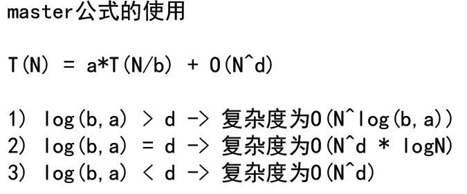

# 递归

递归原理不在赘述，如何来判断递归的复杂度呢？

左程云给出了一个master公式；



那么以一个最简单的例子来进行讲述吧：

<h3>一、程序

```java
public class Max {
    public static void main(String[] args) {
       int[] arr={3,4,2,6,7,9};
        int max = max(arr);
        System.out.println("获取的最大值是"+max);
    }
    public static int  max(int[] arr){
        if (arr==null || arr.length==0){
        }
        return process(arr,0,arr.length-1);
    }
    public static int process(int[] arr,int L,int R) {
        if (L==R) return arr[L];
        
        int mid=L+((R-L) >> 1);
        int leftmax = process(arr, L, mid);
        int rightmax = process(arr, mid+1, R);
        return Math.max(leftmax,rightmax);
    }
    }

```

<h3>二、结果展示

```java
获取的最大值是9
```

<h3>三、可能存在的问题

主要是考察了对递归的理解能力如：


